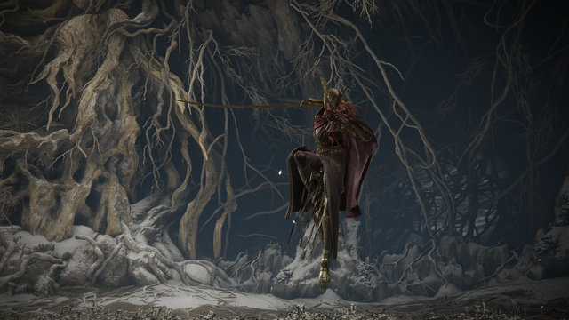
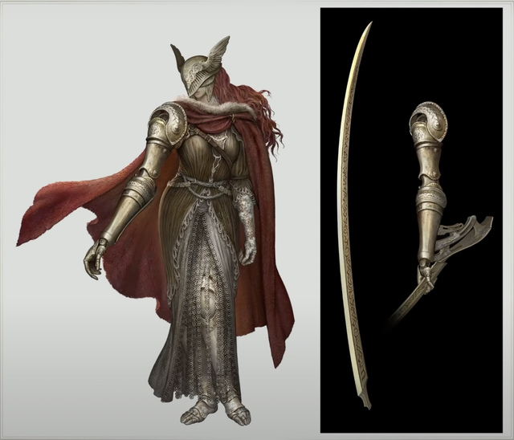
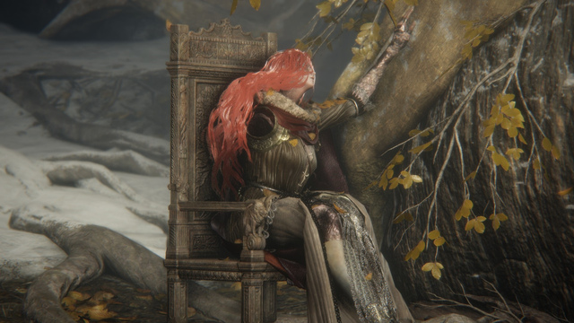
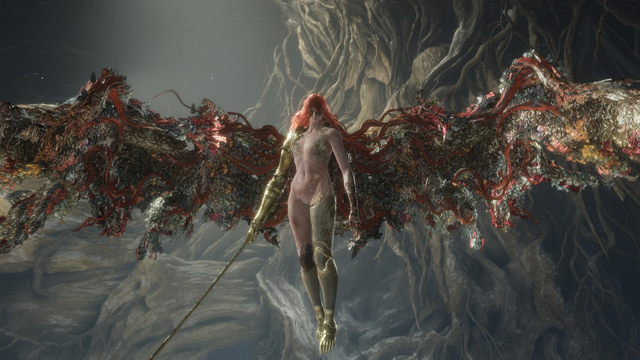
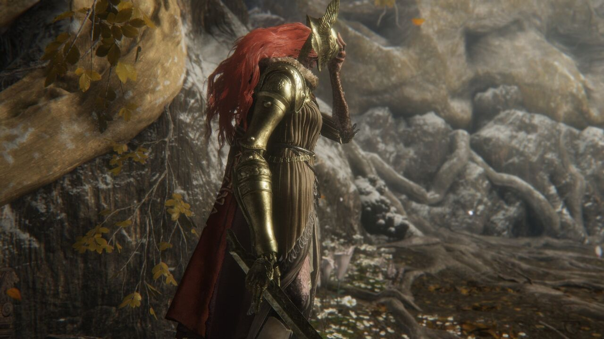
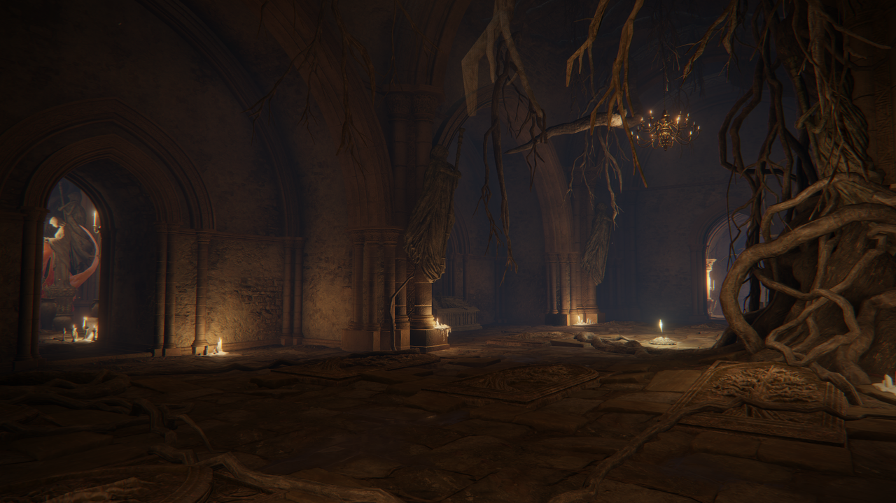
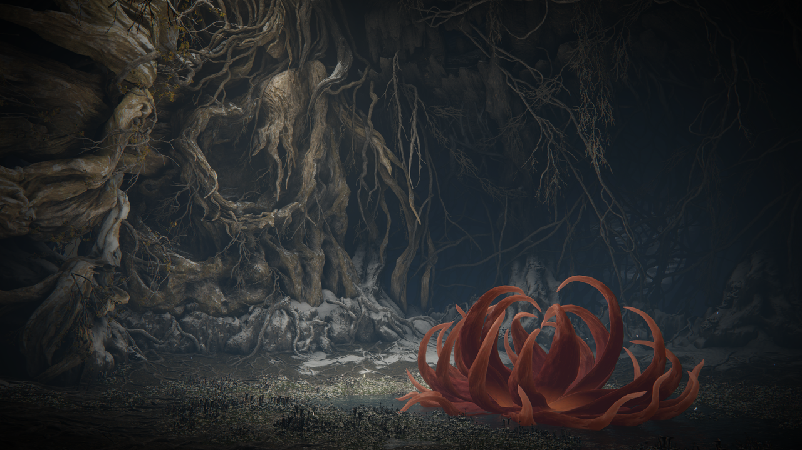
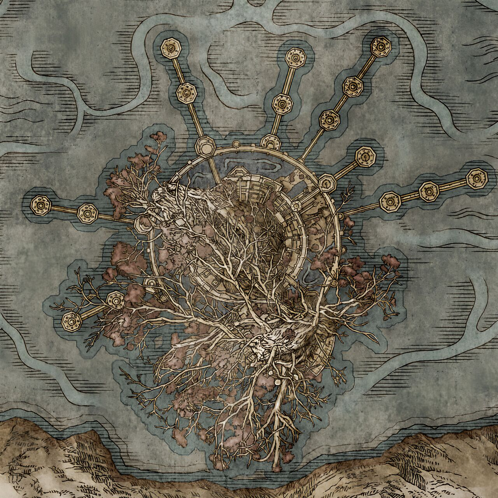

# 女武神马莲尼亚：美术制作规范

> 用途：为 Blockbench 模型、纹理、动画、粒子、音效和竞技场制作提供统一基线。  
> 参考图：仅限内部研究，不得随模组或宣传材料发布。  
> 版权与原始链接：[资料与图片台账](../references/malenia-sources.md)

## 1. 美术方向

马莲尼亚的视觉不是传统重甲女武神，而是「残缺、精密、克制」与「腐败、绽放、失控」的两阶段对照。

第一阶段以纵向纤细轮廓为主：翼盔遮眼、暗红长发、无垢金义肢、贴身甲胄、单刃长刀和破旧披风。她的力量来自平衡和轨迹，不靠夸张体积。第二阶段移除大部分衣甲，以腐败组织形成巨大横向翼展；人物轮廓仍清晰位于翼根中央，不能被花瓣和粒子吞没。

正式资产不复刻原作网格、贴图、甲纹或花翼拓扑。使用原创翼盔纹样、义肢关节、甲片边饰和腐败枝膜，只保留必要设计语汇：无垢金、赤发、遮眼、三处义肢、内置长刀、根系洞窟、猩红花和菌丝状腐败之翼。

## 2. 参考图板

### 角色宣传近景

提取要点：翼盔以不对称羽翼和压低的帽檐遮住双眼；盔、肩甲和义手都是暗淡旧金而非亮黄色。右手可见蓝紫与橙褐混合的腐败斑痕，红发与暗红披风需要通过明度区分。

### 第一阶段动作与竞技场

提取要点：单腿抬起、身体后仰和长刀水平展开构成水鸟般的平衡姿态。竞技场以灰白根系、浅水和暗色洞壁为主，没有遮挡动作的大型障碍。

### 第二阶段身体与翼根

提取要点：红发遮眼取代翼盔；人物皮肤呈灰白与淡褐腐败纹，旧金义臂仍是最硬的结构。腐败翼从背部与周围花瓣聚合，而不是规则羽翼。

### 全身概念与义手刀

提取要点：外层披风形成左高右低的斜线；裙甲细长，双腿比例接近人体而非重甲柱体。义手刀由前臂外侧机构承托，刀身长、窄、略弯，机械臂末端同时保留手掌和刀架。

### 入场姿势与后背层次

提取要点：座椅、圣树根和少量金叶构成休眠感；后背有红发、毛领、披风和甲胄四层。入场动画应先表现缓慢苏醒和装配刀刃，再转入战斗待机。

### 腐败之翼全展

提取要点：翼展远大于身高，内部是棕黑组织、暗红根脉、孔洞和碎片化金色反光。左右翼不完全镜像，边缘破碎且有局部花瓣，但中心人物必须保持可瞄准的干净负形。

### 场边根壁、浅水与地表

提取要点：竞技场边界不是规则石墙，而是相互挤压的巨大灰白根瘤；根壁底部直接过渡到浅水和湿暗地表。少量枯黄叶片集中在高处，不均匀铺满地面。Minecraft 外环应使用大体块不对称根系，核心战区只保留低反射浅水与细碎落叶。

### 圣树根部入口前厅

提取要点：到达 Boss 前先经过石质拱厅，建筑柱列已被垂根和盘根侵入。照明来自低位蜡烛与侧门暖光，主空间仍保持深色。入口走廊可以使用石拱、根系和暖光建立过渡，但这些建筑构件不得延伸进实际战斗圆盘。

### 战后全场与固化花芯

提取要点：战场整体是宽阔、近圆形的低洼洞窟，视线可横穿场地；中央和近景地面平缓，外圈由高耸根壁和黑暗凹口封闭。固化花芯位于可读的开阔地，不被根系遮挡。该图作为竞技场尺度、边界高度和战后花芯位置的主要参考。

### 圣树宏观地图

提取要点：地图表现圣树树冠、环形城市与向外延展的分层路径。它只用于理解“上层树冠—下层艾布雷菲尔—根部深处”的纵向关系，不作为 Boss 房间尺寸、方向或平面轮廓的测量依据。

## 3. 比例与轮廓

| 项目 | 建议规格 | 目的 |
| --- | --- | --- |
| 逻辑碰撞箱 | 宽 0.9 格、高 2.9 格 | 保持人形剑士的精确贴身判断 |
| 第一阶段视觉高度 | 3.1-3.3 格 | 翼盔和长腿形成高挑轮廓 |
| 第二阶段视觉高度 | 3.4-3.7 格 | 赤发与翼根增加高度，不改变碰撞 |
| 腐败翼最大翼展 | 7.0-7.8 格 | 形成第二阶段横向识别，纯视觉 |
| 长刀总长 | 2.8-3.2 格 | 允许长距离突刺；判定仍由服务端定义 |
| 披风展开宽度 | 不超过 2.2 格 | 不遮挡刀尖和左手动作 |
| 猩红花最大直径 | 10-11 格 | 对应 5.5 格逻辑半径 |

剪影测试要求：第一阶段在纯黑轮廓下能读出「单翼头盔、长刀、右侧义臂、单边披风」；第二阶段能读出「中央人形、巨大不规则双翼、长发遮面」。缩小到 64 像素高时，刀与翼根不能融成一块。

## 4. 模型与骨骼

采用一个实体模型，通过显隐层切换两个阶段；不要在转换时替换实体。第一阶段盔甲、披风和翼盔为可隐藏组，第二阶段身体层、腐败翼和猩红花核心为可显示组。

| 骨骼组 | 必需骨骼 | 备注 |
| --- | --- | --- |
| 根与躯干 | `root`、`control`、`pelvis`、`body`、`chest`、`neck`、`head` | `control` 只处理整体受控位移 |
| 天然肢体 | `upper_arm_l`、`forearm_l`、`hand_l`、`thigh_r`、`shin_r` | 左臂和右大腿为主要天然肢体 |
| 义肢 | `prosthetic_arm_r`、`prosthetic_forearm_r`、`prosthetic_hand_r`、`prosthetic_leg_l`、`prosthetic_foot_r` | 关节分段要允许机械扣合动作 |
| 武器 | `blade_mount`、`blade`、`blade_root`、`blade_tip` | 根/尖定位骨骼用于客户端拖尾和离线轨迹 |
| 衣物与头发 | `helm`、`cape_01..03`、`hair_root`、`hair_01..06`、`skirt_front/back` | 使用关键帧次级运动，不做实时布料 |
| 腐败翼 | `wing_root_l/r`、每侧 `wing_branch_01..04`、`wing_membrane_01..04` | 左右翼拓扑和关键帧不可完全镜像 |
| 花朵 | `aeonia_core`、`petal_01..08`、`rot_cloud_anchor` | 花苞、爆发、持续花域共用骨骼资产 |

建议基础密度为 16 像素/格，翼盔、义手关节和刀柄提高到 32 像素/格。第一阶段不超过约 360 个 cube；第二阶段身体附加层与腐败翼不超过约 300 个 cube。翼膜尽量使用少量大面与可控透明边缘，避免数百个重叠透明面。

## 5. 材质与原创调色板

以下色值是 Minecraft 资产目标，不是从参考图直接复制的取样：

| 材质 | 主色 | 阴影 | 高光 | 表面特征 |
| --- | --- | --- | --- | --- |
| 无垢金甲胄 | `#9A7B49` | `#433626` | `#D2B978` | 暗哑、细密划痕、边缘轻微抛光 |
| 长刀钢 | `#A7A397` | `#37383A` | `#E0D7B9` | 窄亮边，刀身主体低反射 |
| 暗红披风 | `#632C31` | `#27171C` | `#98504A` | 旧布、边缘磨损，不做鲜红旗帜 |
| 赤发 | `#A74335` | `#431E22` | `#D46B4B` | 发根深、末端偏橙，区别于披风 |
| 腐败皮肤 | `#9A806F` | `#443735` | `#C4A18B` | 灰白底、橙褐裂纹、少量蓝紫瘀斑 |
| 腐败翼组织 | `#4A352F` | `#1A1517` | `#866044` | 棕黑膜、暗红脉络、金灰孔洞 |
| 猩红花瓣 | `#9D2D2C` | `#3A151A` | `#E16343` | 核心暗、边缘亮，避免全屏纯红 |
| 圣树根与浅水 | `#B1AA94` | `#4B4A43` | `#D9D0B5` | 低饱和背景，突出角色与预警 |
| 水鸟剑风 | `#D9D6CB` | `#77766F` | `#FFFFFF` | 窄边、快速消散、不过度发光 |

纹理组建议：第一阶段本体 256×256、第二阶段身体 128×128、腐败翼 256×256、长刀和义肢 128×128、花朵 128×128。发光遮罩只用于义手起手火花、腐败孢子核心和花朵爆发瞬间。

## 6. 动画语言

### 6.1 通用原则

- 所有斩击由脚步和骨盆带动，肩、义手、刀尖依次跟随，禁止只旋转手臂。
- 第一阶段待机保留静止与观察，不做持续夸张呼吸；第二阶段待机由翼膜低频收缩表达活性。
- 义手高速四连前必须出现关节收紧、刀刃回缩和暖金火花三个信号。
- 快速动作的视觉刀轨可比逻辑判定宽，但不得比逻辑判定短。
- 水鸟每轮必须有收势和重新锁点的瞬间，不能做成连续不可分辨的白色球体。
- 腐败之翼不参与击中动作；真正攻击仍来自身体、刀、幻影或花朵范围。

### 6.2 必做动画

| 动画 | 关键姿势与验收 |
| --- | --- |
| 入场 | 座椅苏醒、抬头、义手刀展开、站定；80 tick 与状态机一致 |
| 待机/步行/绕步/转身 | 第一阶段克制，脚步始终落地；第二阶段翼根低频运动 |
| 单斩/双斩/跑斩/后撤斩 | 起手方向可在前 6 tick 内区分 |
| 义手火花四连 | 关节扣合与火花先于第一刀，末刀有延迟 |
| 上挑落斩 | 上挑抬升目标方向，落斩前短暂停顿 |
| 踢击 | 义足或天然腿的接触关系与服务端判定一致 |
| 延迟突刺 | 刀尖先后收、再沿单一直线释放 |
| 抓取刺穿 | 抓、举、刺、摔四段清楚；锚定失败有安全取消动画 |
| 水鸟乱舞 | 32 tick 腾空和四次独立追踪爆发；每次爆发分别收放 |
| 阶段转换 | 跪地、绽放、甲胄隐去、翼根展开和升空 |
| 猩红艾奥尼亚 | 收翼花苞、俯冲、触地、八瓣展开和花心静止 |
| 腐败下刺/翼展飞斩 | 空中轮廓不同，不能共用相同预备姿势 |
| 腐败幻影 | 本体悬浮稳定；幻影发射节奏与默认五个、数量可配置的服务端判定一致 |
| 硬直眩晕/死亡 | 眩晕期间完整停止攻击和移动；死亡留下固化花芯 |

## 7. 特效规范

### 7.1 义手与刀轨

普通刀轨使用短寿命银灰弧，不使用发光红色。高速四连的义手火花固定出现在前臂和刀架连接处，而不是目标身上。可瞬间防御的攻击在命中前至少 6 tick 将武器主边切换为 `#FF2020` 三段式脉冲，并播放独立提示音；成功瞬间防御使用白色窄环和单次高频金属音，与普通盾牌火花区分。不可瞬间防御的腐败范围、水鸟乱舞和抓取不得使用同形红色轮廓。

### 7.2 水鸟乱舞

每轮剑风由三层构成：脚步附近的灰白环、沿位移方向拉长的半透明弧、末端快速收拢的细碎风线。低粒子模式保留完整外环和移动方向线。单轮结束时清空大部分风线，让玩家看见下一次锁定。

### 7.3 腐败之翼与幻影

翼膜本身不发光，只有菌丝节点和脱落孢子带低强度橙红。幻影使用赤金人形外轮廓，不渲染完整脸和甲纹；每个幻影出生时在地面画出 6 tick 进攻线，命中或挥空后 4 tick 内消失。

### 7.4 猩红艾奥尼亚

预警分为花苞投影、六瓣地面纹和中心脉冲三层。爆发不使用长时间全屏红雾；外围花瓣向外翻开后降低不透明度，地面边界一直保留。持续花域以低矮孢子和根脉表现，不能遮住马莲尼亚下一次起手。

### 7.5 腐败状态 UI

积累条采用六瓣花形刻度而非单纯红条：0-99 时花瓣逐片染红，触发时中心变黑并出现 120 tick 环形倒计时。色盲模式通过已填花瓣数量、边缘闪烁和图标形状表达，不依赖红绿色差。

### 7.6 着色器实施约束

- 每个效果只读取 `action_id`、`action_tick`、`action_seed`、骨骼矩阵、锁定后的世界坐标和客户端画质档；不得读取粒子是否碰到玩家来触发结算。
- 固定使用四类渲染通道：世界空间 SDF 地面预警、骨骼采样刀轨、轮廓/残影、低密度孢子与折射。预警通道优先级最高，关闭粒子后仍必须绘制。
- 半透明翼膜、花瓣和幻影启用深度测试及软交界淡出，不隔墙显示目标；水鸟球壳只绘制边缘，不使用遮挡中心视野的实心体积。
- 颜色和透明度曲线由动作时间轴驱动，随机数只改变孢子、碎屑和边缘破碎，不得改变落点、方向、范围、幻影顺序或生效时刻。
- 低画质降级顺序为体积孢子、次级花瓣、额外残影、浅水折射；水鸟外环、腐败区边界、幻影进攻线和腐败积累 UI 不可关闭。

### 7.7 技能指示器视觉语法

指示器形状和时序以[Boss 技能指示器设计规范](../indicators/boss-skill-indicators.md)为准。下表颜色均为基准色，最终 alpha 必须乘唯一 common 配置中的 `indicators.opacity`；不得在马莲尼亚子树重复定义透明度。

| 语汇 | 主色 | 线型与填充 | 不依赖颜色的识别特征 |
| --- | --- | --- | --- |
| 本体物理剑技 | `#D9D6CB` | 银灰实线边框、低亮扇区/胶囊填充 | 刀向中心线与末端箭头 |
| 水鸟乱舞 | `#F1EEE4` | 双层风圈、四段路径、低密度白灰填充 | 每次爆发都有独立方向缺口，第四段外环更宽 |
| 腐败爆发 | `#B83A32` | 瓣状外边、根脉内部纹理 | 六瓣/八瓣轮廓与向外脉冲 |
| 持续腐败区 | `#8E2E2A` | 固定边界、中心留空、剩余时间收缩环 | 根脉走向和收缩方向 |
| 无伤害位移 | `#A9A69D` | 空心虚线路径，不绘制危险填充 | 重复箭头表示 Boss 移动方向 |
| 瞬间防御提示 | `#FF2020` | 仅武器/攻击方向三段脉冲 | 独立提示音；不改变地面指示器颜色 |

填充遵循深度遮挡；真实边框以 `indicators.occluded_outline_opacity_multiplier` 的低透明度透视显示。根壁遮挡时不得透视显示整块腐败填充或 Boss 轮廓。

## 8. 竞技场与环境

场地为圣树根部的大型洞窟，直径 52 格、净高至少 18 格。中心 16 格直径保持最低且平整，8-18 格半径缓升 1 格，外环继续升至 3 格，根岸最高 5 格；用薄水面材质表现中心浅水反射，但逻辑上是完整方块顶面。外围根系可以形成视觉拱顶，不得深入核心战区成为水鸟和突刺卡点。建筑几何、方块与锚点以[竞技场 NBT 结构规范](../arenas/malenia-arena.md)为准。

背景色以灰白根系、石灰色地面、暗灰洞壁为主，辅以极少量枯黄叶片。地面装饰不能使用与猩红艾奥尼亚预警相同的六瓣红纹。第一阶段水面反射刀轨，第二阶段逐渐加入暗红菌丝，但不永久染红整个竞技场。

Boss 条两阶段均显示「腐败女神」，阶段转换后生命条重新建立而不是在原条中跳回；下方常驻细硬直值条，并按当前阶段最大生命的配置比例重算上限。玩家腐败积累使用独立 HUD，不占用 Boss 条。

## 9. 音频方向

所有音频必须原创录制或具有明确可再分发许可，不截取原作语音、音乐和音效。

| 系统 | 声音方向 | 可读性要求 |
| --- | --- | --- |
| 义手 | 细密棘轮、金属扣合、短促弹簧声 | 四连火花有唯一的两段式扣合音 |
| 长刀 | 窄刃风切、轻金属摩擦 | 突刺与横斩频谱不同 |
| 水鸟 | 四次逐步升高的环形风声 | 每次爆发开始有清晰重音，间隔保持安静 |
| 腐败 | 湿润裂开、低频孢子脉冲 | 不使用持续刺耳噪声掩盖下一招 |
| 猩红花 | 收拢吸气、触地闷响、花瓣层层展开 | 俯冲、爆发和持续区三阶段可仅凭声音区分 |

### 9.1 台词字幕与非语言音效

完整台词只显示字幕，不制作对白录音，不要求口型、头部配合或额外胸腔动画。马莲尼亚保留呼吸、受击、倒地和短喝等非语言音效；这些短音不能拼接成对白，也不能遮盖瞬间防御和技能预警音。完整事件、字幕文本与语言资源键以[Boss 台词字幕与非语言音效规范](../dialogue/boss-voice-lines.md)为准。

## 10. 美术交付清单

当前只交付 Boss 空模型占位与战斗所需表现资源；最终 Boss 模型和竞技场建筑均等待用户后续提供。下表继续保留完整资产合同，其中“双阶段模型”的最终内容与“竞技场建筑”不计入当前交付，但空模型占位仍须满足合法资源和渲染注册要求。

| 资产 | 格式 | 验收 |
| --- | --- | --- |
| 双阶段模型 | Blockbench 工程 + GeckoLib geo JSON | 单实体、共享根骨、阶段层可独立显隐 |
| 纹理与遮罩 | PNG | 无原作贴图拷贝；含发光和无发光降级版本 |
| 动画 | GeckoLib animation JSON | 覆盖第 6.2 节；动作 tick 与战斗规格一致 |
| 刀轨与粒子 | PNG + 粒子 JSON | 普通、降低、最小三档均可读 |
| 技能指示器 | SDF 图集 + 世界空间几何 | 15 个技能映射完整；填充受遮挡、边框低透明透视；透明度 0.10/0.60/1.00 均可辨 |
| 腐败状态 UI | PNG + 布局数据 | 100%/75%/50% GUI 缩放下不遮挡原版 HUD |
| 原创音效 | OGG | 每个高威胁技能有唯一前摇音；授权记录完整 |
| 台词字幕 | 语言资源 + 字幕布局 | 全部程序事件有文本；说话者、持续时间和优先级正确；无需对白 OGG 或口型动画 |
| 竞技场建筑 | 分片 NBT 结构 + 方块标签 | 盆地高差正确，片段无接缝，核心战区无卡点，全部数据标记和花朵落点合法 |

发布前必须审计素材来源，并确认 `docs/assets/reference/` 未进入运行时资源、发布 JAR、宣传图或可分发资源包。