# 约定之王拉塔恩：美术制作规范

> 用途：为 Blockbench 模型、纹理、动画、粒子、音效和竞技场制作提供统一基线。  
> 参考图：仅限内部研究，不得随模组或宣传材料发布。  
> 版权与原始链接：[资料与图片台账](../references/promised-consort-radahn-sources.md)

## 1. 美术方向

核心视觉对立是「年轻狮子的黑铁重量」与「米凯拉无温度的白金神性」。第一阶段应先读到宽肩、红鬃、双大剑和向下压迫的三角形轮廓；第二阶段由米凯拉的发丝、四臂和光环把轮廓向上拉成近似圣像，但拉塔恩仍是承担力量和位移的主体。

不追求一比一复刻原作网格、贴图或纹样。正式资产应使用原创甲片结构、狮纹、面甲和神门装饰，同时保留可识别的设计语汇：黑铁双剑、红色披风、金色铠甲边饰、肢体角质增生、白金长发、圆环与竖直光柱。

## 2. 参考图板

### 第一阶段整体轮廓

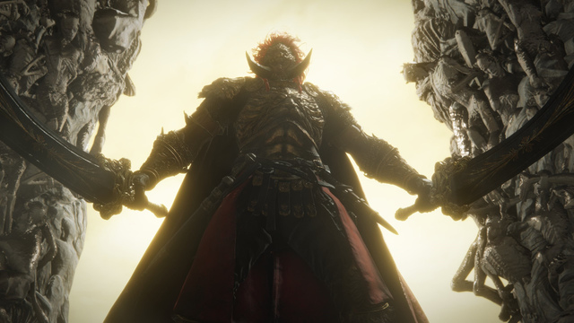

提取要点：肩部和双剑构成极宽横向轮廓；头部相对身体偏小；剑尖接近地面，使待机姿势持续带有重量。Minecraft 模型不要把腿做得过细，否则在第三人称中会像悬浮上身。

### 第二阶段双人轮廓

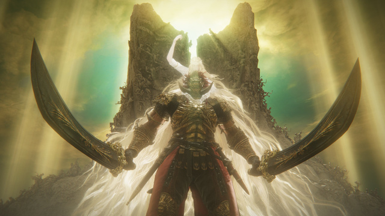

提取要点：米凯拉位于肩线之后，头部高于拉塔恩约半个头；白金发丝形成第二层披风，并在双臂外侧留下透空区。四臂姿势应形成稳定的环抱构图，不与拉塔恩持剑手臂混成一团。

### 蒙格容器与角质细节

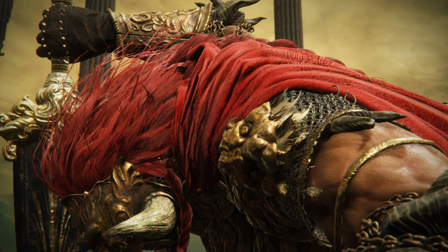

提取要点：角从裸露皮肤和甲缝中不规则穿出，不应做成左右完全镜像的装饰。纹理使用暗棕根部、灰白尖端，数量控制在能从 8 格外读出的 6-10 个大形体，细小角只画入贴图。

### 神之门与竞技场构图

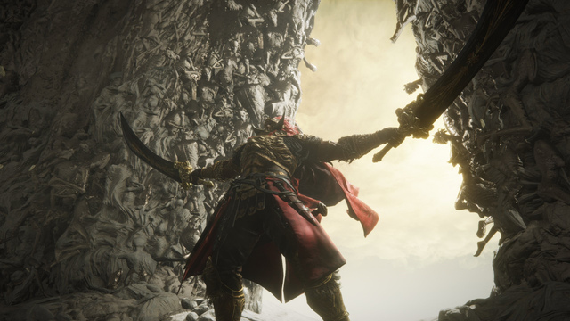

提取要点：场地几乎无掩体，神门是唯一垂直地标；地面为低饱和灰白，角色红金配色因此突出。Minecraft 竞技场应避免真实尸体堆砌，改用原创的风化石灰岩、灰烬和根系浮雕。

### 面甲、红鬃与铠甲层次

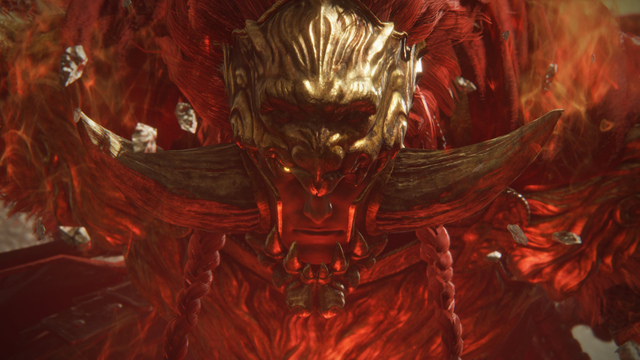

提取要点：红发从金属头饰后方形成放射状鬃毛；胸甲和肩甲不是同一明度，轮廓边缘以旧金勾勒。面部必须在近战视距保持阴影和克制，避免高亮眼睛抢走招式提示。

### 米凯拉发丝与附身关系

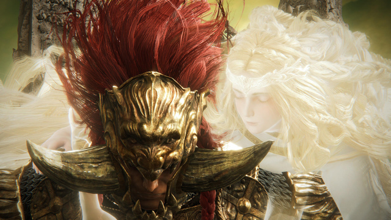

提取要点：发丝是最亮的大面积材质，但主体仍有暖金与象牙白层次；米凯拉的手臂环绕拉塔恩而非独立战斗。长发不能遮住双剑起手和玩家视野，近距离时应降低不透明度或隐藏靠镜头的发束。

### 战区地表与神之门基座

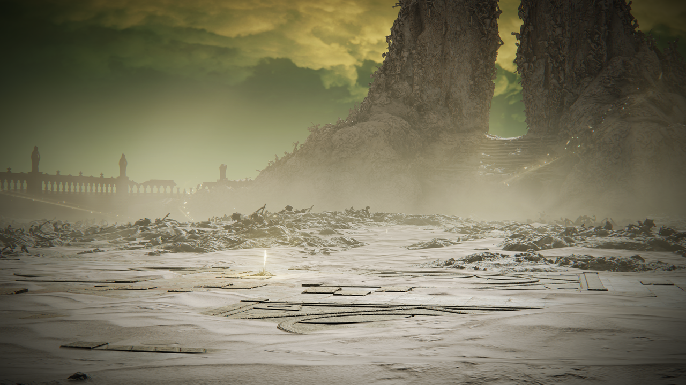

提取要点：核心战区由近乎平坦的浅灰石板与薄灰覆盖层构成，圆弧嵌线只占局部；外围堆积成低矮不规则脊线，神之门基座从地表缓慢抬升。Minecraft 场心应保持低纹理密度，碰撞高度变化集中到外环。

### 神之门与场地正面全景

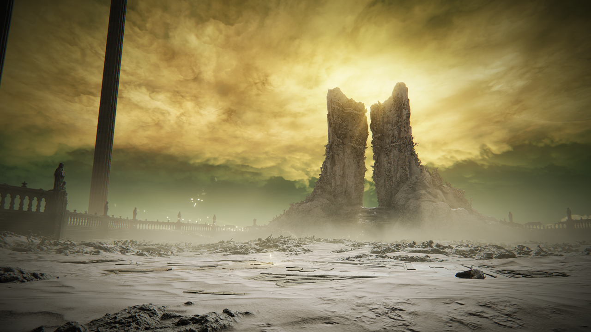

提取要点：神之门位于竞技场单一主轴上，由两块不对称竖直体和中央狭缝构成；边界栏杆压低在地平线附近，不与门体争夺轮廓。金黄天空提供强逆光，门体本身仍保持灰白与暗褐，不做高亮金色实体。

### 战斗中的门缝逆光与地表残骸

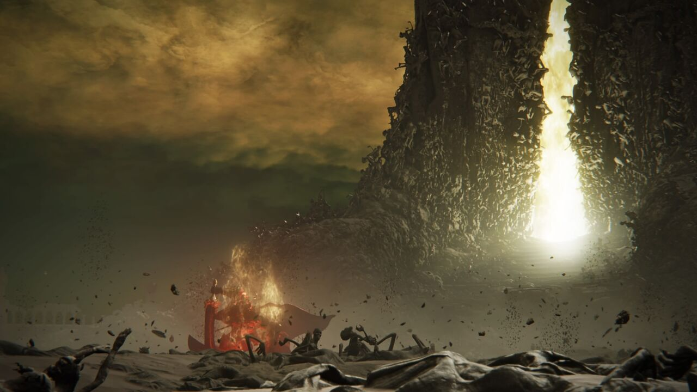

提取要点：战斗视角下，中央门缝是最亮区域，地表外缘存在低矮、杂乱但不可作为掩体的残骸脊。角色与技能特效必须始终能在灰白地面和金色逆光之间保持清晰边缘。

### 神之门表面与台阶

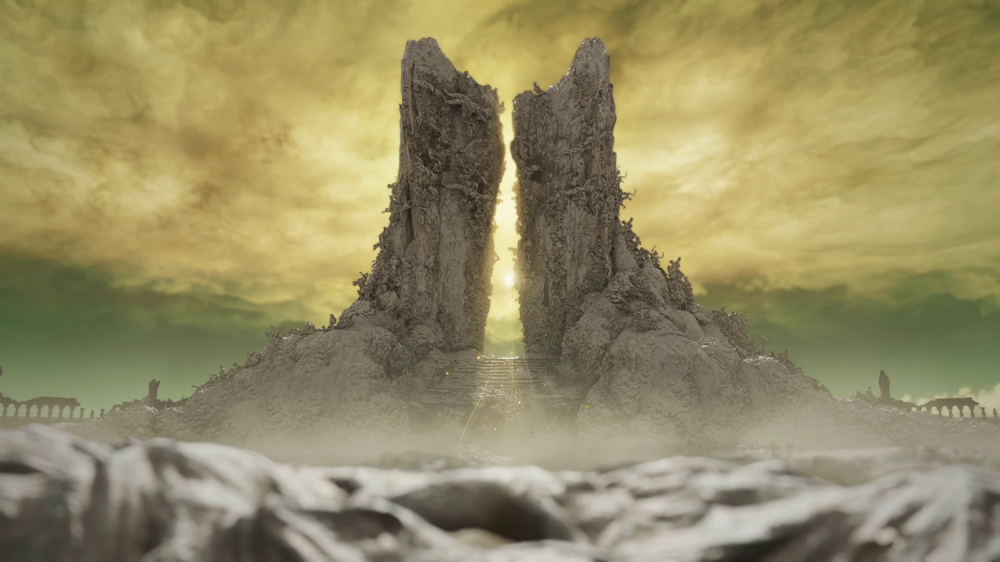

提取要点：门体不是规则石柱，而是由密集有机形体构成的侵蚀状巨块；中央台阶短而陡，门缝后方为近白光源。正式资产不能复制尸骸形体，应改译为风化石、角质枝纹和抽象人形负刻。

### 神之门前阶梯与铺地模块

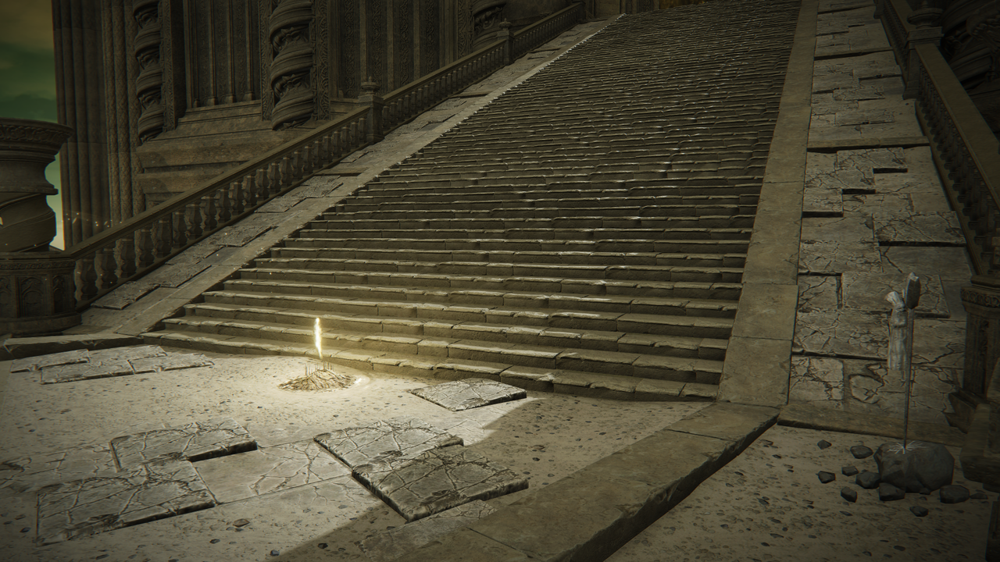

提取要点：宽阶梯由窄踏步、破损边板和双侧栏杆组成；阶前铺地使用大尺寸开裂石板与浅色填缝。该图用于入口/出口构造和方块模块设计，不把完整长阶梯放入 Boss 核心战区。

### 恩尼尔·伊利姆远景建筑语汇

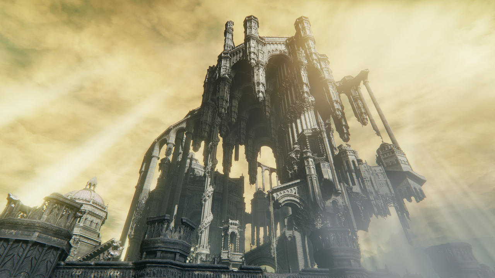

提取要点：区域以高耸拱架、细长柱、悬空体量和金色天空形成垂直感。Boss 场地应只在边界外使用这些远景轮廓；核心圆盘保持开阔，避免把区域建筑密度直接搬入战场。

## 3. 比例与轮廓

| 项目 | 建议规格 | 目的 |
| --- | --- | --- |
| 逻辑碰撞箱 | 宽 1.9 格，高 4.6 格 | 保证门洞和近战距离稳定 |
| 模型视觉高度 | 第一阶段 5.2 格；第二阶段 6.3 格 | 米凯拉附身后增加圣像感 |
| 肩宽 | 2.5-2.8 格 | 建立横向压迫感，但不扩大逻辑碰撞 |
| 单剑长度 | 3.6-4.0 格 | 保留巨剑夸张比例；判定仍由服务端定义 |
| 米凯拉高度 | 从鞍点起约 2.4 格 | 保证头部和光环高于拉塔恩 |
| 披风最大展开 | 2.8 格 | 不能覆盖左右剑尖定位骨骼 |

正面缩略图测试必须同时读出「双剑、宽肩、红鬃」；第二阶段再增加「白金发幕、四臂、光环」。去掉纹理后仍应通过剪影区分两个阶段。

## 4. 模型与骨骼

推荐以 16 像素/格为基础密度，英雄部位局部提高到 32 像素/格。模型由一个实体渲染，米凯拉作为可显隐骨骼层挂在 `miquella_root`，避免阶段转换更换实体导致生命、仇恨或动画不同步。

最低骨骼表：

| 骨骼组 | 必需骨骼 | 备注 |
| --- | --- | --- |
| 根与躯干 | `root`、`control`、`pelvis`、`body`、`chest`、`neck`、`head` | `control` 只做整体受控位移 |
| 拉塔恩手臂 | `upper_arm_l/r`、`forearm_l/r`、`hand_l/r` | 双剑动作不可共用镜像曲线 |
| 拉塔恩腿部 | `thigh_l/r`、`shin_l/r`、`foot_l/r` | 下砸前必须表现重心变化 |
| 武器 | `sword_l/r`、`blade_root_l/r`、`blade_tip_l/r` | 根/尖定位骨骼用于拖尾采样 |
| 次级部件 | `cape`、`hair_main`、`hair_lock_01..06` | 使用有限关键帧，不做实时布料 |
| 米凯拉 | `miquella_root`、`miquella_body/head`、四组上臂/前臂/手 | 四臂动作保持低频、平稳 |
| 神性标志 | `halo` | 米凯拉光环使用独立半透明材质 |

模型面数不是唯一预算，但建议 Boss 本体不超过约 450 个 cube，米凯拉与发丝不超过约 220 个 cube。透明面只用于发丝边缘与光环，不在铠甲上叠多层半透明贴图。

## 5. 材质与配色

建议调色板是实现目标，不是从截图直接取样：

| 材质 | 主色 | 阴影 | 高光 | 表面特征 |
| --- | --- | --- | --- | --- |
| 黑铁双剑 | `#25262A` | `#111216` | `#6B6253` | 冷黑底、磨损边、低光泽 |
| 旧金甲片 | `#9B793E` | `#4C3923` | `#D0B56C` | 不均匀氧化，避免亮黄塑料感 |
| 红鬃/披风 | `#7C2924` | `#351719` | `#B24B35` | 发丝偏暗红，披风略偏棕 |
| 角质 | `#7B6A58` | `#352E2B` | `#BDB29C` | 根深尖浅，表面有横向生长纹 |
| 米凯拉发丝 | `#E8D9A5` | `#A88E58` | `#FFF2C8` | 不使用纯白大平面 |
| 圣光核心 | `#FFF4C7` | `#D4A84F` | `#FFFFFF` | 核心白、边缘金、短暂而锐利 |
| 重力能量 | `#5B2D86` | `#1A1027` | `#B57BE3` | 深色占比高，粒子向内旋转 |
| 血焰 | `#8F1826` | `#25080E` | `#E85C45` | 地裂先暗红，爆发瞬间橙红 |

纹理组建议：本体 256×256、米凯拉 128×128、双剑 128×128、发光遮罩各自同尺寸。若渲染管线不支持独立 emissive，必须准备无自发光降级版本，不能用全亮度实体替代。

## 6. 动画语言

### 6.1 共通原则

- 前摇先移动身体重心，再移动剑；只转剑会显得轻且难读。
- 左右手起手必须在前 6 tick 内形成明显不对称轮廓。
- 任何高速位移前至少显示一种稳定信号：双剑并拢、重力紫光或圣光蓄积。
- `ACTIVE` 段的剑刃轨迹必须穿过对应服务端判定体；允许视觉略宽，不允许视觉明显短于判定。
- 大招后摇要让玩家辨认安全输出窗口，不使用待机动画提前覆盖。

### 6.2 必做动画清单

| 动画 | 最低要求 | 关键姿势 |
| --- | --- | --- |
| 待机/行走/转身 | 两阶段各一套上身层 | 双剑低垂、披风延迟、转身先动脚 |
| 左起与右起连段 | 独立曲线 | 起手肩、剑尖方向一眼可分 |
| 狮子斩与二连 | 起跳、翻身、落地、拔剑 | 二连重新蓄力，不复用第一击落地帧 |
| 唤星 | 合剑、引力、下砸 | 合剑时紫色核心位于胸前 |
| 重力陨石 | 铲地、举岩、后跃、发射 | 岩块先升高再追踪，不能凭空出现 |
| 阶段转换 | 离场、米凯拉显现、陨落回归 | 140 tick 全流程与服务端锚点一致 |
| 三类光速斩 | 纵斩、直线突贯、侧闪 | 分身只是残影，本体落点更亮 |
| 王者连舞 | 双斩、旋身、升空、十字落地 | 每次光柱晚于剑击出现 |
| 大荒星陨 | 升空、消失、回归、起身 | 场地提示承担主要可读性 |
| 硬直眩晕/死亡 | 完整独立动画 | 眩晕期间完整停止攻击和移动，不设置交互点 |

## 7. 特效规范

### 重力

先显示环境变化，再显示伤害：碎屑轻微离地、紫黑流线向中心弯曲、核心压暗，最后才出现冲击。重力拉扯不应用大片不透明雾遮挡玩家脚下位置。

### 圣光回响

光柱由三层组成：地面细金线预警、半透明象牙外柱、短暂白色核心。预警线必须在低粒子设置下保留。光柱消散从核心向上收束，不留下长时间全屏泛白。

### 瞬间防御提示

可瞬间防御的本体武器攻击在命中前至少 6 tick 将对应剑刃或攻击方向切换为 `#FF2020` 三段式脉冲，并播放独立提示音。红光必须覆盖完整有效剑侧，不能只在粒子密度高时可见；成功瞬间防御使用白色窄环和高频金属音。分身、重力范围、血焰爆燃、圣光回响和其他不可瞬间防御效果不得使用同形红色轮廓。

### 分身

分身以低饱和金白剪影表现，不渲染完整贴图细节；出生到命中不超过 12 tick，命中后 4 tick 内消失。本体使用红披风和黑铁剑保持可辨，不让玩家误认真正伤害源。

### 大荒星陨

地面星图必须明确显示核心圈与外环边界。摄像机震动只在落地后触发，默认强度可在客户端降到 0；不得依赖震动传达危险。

### 着色器实施约束

- 每个效果只读取 `action_id`、`action_tick`、`action_seed`、骨骼矩阵、锁定后的世界坐标和客户端画质档；不得读取粒子是否碰到玩家来触发结算。
- 固定使用四类渲染通道：世界空间 SDF 地面预警、骨骼采样刀轨、轮廓/残影、低密度体积与折射。预警通道优先级最高，关闭粒子后仍必须绘制。
- 半透明对象启用深度测试和软交界淡出，不隔墙显示目标轮廓；重力折射最大屏幕偏移为 2 像素，圣光白色核心最长持续 2 tick。
- 颜色和透明度曲线由动作时间轴驱动，随机数只改变碎屑、噪声和边缘破碎，不得改变落点、方向、范围或生效时刻。
- 低画质降级顺序为体积雾、次级碎屑、额外残影、折射；地面边界、剑轨主边、分身进攻线和核心/外环边界不可关闭。

### 技能指示器视觉语法

指示器形状和时序以[Boss 技能指示器设计规范](../indicators/boss-skill-indicators.md)为准。下表颜色均为基准色，最终 alpha 必须乘唯一 common 配置中的 `indicators.opacity`；不得在约定之王子树重复定义透明度。

| 语汇 | 主色 | 线型与填充 | 不依赖颜色的识别特征 |
| --- | --- | --- | --- |
| 本体物理剑技 | `#C9B98B` | 暗金实线边框、低亮扇区/胶囊填充 | 双剑侧向箭头和交叉刻线 |
| 重力 | `#6F3A91` | 紫黑双线、向内流动纹理 | 向心箭头、双圈和旋涡刻线 |
| 血焰 | `#A72B32` | 暗红虚线裂痕、爆燃倒计时填充 | 锯齿边和由两端向中心的收缩线 |
| 米凯拉圣光 | `#F1D78A` | 象牙填充、浅金实线、短白色核心 | 同心环、竖线与由内向外的脉冲 |
| 分身攻击 | `#D6C58E` | 低 alpha 窄线，不绘制实体形状填充 | 编号刻线与固定左右/中线顺序 |
| 无伤害位移/拉扯 | `#9188A0` | 空心虚线路径或空心圆 | 箭头指向移动或拉扯方向 |
| 瞬间防御提示 | `#FF2020` | 仅本体武器/攻击方向三段脉冲 | 独立提示音；分身与范围魔法不使用 |

填充遵循深度遮挡；真实边框以 `indicators.occluded_outline_opacity_multiplier` 的低透明度透视显示。神之门、拉塔恩模型或玩家遮挡时不得透视显示整块填充、分身轮廓或圣光体积。

## 8. 竞技场与 UI

竞技场地表使用灰白石、浅灰灰烬和少量暗金嵌线，禁止可误认成血焰裂痕或圣光预警的常亮红线/金线。中心 34 格半径保持近似平坦且不放高于半格的装饰，34-40 格边界带允许 1-2 格高的可破坏残垣，但不能成为永久卡位点。场地净高至少 28 格；神之门、雾门和锚点以[竞技场 NBT 结构规范](../arenas/promised-consort-arena.md)为准。

Boss 条分两行：上行为生命与固定名称「约定之王」，下行为细硬直值条。第二阶段只更新米凯拉附身图标，不修改 Boss 名称。色盲可读性依靠形状、线型和运动方向，不只依赖紫/金色差。

## 9. 音频方向

音效采用原创录制或明确可商用授权素材，不截取原作音频。四类声音要保持频段分工：双剑为低中频金属和风切；重力为低频脉冲与反向吸气；血焰为短促裂响；米凯拉圣光为高频合唱质感和玻璃泛音。每个高威胁技能在命中前至少有一个不与其他技能共用的识别音。

### 9.1 台词字幕与非语言音效

完整台词只显示字幕，不制作米凯拉或拉塔恩的对白录音，也不要求口型、头部配合、四臂呼吸或额外模型动画。拉塔恩的入场/胜利战吼、喘息、受击和倒地短音必须保留；这些非语言音效使用标准声音事件，且瞬间防御提示音始终拥有更高混音优先级。完整事件、说话者、字幕文本与语言资源键以[Boss 台词字幕与非语言音效规范](../dialogue/boss-voice-lines.md)为准。

## 10. 美术交付清单

最终 Boss 模型和竞技场建筑均等待用户后续提供；本节继续保留完整资产合同，后续接入时按表验收。当前不创建竞技场 NBT 或临时替代建筑。

| 资产 | 格式 | 验收 |
| --- | --- | --- |
| Boss 模型与骨骼 | Blockbench 工程 + GeckoLib geo JSON | 两阶段共享根骨，命名符合第 4 节 |
| 纹理 | PNG | 无原作贴图拷贝；含发光与无发光版本 |
| 动画 | GeckoLib animation JSON | 覆盖第 6.2 节；时间轴与战斗规格一致 |
| 粒子图集 | PNG + 粒子 JSON | 普通/降低/最小三档均可读 |
| 技能指示器 | SDF 图集 + 世界空间几何 | 22 个技能 ID 映射完整；填充受遮挡、边框低透明透视；透明度 0.10/0.60/1.00 均可辨 |
| 音效 | OGG | 原创或授权记录完整；无爆音和超长静音 |
| 台词字幕 | 语言资源 + 字幕布局 | 米凯拉台词说话者正确；无需对白 OGG 或口型动画；拉塔恩战吼使用独立非语言音效 |
| 竞技场建筑 | 分片 NBT 结构 + 方块标签 | 核心战区平整，片段无接缝，神之门和所有数据标记合法 |
| UI 图标 | PNG | 硬直值与阶段状态在 1× GUI 比例可辨 |

发布前必须执行一次素材来源审计，并确认 `docs/assets/reference/` 未被打包进运行时资源与发布构件。