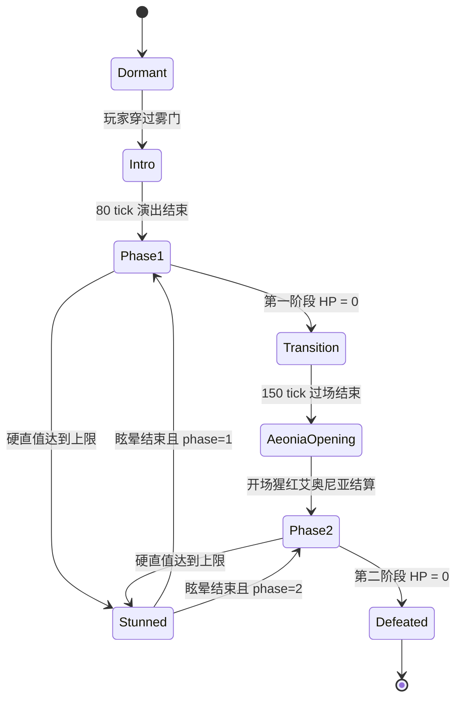

# 腐败女神：可实现战斗规格

> 文档状态：初版实现基线  
> 目标平台：Forge 1.20.1（Java 17）与 NeoForge 1.21.1（Java 21）  
> 平衡对象：原版终局装备的 1-4 名玩家  
> 游戏内显示名称：腐败女神  
> Boss ID：`elder_bosses:malenia`  
> 资料核对日期：2026-09-07

## 1. 设计目标

本 Boss 还原《艾尔登法环》中马莲尼亚的四个核心身份：会因命中而恢复生命的决斗者、能被压制但会以高机动反夺节奏的剑士、水鸟乱舞的连续追击，以及第二阶段以腐败之翼和猩红花重塑战场的女神。

Minecraft 改编不复制原作帧数与近身无解场面。实现优先级如下：

1. 每次危险动作都能从义手火花、身体重心、腾空高度或腐败花苞判断。
2. 命中回血惩罚错误，但不能因多人同时被一刀扫中而成倍恢复。
3. 水鸟乱舞保持原作 Boss 版四次追踪爆发和高速剑风，同时提供可靠的跑离、穿越与格挡反制。
4. 第一阶段是克制的地面决斗；第二阶段提高进攻密度，并以腐败区域迫使玩家换位。
5. 普通单次命中不直接击杀满状态终局玩家，致命性来自连续失误和猩红腐败积累。
6. 生命、回血、腐败、动作时序、判定、选招和腐败区域上限中的可调项由唯一 common 配置中的服务端权威值控制；固定资源 ID、开战快照和多人单次伤害倍率由程序固定。

全部 15 个技能额外提供 `cast_speed_multiplier` 与 `range_multiplier`。默认只将慢速技能提速约 30%-50%，所有技能范围扩大 20%-50%；倍率同时作用于服务端命中、受控位移和客户端预警。客户端 VFX 依据动作快照生成剑气、轨迹、猩红孢子、花环、俯冲残影和冲击效果，预算由 `[skill_vfx]` 控制。

## 2. 原作事实与改编决策

### 2.1 角色设定摘要

- 马莲尼亚是玛莉卡与拉达冈的女儿，也是米凯拉的孪生妹妹。两人同为具有成神资格的神人，却分别承受猩红腐败与永恒幼年的先天缺陷。
- 腐败从体内持续侵蚀马莲尼亚，使她失去右臂、左腿和右足，并蔓延至眼部。她使用工艺精密的无垢金义肢与内置长刀战斗；身体残缺不应在动画中表现成笨重或迟缓。
- 一名曾封印腐败外神的盲眼剑士成为她的导师。流水般的剑术让她以平衡、步法和连续轨迹抵抗体内腐败，也形成水鸟乱舞的动作根基。
- 马莲尼亚自称米凯拉之刃，以保护兄长及其圣树计划为使命。无垢金甲胄既是身份标志，也呼应米凯拉试图压制外神影响的研究。
- 破碎战争中，她率军南下并与拉塔恩在盖利德决战。首次大规模绽放使盖利德化为腐败之地，也令她陷入昏迷；尊腐骑士芬雷独自将她带回圣树。
- 她在圣树根部等待失踪的米凯拉。第一阶段的克制与观察应表现长久沉睡后仍然精确的守护者；第二阶段则是她再次放弃压制、让腐败绽放后的失控神性。
- 猩红艾奥尼亚的物品叙事称花已绽放两次，第三次将使她成为真正女神。原作 Boss 战仍以「腐败女神」第二阶段结束，本项目不据此增加未经确认的第三阶段。

叙事演出应避免把她简化为嗜战或纯粹瘟疫怪物。她的主题是以训练、义肢和无垢金长期对抗自身诅咒，却在决定性的战斗中选择释放它；胜利后的固化花芯同时表达威胁、休眠和未完成的转化。

### 2.2 机制对照

| 项目 | 经资料核对的原作信息 | 本项目决策 |
| --- | --- | --- |
| 战斗结构 | 第一阶段 18,473 HP；归零后过场；第二阶段 14,778 HP，约为第一阶段的 80% | 使用两条独立生命池；第一阶段归零后无掉落，第二阶段以阶段生命上限的 80% 开始并可回满 |
| 命中恢复 | 每次成功攻击都会恢复生命，被盾牌格挡也会恢复 | 保留格挡回血；每个攻击段只恢复一次，并设置动作上限和时间窗上限 |
| 防御与韧性 | 两阶段防御 125、韧性 80；需三次成功弹反才失衡 | 玩家造成的实际生命损失按比例转为硬直值，积满后打断动作并进入眩晕；距离越远倍率越低 |
| 战斗台词 | 入场、阶段转换、击败玩家和战败有标志性对白 | 保留关键叙事节点与克制语气，只显示本项目原创字幕，不制作对白录音或口型 |
| 异常倾向 | 火焰抗性最低；流血与冻伤相对有效；腐败/中毒抗性极高；免疫癫狂 | 保留为固定异常规则，不开放为 Malenia 配置或战斗快照 |
| 水鸟乱舞 | Boss 版腾空后进行四次高速斩击爆发，每次都会追向玩家；玩家武器版才是三组输入、十次斩击与末段剑风 | 实现四次独立追踪爆发；每次爆发开始前重新取得目标，爆发内限制转向并限制实际命中次数；不把玩家武器版的独立终末剑风套给 Boss |
| 第二阶段开场 | 固定使用猩红艾奥尼亚 | 阶段转换结束后强制开花，落点警示后不再追踪 |
| 第二阶段能力 | 保留一阶段剑技，新增腐败俯冲、飞斩和多个幻影 | 共用地面剑技池，加入独立空中动作槽与腐败积累 |
| 腐败绽放 | 花每次绽放都会推进腐败，第三次将成为真正的女神 | 作为叙事与阶段视觉依据；单场战斗不增加隐藏第三阶段 |

原作数据只用于行为、节奏和视觉研究。以下 Minecraft 数值为原创改编参数，不是原作伤害换算。

## 3. 统一数值口径

### 3.1 伤害公式

所有生命伤害只允许使用以下形式：

`最终基础伤害 = 固定值 + Boss 当前 ATTACK_DAMAGE × 攻击力百分比`

文档统一写成 `固定值 + 攻击力百分比`，例如 `2 + 55%`。默认 `ATTACK_DAMAGE = 20`。公式求值后再进入 Minecraft 护甲、抗性、附魔、格挡和效果结算。禁止按目标当前生命、最大生命或玩家数量暗中追加伤害。

每个生命伤害事件必须声明结算通道。常规物理、斩击、打击、突刺和流血触发伤害统一为`物理`，进入 Minecraft 护甲、抗性与附魔结算；魔法、圣属性和霜冻触发伤害统一为`魔法`，绕过护甲，但仍接受魔法通道倍率与其他合法减伤。护甲规则由 `DamageChannel` 与伤害类型标签固定，不提供独立配置开关。原来源标签仅用于特效、积累和来源倍率，不再创建独立伤害类型。火焰、雷电、毒、猩红腐败、睡眠和癫狂规则保持独立。

Boss 受击分类只读取 `elder_bosses` 命名空间下的伤害类型标签。数据包可在保持 `replace: false` 的前提下向 `magic`、`holy`、`pierce`、`bleed_trigger`、`frost_trigger`、`fire`、`lightning`、`forced_death` 或 `bypasses_boss_scaling` 追加自定义伤害类型；其中 `bypasses_boss_scaling` 聚合原版 `#minecraft:bypasses_invulnerability` 与 `#elder_bosses:forced_death`。`#minecraft:bypasses_armor` 不整体视为魔法，未被上述分类标签收录的伤害按常规物理处理。

物理伤害与腐败伤害必须拆成独立事件，例如 `3 + 65%（物理）` 与 `0 + 15%（腐败）`。同一攻击段共享命中去重 ID。腐败积累不是生命伤害，以独立积累值显示。

### 3.2 默认基础属性

| 属性 | 默认值 | 备注 |
| --- | ---: | --- |
| 第一阶段最大生命 | 900 | 归零触发阶段转换，不触发死亡结算 |
| 第二阶段最大生命 | 900 | 转换完成时从 720，即 80% 开始 |
| ATTACK_DAMAGE | 20 | 所有生命伤害与回血公式的攻击力来源 |
| 移动速度 | 0.34 | 常规追步；冲刺和腾空使用受控位移 |
| 跟随范围 | 56 格 | 只在竞技场内选取目标 |
| 击退抗性 | 0.75 | 普通动作可被重击打断；霸体动作覆盖为 1.0 |
| 伤害转硬直比例 | 75% | 按 Boss 实际损失生命计算，可配置 |
| 硬直值上限 | 当前阶段最大生命的 10% | 使用多人缩放后的阶段生命上限 |
| 硬直衰减延迟 | 120 tick | 最后一次有效硬直积累后计时 |
| 硬直衰减速度 | 每 tick 1.5 | 延迟结束后降至 0 |
| 逻辑碰撞箱 | 宽 0.9、高 2.9 格 | 腐败之翼不扩大逻辑碰撞箱 |

### 3.3 多人缩放

开战时记录竞技场内非旁观、存活且非创造模式的玩家数 `N`，限制在 1-4：

`每阶段最大生命倍率 = 1 + 50% × (N - 1)`

| 有效玩家数 | 第一阶段生命 | 第二阶段上限 / 开场生命 | 每阶段硬直值上限 | 招式伤害倍率 |
| ---: | ---: | ---: | ---: | ---: |
| 1 | 900 | 900 / 720 | 90 | 1.00 |
| 2 | 1350 | 1350 / 1080 | 135 | 1.00 |
| 3 | 1800 | 1800 / 1440 | 180 | 1.00 |
| 4 | 2250 | 2250 / 1800 | 225 | 1.00 |

新玩家中途进入时按差额增加当前阶段最大生命和当前生命；玩家离开不会降低当前最大生命。回血上限只按玩家数小幅增加，不按一次挥剑命中的玩家数增加。

### 3.4 抗性与异常

| 类别 | 第一阶段倍率 | 第二阶段倍率 | 实现说明 |
| --- | ---: | ---: | --- |
| 物理 | 0.90 | 0.90 | 常规物理、突刺和流血触发伤害；受到护甲影响 |
| 魔法 | 0.80 | 0.80 | 魔法、圣属性和霜冻触发伤害；不受护甲影响 |
| 火焰 | 1.00 | 1.00 | 原作最低元素抗性，作为明确弱点 |
| 雷电 | 0.80 | 0.80 | 竞技场浅水不额外放大雷电伤害 |
| 圣属性来源 | 0.60 | 0.60 | 进入魔法通道后应用 0.75 来源倍率，维持原有效承伤 |
| 中毒 | 0.20 | 0.20 | 极高积累抗性，但不完全免疫 |
| 猩红腐败 | 容量 1000 | 容量 1000 | 使用独立容量 Attribute 表示极高积累抗性，不提供免疫 |
| 流血 | 0.75 | 0.75 | 积累倍率；触发的生命伤害进入物理通道 |
| 霜冻 | 0.85 | 0.85 | 积累倍率；触发的生命伤害进入魔法通道，减速不破坏受控位移 |
| 睡眠 | 0.35 | 0.35 | 触发后只造成 40 tick 失衡，不进入无限睡眠 |
| 癫狂 | 0.00 | 0.00 | 完全免疫 |

## 4. 命中回血

### 4.1 回血公式

回血也采用可审计的二元表达：

`单次恢复 = 固定值 + Boss 当前 ATTACK_DAMAGE × 恢复百分比`

| 命中类别 | 默认恢复 | 备注 |
| --- | --- | --- |
| 常规剑击、踢击 | `1 + 6%` | 默认值为 2.2 生命 |
| 重击、突刺终结 | `2 + 8%` | 默认值为 3.6 生命 |
| 水鸟乱舞单个有效命中 | `0 + 4%` | 默认值为 0.8，整招另有上限 |
| 抓取完整命中 | `3 + 10%` | 默认值为 5 生命，只在抓取摔落完成时恢复一次 |
| 腐败爆炸、持续区域、幻影 | `0 + 0%` | 非本体武器接触，不触发回血 |

### 4.2 合法触发与上限

- 只有服务端确认的本体剑、义手或腿部攻击命中合法目标时触发；投射物、腐败云和表现分身不触发。
- 被盾牌格挡仍视为命中并按 100% 恢复，这是 Boss 身份机制；无敌帧、旁观、创造模式和完全未接触不恢复。
- 同一攻击段扫中多个目标只恢复一次，取该段最高的单目标恢复值。
- 默认单动作恢复上限为 16；任意连续 100 tick 的总恢复上限为 `36 × [1 + 15% × (N - 1)]`。
- 当前阶段生命不能超过该阶段上限；第一阶段生命不能跨阶段保存，第二阶段独立计算。
- 玩家、普通非敌对生物、驯服生物、召唤物和盔甲架分别受对应配置开关控制；召唤物通过 `elder_bosses:malenia_healing_summons` 实体类型标签分类。实体类型一旦加入 `elder_bosses:malenia_healing_excluded`，无论其他治疗开关如何配置都不能成为回血来源；同阵营实体永远不作为攻击或回血目标。
- 生命条上的恢复以 10 tick 粉红预测段显示，然后平滑填充，帮助玩家理解回合得失。

该上限是 Minecraft 公平性改编。它保留「格挡也会让她恢复」的压力，但避免多人站位失误让一次范围斩按四名玩家结算四次回血。

## 5. 猩红腐败系统

原版 Minecraft 没有对应状态，本项目使用服务端权威的 `scarlet_rot` 积累条：

| 参数 | 默认值 |
| --- | ---: |
| 腐败容量属性 | `elder_bosses:scarlet_rot_capacity = 100` |
| 未继续积累的衰减延迟 | 60 tick |
| 延迟后衰减速度 | 每 20 tick 减少 8 |
| 触发持续时间 | 120 tick |
| 持续伤害间隔 | 20 tick |
| 每次持续伤害 | `0 + 10%（腐败）` |
| 治疗削弱 | 30% |
| 移动速度削弱 | 10% |

所有 `LivingEntity` 都能积累并触发猩红腐败。容量只由实体自身的 `elder_bosses:scarlet_rot_capacity` 属性决定，默认 100，独立于最大生命、当前生命、护甲、攻击力和其他属性，不因这些属性变化而缩放。容量不属于 common 配置或战斗快照；common 配置只保留腐败衰减、持续、伤害、减疗、减速和净化规则。

腐败伤害共结算 6 次，每次都明确为 `0 + 10%（腐败）`。饮用蜂蜜清除 25 点积累但不移除已触发状态；净化物固定为已注册的 `elder_bosses:golden_needle` 金针，完成 32 tick 使用动作后清除全部积累和已触发状态，默认消耗 1 个。使用时长和是否消耗由 common 配置中的服务端权威值控制；净化物资源 ID 不参与配置或热重载。

Boss 自身的 `elder_bosses:scarlet_rot_capacity` 基础值为 1000，用容量表达既有的 0.10 相对积累抗性；触发后与其他 `LivingEntity` 一样受到伤害、减疗和减速，不存在隐藏免疫或独立倍率。

## 6. 战斗空间与目标规则

最终竞技场将由服务端从数据包放置 NBT 结构模板，建筑资产表现为半径 26 格、净高至少 18 格的近圆形圣树根系盆地：中心最低，8-18 格半径缓升 1 格，18-24 格半径升至 3 格，外围根岸最高升至 5 格。中心浅水只作视觉层，不改变移动速度、火焰伤害或雷电伤害。建筑资产和放置链路不属于当前实装范围，当前不创建临时场地；模板 ID、分片、数据标记、坐标和后续放置流程仍完整保留在[马莲尼亚竞技场 NBT 结构规范](../arenas/malenia-arena.md)。

马莲尼亚的导航和受控位移始终把目标点投影到服务端高度图，不因盆地高差降低冲刺距离、腾空高度或水鸟速度；在竞技场内免疫摔落伤害，并允许按动作需要破坏白名单方块或短时忽略方块碰撞，但不能越过受保护的场地边界。

| 距离带 | 范围 | 主要行为 |
| --- | --- | --- |
| 贴身 | 0-2.5 格 | 踢击、横斩、后撤、快速四连 |
| 近距 | 2.5-6 格 | 基础连段、上挑、抓取、突刺 |
| 中距 | 6-12 格 | 跑斩、延迟突刺、水鸟乱舞候选 |
| 远距 | 12-26 格 | 追步、飞斩、腐败幻影、缩短距离 |

Boss 每 15 tick 重评主目标。分数默认由距离 45%、最近 8 秒输出 35%、正在使用物品 10%、最近打断她的玩家 10% 组成。水鸟乱舞每轮锁定一次位置，不能在同一轮逐 tick 修正目标；猩红艾奥尼亚显示落点后停止追踪。

## 7. 服务端权威状态机

| 状态 | 持续 | 可受伤 | 可移动 | 关键规则 |
| --- | ---: | --- | --- | --- |
| `DORMANT` | 直到开战 | 否 | 否 | 不显示 Boss 条，不运行 AI |
| `INTRO` | 80 tick | 否 | 否 | 从树根座椅起身、装配义手刀、关闭雾门；第 20 tick 显示入场字幕 |
| `PHASE_1` | 第一条生命 | 是 | 是 | 克制地面剑术、反应式后撤和水鸟乱舞 |
| `TRANSITION` | 150 tick | 否 | 受控 | 拦截死亡、清理动作、展开腐败之翼、建立第二生命池 |
| `AEONIA_OPENING` | 100 tick | 部分时段否 | 受控 | 第二阶段固定开场花，不进入随机技能池 |
| `PHASE_2` | 第二条生命 | 是 | 是 | 地面剑技、空中腐败动作与更高进攻密度 |
| `STUNNED` | 70 tick | 是 | 否 | 打断并清除当前动作；可正常受伤，无特殊伤害倍率；暂停回血 |
| `DEFEATED` | 160 tick | 否 | 否 | 第 28 tick 显示战败字幕，结束后固化猩红花、结算掉落、清除腐败区 |

每个动作使用 `WINDUP`、`ACTIVE`、`RECOVERY` 三段。服务端同步 `phase`、`combat_state`、`action_id`、`action_tick`、`action_seed`、`target_entity_id`、`stagger`、`stagger_capacity`、`phase_health`、`heal_budget`、`wings_visible`、`dialogue_event_id` 和 `dialogue_event_start_tick`。客户端只负责动画、拖尾、台词字幕、非语言音效、屏幕效果和粒子。

## 8. 通用选招与打断逻辑

### 8.1 第一阶段节奏

第一阶段有 15-35 tick 的观察步伐。马莲尼亚绕目标保持 4-7 格距离，不会持续贴脸挥刀。候选动作排除冷却未结束、距离不符、路径失败和最近两次使用的动作后再带权随机。

| 条件 | 权重变化 |
| --- | --- |
| 目标正在使用食物/药水且距离 4-10 格 | `RUNNING_SLASH`、`THRUST` 权重 ×1.7 |
| 目标连续持盾超过 40 tick | `KICK` 权重 ×1.8，`GRAB` 权重 ×1.4 |
| 两名以上玩家在 4 格内 | `RETREAT_SLASH` 权重 ×1.5；水鸟乱舞不额外增权 |
| 马莲尼亚在 100 tick 内被打断两次 | `KICK`、后撤和霸体动作权重 ×1.4 |
| 目标超过 12 格 | 跑斩和追步权重 ×1.6，不直接传送 |
| 水鸟乱舞已就绪但目标在 4 格内 | 优先后撤到至少 6 格再允许起手 |

### 8.2 第二阶段节奏

第二阶段观察间隔缩短为 8-20 tick，空中技能权重提高至 1.50 倍，但任何时刻只允许一个 `AIR_ACTION`。猩红艾奥尼亚、腐败幻影和水鸟乱舞共享「高威胁组冷却」：其中一个动作结束后至少 140 tick 才能使用另一个。

### 8.3 受击打断与霸体

- 每次服务端伤害结算完成后，读取 Boss 本次实际损失生命 `D`，硬直增量为 `D × 75% × 距离倍率`；被护甲、抗性或无敌完全抵消的伤害不产生硬直值。
- 同一命中 ID 拆出的物理、魔法或其他生命伤害分量先汇总实际生命损失，再只计算一次硬直增量，避免复合伤害重复享受转化比例。
- 距离取伤害来源实体到 Boss 碰撞箱最近点的水平距离，使用离散区间：不超过 4 格 ×1.00、大于 4 且不超过 8 格 ×0.70、大于 8 且不超过 16 格 ×0.40、大于 16 格 ×0.20。投射物使用命中时投射物位置，不按射手位置计算。
- 硬直值上限为当前阶段最大生命的 10%。阶段转换清空硬直值并按第二阶段最大生命重算上限；生命上限因新玩家加入而提高时，硬直上限同步提高，当前硬直值不按比例补偿。
- `KICK`、`WATERFOWL_DANCE` 的冲刺段、`SCARLET_AEONIA` 的下坠段和 `SCARLET_PHANTOMS` 具有霸体；霸体不免除硬直积累，只把进入 `STUNNED` 延迟到当前 `ACTIVE` 段结束，随后打断剩余动作。
- 同一攻击者、同一伤害来源在 5 tick 内只累计一次；持续伤害、环境伤害和非玩家阵营伤害不累计。实际生命损失、同一命中 ID 聚合以及只接受玩家及归属于玩家的来源均为服务端固定规则，不提供配置开关。
- 进入 `STUNNED` 后立即取消当前动作、清除当前动作判定和未触发的本体剑风，但不清除已经生成的腐败区。

## 9. 第一阶段技能规格

时序统一写作 `前摇 / 有效 / 后摇`，单位为 tick。每一伤害分量都是一次独立生命伤害事件。

| ID / 名称 | 时序 | 判定与行为 | 单次伤害（固定值 + ATK%） | 瞬间防御 | 冷却 |
| --- | --- | --- | --- | --- | ---: |
| `SINGLE_SLASH` 流水横斩 | 10 / 3 / 14 | 3.4 格、120°扇形 | `1 + 45%（物理）` | 可 | 28 |
| `DOUBLE_SLASH` 双重变向斩 | 11/3/6，9/3/18 | 左右两次 3.5 格扇形 | 每击 `1 + 42%（物理）` | 两击可 | 42 |
| `RAPID_SLASHES` 义手火花四连 | 14 / 18 / 22 | 火花后前三刀密集，第四刀延迟 | 前三击各 `0 + 34%（物理）`；终结 `2 + 50%（物理）` | 四击可 | 70 |
| `RUNNING_SLASH` 环身跑斩 | 16 / 4 / 18 | 侧向跑动后切入 6 格 | `2 + 55%（物理）` | 可 | 55 |
| `UPWARD_COMBO` 上挑落斩 | 18/4/8，14/5/24 | 上挑后短暂腾空，下劈半径 2.5 格 | 上挑 `2 + 50%（物理）`；落斩 `3 + 65%（物理）` | 两击可 | 90 |
| `KICK` 旋身踢 | 9 / 4 / 18 | 2.3 格、100°扇形；高盾牌冲击 | `2 + 42%（物理）` | 不可 | 50 |
| `THRUST` 延迟突刺 | 22 / 4 / 24 | 直线 7 格、宽 1.2 格 | `3 + 70%（物理）` | 可 | 85 |
| `GRAB_IMPALE` 义手擒拿 | 24 / 5 / 38 | 向前 5 格抓取；只锁单个玩家 | 抓取 `0 + 0%`；刺穿 `6 + 95%（物理）`；摔落 `2 + 35%（物理）` | 不可 | 180 |
| `RETREAT_SLASH` 后撤反斩 | 8 / 4 / 20 | 后撤 3 格同时扫前方 | `1 + 45%（物理）` | 可 | 65 |
| `WATERFOWL_DANCE` 水鸟乱舞 | 32 / 68 / 42 | 四次独立追踪爆发；沿每次实际移动轨迹作宽 3.5 格胶囊判定；详见第 10 节 | 每个有效命中 `0 + 22%（物理）` | 不可 | 320 |

### 9.1 第一阶段技能特效时间轴

客户端以 `action_id`、`action_tick` 和 `action_seed` 驱动特效。刀轨使用 `blade_root` 到 `blade_tip` 的采样带，地面预警使用有符号距离场（SDF），残影使用深度淡出；任何渲染通道都不得反向决定判定范围或命中时刻。

| 技能 | 前摇特效 | 有效段特效 | 后摇与着色器约束 |
| --- | --- | --- | --- |
| `SINGLE_SLASH` | 刀尖出现一条不发光的银灰细线，义手腕部在第 6 tick 闪一次暖金扣合光 | 沿 120°轨迹展开窄弧，弧首明亮、弧尾在 3 tick 内断裂 | 碎弧沿切线消散；使用刀刃 UV 扫描和深度交界淡出，不生成常驻地面纹 |
| `DOUBLE_SLASH` | 第一刀在身体左侧形成低位短弧，变向前右肩和刀尖各出现一次反向亮点 | 两道弧分别使用冷银与暖银边缘，第二道更宽但不提高不透明度 | 第一弧在第二刀前清空，避免合成圆球；镜像轨迹必须使用独立采样数据 |
| `RAPID_SLASHES` | 义手关节依次亮起三段环形遮罩，第 10-14 tick 在刀架处喷出短促金屑 | 前三刀为三条彼此留缝的窄白弧，末刀前清空画面，再展开一条带金边的宽弧 | 金屑受重力下坠，宽弧 6 tick 内从中心撕裂；禁止用全屏径向模糊代替刀轨 |
| `RUNNING_SLASH` | 脚下浅水产生偏向外侧的半月涟漪，披风边缘留下低透明位移残影 | 切入路径出现一条贴地风线，命中扇形只在刀刃经过时显亮 | 残影按世界坐标冻结并在 5 tick 内淡出；运动模糊只作用于 Boss 遮罩 |
| `UPWARD_COMBO` | 刀刃下方空气被压成竖向细带，脚边出现向内收拢的灰白月牙 | 上挑生成向上的螺旋窄带；落斩前地面显示 2.5 格断续圆环，触地时环向外压平 | 冲击尘不高于玩家腰部；圆环以 SDF 半径控制，不能用粒子数量暗示真实范围 |
| `KICK` | 支撑脚下出现短弧摩擦纹，踢击腿轮廓用暗金边缘强调，不显示刀光 | 接触方向喷出扁平扇形尘带；格挡时额外显示一次向盾面收缩的白色窄环 | 尘带 4 tick 内落地，屏幕震动不承担提示职责；不复用斩击材质 |
| `THRUST` | 刀尖前方显示长度逐步收紧的银色虚线，最后 6 tick 固定方向 | 有效段把虚线压成宽 0.12 格的高亮针线，末端出现一次菱形空气破口 | 针线从 Boss 端向外熄灭；使用世界空间线段 SDF，视觉长度不得短于 7 格判定 |
| `GRAB_IMPALE` | 左手周围出现三段向内闭合的暗金括号，前方 5 格仅显示低亮度抓取方向带 | 抓取成功后括号锁在目标外轮廓；刺穿时刀身出现一次白金脉冲，摔落时生成低矮尘环 | 锚定失败立即打散括号且不播放刺穿脉冲；目标遮罩不得透墙显示 |
| `RETREAT_SLASH` | 身后先出现退路风线，刀刃在胸前压成短亮边 | 位移残影向后拉伸，实际斩击弧朝前展开，二者颜色和运动方向明确相反 | 残影不超过两个采样层；墙体裁剪时同步缩短风线，不能穿出方块 |
| `WATERFOWL_DANCE` | 0-21 tick 脚边四层灰白环逐层上升，22 tick 取得第一爆发目标；后续爆发前分别重新取得目标 | 四次爆发均使用密集但可分段识别的环身剑风、位移方向线和清晰空拍；最后一次收束为更宽的环形剑风，但不增加独立伤害事件 | 每次爆发结束清除至少 70% 风线；低粒子模式仍保留当前爆发外环、方向缺口和移动边界 |

### 9.2 基础派生

`SINGLE_SLASH`、`DOUBLE_SLASH`、`RUNNING_SLASH` 可在命中或被格挡后派生，但一次动作链最多 4 个剑术段。目标离开 7 格或任一段完全挥空时，派生概率降到 0。第四段后必须进入至少 20 tick 后摇。

`RAPID_SLASHES` 前 14 tick 义手关节出现一次暖金火花并伴随金属扣合音，作为高速四连的固定预警。第四刀延迟至少 8 tick，不能与前三刀形成无法退出的连续硬直。

### 9.3 抓取

抓取前先后撤半格并把左手收到肩后。抓取判定只持续 5 tick；命中后将目标锚定在义手前方，20 tick 时结算 `6 + 95%（物理）`，30 tick 时结算 `2 + 35%（物理）` 并释放。抓取过程不会越过方块或竞技场边界；若位置校验失败则立即释放目标且不结算后续伤害。

## 10. 水鸟乱舞

### 10.1 触发限制

- 每个阶段开始后至少 260 tick 才能首次进入候选集。
- 第一阶段生命低于本阶段上限的 70% 后才允许首次使用；第二阶段开场花结束后至少 180 tick 才允许使用。
- 起手时与主目标至少相距 6 格；不足时先执行可打断的后撤准备，不从贴身瞬发。
- 与猩红艾奥尼亚、腐败幻影共享 140 tick 高威胁组冷却。
- 32 tick 腾空前摇期间翅状白色剑风由脚边向上收拢；最后 10 tick 不再转向。

### 10.2 四次爆发时间轴

| 动作 tick | 段 | 位移与追踪 | 视觉 | 每名玩家最大受击 |
| ---: | --- | --- | --- | ---: |
| 0-31 | 腾空预警 | 上升 2.2 格；22 tick 取得第一爆发目标 | 四层剑风逐步收拢 | 0 |
| 32-45 | 第一爆发 | 朝目标追击最多 7 格；爆发内限制最大转向角 | 密集环身剑风 | 2 |
| 46-49 | 间隔 | 悬停减速；46 tick 取得第二爆发目标 | 风线大幅淡出 | 0 |
| 50-61 | 第二爆发 | 朝新目标追击最多 6 格；允许越过目标 | 密集环身剑风 | 2 |
| 62-65 | 间隔 | 穿过目标后转身；62 tick 取得第三爆发目标 | 风线大幅淡出 | 0 |
| 66-77 | 第三爆发 | 朝新目标追击最多 5 格 | 密集环身剑风 | 2 |
| 78-81 | 间隔 | 悬停并在 78 tick 取得第四爆发目标 | 剑风向外展开 | 0 |
| 82-99 | 第四爆发 | 朝新目标追击最多 4 格并收束动作 | 更宽的环形剑风 | 1 |
| 100-141 | 后摇 | 落地并收刀 | 风线消散 | 0 |

每个有效命中造成 `0 + 22%（物理）`。同一玩家在前三个爆发中各最多承受两次、第四爆发最多一次，因此完整失误的理论上限仍为七次伤害事件。四次爆发及各自追踪来自原作 Boss 动作；具体 tick、位移上限、转向限制和命中上限是 Minecraft 可读性与平衡适配，不宣称为原作帧数据。

每次爆发以该爆发实际经过的服务端移动轨迹为线段建立胶囊判定，默认宽度为 3.5 格，由 `burst_width` 配置。路径受逐 tick 碰撞裁剪时，胶囊终点同步缩短，不使用预制视觉斩击轨迹代替实际位移。

### 10.3 反制与回血

- 跑离：看到腾空后持续远离可避开第一轮；轮次之间的锁点不会预测 10 tick 之后的位置。
- 穿越：第二至第四爆发开始时朝马莲尼亚上一位置横向穿行，可让受限追踪路径越过玩家。
- 格挡：每次爆发只消耗一次大额盾牌耐久，不按视觉剑风数量快速摧毁盾牌；她仍会获得该爆发一次回血。
- 打断：腾空前 22 tick 若硬直值积满则立即进入硬直；四次爆发的固定霸体窗口分别为 32-45、50-61、66-77、82-99 tick，积满只延迟到当前爆发结束，并在 46、62、78、100 tick 边界触发待处理眩晕。该规则与四爆发分段绑定，不提供独立的霸体起始 tick 配置。
- 每个实际命中按 `0 + 4%` 恢复，但整招最多恢复 16，且命中多名玩家不重复计算同一斩击。

## 11. 阶段转换

第一阶段生命首次归零时拦截死亡流程，取消当前动作并进入 `TRANSITION`：

| 时间 | 演出与逻辑 |
| ---: | --- |
| 0-20 tick | 无敌、无碰撞；清除未结算的剑风和抓取锚定；停止回血 |
| 21-70 tick | 跪地并发生第一次近景绽放；第 42 tick 显示阶段转换字幕；客户端显示暗红花瓣，不产生伤害 |
| 71-120 tick | 移除盔甲外层、显示腐败之翼；建立第二阶段最大生命并设为 80% |
| 121-150 tick | 升空至场心上方，选定开场猩红艾奥尼亚目标 |

转换不清除玩家腐败积累、仇恨和 Boss 技能历史，但清空硬直值并按第二阶段最大生命重算上限。任何伤害、燃烧、虚空或 `/kill` 都不能绕过转换直接结算掉落。若场心锚点无效，取消战斗并安全返还玩家，而不是把 Boss 放进方块。

## 12. 第二阶段技能规格

第二阶段继承第一阶段全部技能。原作资料只能确认“许多常规攻击”会施加猩红腐败，公开资料没有逐招白名单；因此本项目将以下数值明确视为可配置的 Minecraft 可读性适配，而不是原作数据：普通剑击 +4，重击/突刺 +8，水鸟乱舞每个实际命中 +5。三个默认值分别由 `[malenia.phase_two_rot]` 的 `ordinary_sword_buildup`、`heavy_thrust_buildup`、`waterfowl_buildup` 控制，并在开战时进入类型安全快照。

基础动作按服务端动作 ID 与命中段分类：`SINGLE_SLASH`、`DOUBLE_SLASH`、`RAPID_SLASHES`、`RUNNING_SLASH`、`RETREAT_SLASH` 使用普通剑击值；`UPWARD_COMBO`、`THRUST`、`GRAB_IMPALE` 使用重击/突刺值；`WATERFOWL_DANCE` 使用水鸟值；`KICK` 使用独立的 `kick_buildup`，默认 +8。只有 `DAMAGED` 结果增加积累，`BLOCKED` 不增加；技能或持久腐败区在命中事件中给出的显式正数优先，且持久腐败区不依赖当前动作。不能把第二阶段所有近战自动标成腐败攻击，也不能额外追加隐藏生命伤害。

| ID / 名称 | 时序 | 判定与行为 | 单次伤害（固定值 + ATK%） | 腐败积累 | 瞬间防御 | 冷却 |
| --- | --- | --- | --- | ---: | --- | ---: |
| `SCARLET_AEONIA` 猩红艾奥尼亚 | 42 / 58 / 54 | 俯冲、落地冲击、花朵爆发和持续花域 | 俯冲 `3 + 60%（物理）`；爆发 `5 + 90%（腐败）`；花域每次 `0 + 15%（腐败）` | 15 / 45 / 每次 12 | 不可 | 360 |
| `SCARLET_PLUNGE` 腐败下刺 | 24 / 12 / 30 | 前方落刺与 4 格扇形爆发 | 刀身 `3 + 65%（物理）`；爆发 `2 + 45%（腐败）` | 8 / 24 | 仅刀身 | 130 |
| `FLYING_SLASH` 翼展飞斩 | 20/5/8，12/4/24 | 空中横扫后 7 格突刺 | 横扫 `2 + 50%（物理）`；突刺 `3 + 65%（物理）` | 6 / 9 | 两段可 | 120 |
| `SCARLET_PHANTOMS` 腐败幻影 | 36 / 72 / 38 | 默认 5 个幻影依次进攻，本体最后俯冲；每道幻影沿生成点至锁定目标点作宽 1.6 格胶囊判定 | 幻影各 `1 + 28%（腐败）`；本体 `4 + 75%（物理）` | 每个 8；本体 12 | 不可 | 280 |
| `WINGED_SWEEP` 腐翼回旋 | 16 / 8 / 22 | 近身 4 格环扫，翅膀只做视觉 | `2 + 55%（物理）` | 10 | 可 | 85 |

### 12.1 第二阶段技能特效时间轴

第二阶段腐败效果使用独立的翼膜、孢子、根脉和花瓣遮罩。翼膜只接受低频脉冲，不发出判定光；腐败区域边界必须由地面 SDF 保持可见，透明花瓣和体积雾不得遮住下一次身体起手。

| 技能 | 前摇特效 | 有效段特效 | 后摇与着色器约束 |
| --- | --- | --- | --- |
| `SCARLET_AEONIA` | 腐败翼的枝膜从外向内变暗，花瓣投影收成花苞；锁点后生成六瓣地纹和逐拍增强的中心脉冲 | 俯冲只保留一条暗红方向带；触地先出现物理尘环，爆发再展开八瓣花冠；花域显示 5.5 格根脉边界与低矮孢子层 | 花瓣由外向内降低不透明度，根脉边界持续到判定结束；花域使用地形深度裁剪，禁止长时间全屏红雾 |
| `SCARLET_PLUNGE` | 本体上升时刀尖垂直对准地面，落点前方绘出断裂的 4 格扇形根脉 | 刀身落点出现窄白穿刺柱，随后暗红扇形从中心向外裂开，物理与腐败两次事件用白/红先后区分 | 裂纹沿原路熄灭，孢子高度不超过 1.2 格；扇形边缘由 SDF 控制并服从方块遮挡 |
| `FLYING_SLASH` | 双翼向相反方向展开，横扫侧出现一条银灰翼缘线；转入突刺前刀尖形成细长亮点 | 横扫弧保持水平，突刺改为单一直线针光，路径后方留下两条低透明翼流 | 翼流只在本体路径内显示且 6 tick 内消散；横扫与突刺不得共享同一轨迹材质或颜色峰值 |
| `SCARLET_PHANTOMS` | 脚下 3 格腐败池先画边界，默认五个发射锚点依次亮起；本体保持低频翼脉冲 | 每个幻影出生前显示 6 tick 进攻胶囊，默认前三道使用斩击视觉、后两道使用突刺视觉；本体俯冲使用更亮的金属刀芯 | 幻影命中或挥空后 4 tick 内按轮廓碎裂，最多两个逻辑判定同时高亮；使用 `action_seed` 固定生成点与锁点，不能随机改变进攻线 |
| `WINGED_SWEEP` | 翼根先向旋转反方向压缩，刀身周围出现 4 格断续圆环，明确翅膀不构成命中面 | 本体刀轨形成一圈不闭合的银灰环，背后的腐败翼只拖出暗红低亮轮廓 | 刀环先于翼影消失，恢复阶段仅保留下落孢子；环形 SDF 必须留出真实缺口，不能渲染成全覆盖圆盘 |

### 12.2 猩红艾奥尼亚

第二阶段固定以该技能开场，之后进入普通冷却。0-25 tick 上升并收拢腐败翼；26 tick 锁定目标当前位置；27-42 tick 显示直径 3 格的落点花纹，不再追踪；43-48 tick 俯冲；49 tick 结算 `3 + 60%（物理）`；58 tick 花朵爆发并结算 `5 + 90%（腐败）`。动作 0-42 tick 无敌且整个固定开场期间不积累硬直；43 tick 起仅按动作规则提供霸体，不再无敌。

花域半径 5.5 格，持续 84 tick，每 20 tick 最多结算一次 `0 + 15%（腐败）` 和 12 点积累。花瓣由不透明变半透明时仍有判定，地面边界必须一直可见。马莲尼亚在花心 30 tick 内不能选择新技能，为玩家提供远程或治疗窗口。

### 12.3 腐败幻影

起手在脚下生成 3 格腐败池作为禁止贴身提示。原作可确认的动作骨架是“多个斩击/突刺幻影依次进攻，最后由马莲尼亚本人俯冲”；公开资料未给出可审计的幻影数量、逐个攻击类型或空间顺序。当前默认五个幻影、8 tick 间隔、前三斩击/后两突刺是可配置的 Minecraft 适配参数，幻影本身不可选取、无碰撞，伤害判定由服务端时间轴创建；斩击/突刺类别只用于 Minecraft 表现与判定分组，不宣称复现原作精确顺序。

每个幻影在生成时锁定目标点，并沿生成点到该锁点建立默认宽 1.6 格的胶囊判定；`phantom_count` 与 `phantom_width` 均由 common 配置进入开战快照。每个幻影只造成一次 `1 + 28%（腐败）` 并增加 8 点腐败积累；同一玩家最多被前半组中的两个、后半组中的两个命中。本体俯冲造成 `4 + 75%（物理）`。具体空间顺序等待模型和可核验动作资料后确定；在此之前只保证生成点与锁点顺序确定、服务端可复现且不随机制造不可学习的安全区。

## 13. 瞬间防御、硬直值与眩晕

### 13.1 瞬间防御

原版 Minecraft 没有抬盾时序判定，本项目在服务端记录玩家开始使用可格挡物品的 tick。只有攻击段被程序标记为 `instant_guard`、攻击进入原版盾牌正面格挡角度，且命中发生在举盾后的第 3-6 tick（含首尾）时，才判定瞬间防御。第 0-2 tick、超过第 6 tick、提前持续举盾、背对攻击以及攻击段不在白名单时，都只按原版普通盾牌规则处理。

| 规则 | 默认值 |
| --- | ---: |
| 有效窗口 | 举盾后第 3-6 tick |
| 再次起盾最短间隔 | 4 tick |
| 瞬间防御生命伤害倍率 | 0.0 |
| 瞬间防御盾牌耐久倍率 | 0.50 |
| 预警提前量 | 命中前至少 6 tick |
| 红色预警色 | `#FF2020` |

所有可瞬间防御的攻击段必须在命中前同时发出两种不可关闭的提示：武器或攻击方向出现明显红色轮廓/脉冲，以及固定注册的 `elder_bosses:malenia.instant_guard_cue` 独立音效。该资源 ID 不参与配置或热重载。多段连击的每个可瞬防攻击段都要独立提前至少 6 tick 提示，不能用第一段提示覆盖后续攻击。低粒子模式仍保留红色轮廓；静音玩家仍可只凭光效判断，色觉障碍玩家可凭音效与三段式脉冲节奏判断。红光只表示“可以瞬间防御”，不能与腐败区域的暗红持续特效共用形状。

瞬间防御资格由程序固定，不从 TOML 读取技能名或攻击段列表：

| 技能 | 可瞬间防御段 |
| --- | --- |
| `SINGLE_SLASH` | 横斩 |
| `DOUBLE_SLASH` | 两次横斩 |
| `RAPID_SLASHES` | 前三斩与终结斩 |
| `RUNNING_SLASH` | 跑斩 |
| `UPWARD_COMBO` | 上挑与落斩 |
| `THRUST` | 突刺 |
| `RETREAT_SLASH` | 反斩 |
| `SCARLET_PLUNGE` | 仅刀身，不含腐败爆发 |
| `FLYING_SLASH` | 横扫与本体突刺 |
| `WINGED_SWEEP` | 本体刀身环扫 |

瞬间防御不直接增加 Boss 硬直值，也不累计独立计数；玩家若要打入 `STUNNED`，仍需通过实际伤害累计硬直值。成功瞬间防御仍视为马莲尼亚本体命中，因此按照第 4 节触发一次回血。踢击、抓取、水鸟乱舞、腐败爆发、花域和幻影不可瞬间防御。

### 13.2 硬直值与眩晕

硬直值公式为：

`硬直增量 = Boss 本次实际损失生命 × damage_conversion_ratio × distance_multiplier`

默认 `damage_conversion_ratio = 0.75`，上限为当前阶段最大生命的 10%。不超过 4、大于 4 且不超过 8、大于 8 且不超过 16、大于 16 格四档距离倍率分别为 1.00、0.70、0.40、0.20；区间边界、倍率、上限比例、衰减延迟和衰减速度全部由 common 配置中的服务端权威值控制。

硬直值达到上限后立即取消当前动作并进入 70 tick `STUNNED`。眩晕期间不能移动、选招、攻击或回血，但仍可正常受伤；不存在特殊交互点、额外伤害倍率或专用攻击动作。眩晕结束后硬直值清零，并获得 80 tick 硬直积累免疫。若在霸体 `ACTIVE` 段内积满，则记录待触发眩晕，在该 `ACTIVE` 段结束时取消后续动作并进入 `STUNNED`。

## 14. 判定与移动技术规格

### 14.1 判定形状

| 类型 | 用途 | 服务端实现 |
| --- | --- | --- |
| 扇形 | 横斩、踢击、腐翼回旋 | AABB 粗筛后检查水平距离、夹角与高度差 |
| 胶囊体 | 突刺、飞斩、水鸟乱舞、幻影 | 水鸟使用每次爆发的实际移动线段；幻影使用生成点到锁定目标点线段；均与膨胀玩家碰撞箱求最近距离 |
| 圆柱体 | 花朵爆发、腐败池、剑风 | 水平半径与独立高度范围 |
| 抓取体 | 义手擒拿 | 单目标胶囊体；命中后进入受控锚定 |
| 扫掠轨迹 | 仅视觉刀风 | 采样预制局部轨迹，不读取客户端骨骼，也不替代水鸟的服务端路径胶囊判定 |

每个攻击段维护 `hit_set<UUID>`。同一段对同一目标只能结算一次伤害和一次腐败积累。范围攻击跨越竞技场边界、不可加载区块或维度时立即取消。

### 14.2 受控位移

- 常规走位使用导航；跑斩、突刺、水鸟和俯冲使用预计算曲线与逐 tick 方块碰撞裁剪。
- 单 tick 水平位移上限为 1.15 格；不得一次传送穿过玩家、墙体或盾牌面。
- 常规走位撞墙时重新寻路；受控攻击路径遇到普通方块时可破坏 `elder_bosses:boss_breakable` 标签内方块，或在最多 20 tick 内临时忽略方块碰撞穿过墙体。
- `elder_bosses:arena_protected`、场地边界、雾门、基岩、方块实体和任何未列入白名单的方块不可破坏。每 tick 最多破坏 24 个方块，脱战或重置时恢复本场由 Boss 破坏的方块快照。
- 穿墙只改变 Boss 与方块的碰撞，不提供无敌、不穿过玩家盾牌面，也不允许离开竞技场边界；路径出口无合法站立点时取消动作并回到最近合法导航点。
- 腐败之翼、披风、头发和长刀的视觉网格不参与实体推动或方块碰撞。

## 15. 动画、特效与性能预算

### 15.1 最低骨骼

`root`、`control`、`pelvis`、`body`、`head`、`hair_01..06`、左右上臂/前臂/手、左右大腿/小腿/脚、`prosthetic_arm`、`prosthetic_hand`、`prosthetic_leg_l`、`prosthetic_foot_r`、`blade`、`blade_root`、`blade_tip`、`cape`、`wing_root_l/r`、每侧至少 4 条 `wing_branch_*`、`aeonia_core`。

### 15.2 视觉语言

| 系统 | 颜色与形状 | 提示职责 |
| --- | --- | --- |
| 义手剑术 | 暗金、银白细弧、短促义手火花 | 区分起手、刀向和快速四连 |
| 水鸟乱舞 | 白灰环形风刃、单足跃步、四次收放 | 标出轮次、移动方向和间隔 |
| 腐败积累 | 暗红根脉、橙红孢子、花瓣环 | 显示积累来源和持续区域边界 |
| 腐败之翼 | 棕黑枝膜、暗红菌丝、局部金色孔洞 | 第二阶段轮廓，不承担伤害判定 |
| 猩红艾奥尼亚 | 收拢花苞、六瓣落点、爆发花冠 | 分离俯冲、爆发和持续花域三段 |
| 幻影 | 半透明赤金人形、不同进攻线 | 预告确定的生成点、锁点与斩击/突刺适配类别 |

### 15.3 服务端腐败区域上限与同步约束

| 项目 | 单 Boss 约束 |
| --- | ---: |
| 同时存在的腐败区域 | 3 |
| 自定义同步流量 | 常态平均低于 2 KB/s/玩家 |

`[malenia.performance].max_rot_zones` 是服务端权威的玩法上限：达到上限后创建新腐败区域会移除最早的活动区域，设为 `0` 则禁止创建新区域。它直接改变区域伤害与腐败积累的存续范围，不是纯视觉性能开关。

### 15.4 台词字幕与非语言音效

马莲尼亚只在入场、阶段转换、每阶段首次直接击败玩家和战败等关键叙事节点显示台词字幕；硬直、低生命和普通技能不显示台词。完整事件表、原创中文文本、优先级、字幕和资源键见[Boss 台词字幕与非语言音效规范](../dialogue/boss-voice-lines.md)。台词选择和触发状态由程序固定，TOML 只控制启用、触发 tick、统一持续时间和队列数量。

对白不制作 OGG，不要求口型或额外模型动画。马莲尼亚的呼吸、受击、倒地和短喝等非语言音效保留，并使用原创或明确授权素材；瞬间防御提示音优先于这些战斗短音。

### 15.5 技能指示器

所有伤害技能都使用服务端状态驱动的世界空间指示器，完整形状、锁定、遮挡、透明度、性能和 15 个技能映射见[Boss 技能指示器设计规范](../indicators/boss-skill-indicators.md)。马莲尼亚的浅水与盆地坡面必须使用地表采样：填充受地形遮挡，危险边框以 common 配置指定的低透明度透视显示，不能沿根壁拉伸。

瞬间防御仍只由武器/攻击方向红光与提示音表达，不能把整个地面指示器染红。腐败使用暗红根脉填充和瓣状边框，物理剑技使用银灰边框，水鸟使用灰白路径环；三者还必须通过形状和线型区分。

## 16. 程序控制与配置

项目只注册 `config/elder_bosses-common.toml`。马莲尼亚数值位于 `[malenia.*]` 子树，完整样例见[Common 配置样例](../config/elder-bosses-common.example.toml)，层级说明见[Common 配置结构](../config/README.md)。每个技能必须暴露：

Boss ID `elder_bosses:malenia` 与语言资源显示名「腐败女神」是固定注册合同，不属于服务端数值配置，配置文件不能改名或替换实体类型。

战斗配置固定在开战时生成快照，进行中的战斗不读取重载后的值。多人只缩放阶段生命与回血时间窗预算，招式单次伤害倍率固定为 1.0。第二阶段开场生命比例只由 `[malenia.general].phase_two_start_ratio` 提供，不在阶段转换节重复定义。瞬间防御提示音和金针净化物使用上述固定注册 ID。

- `enabled`、`weight`、`cooldown_ticks` 与高威胁组冷却。
- `windup_ticks`、`active_ticks`、`recovery_ticks`。
- 每个伤害分量的 `flat` 与 `attack_ratio`。
- 伤害来源标签、`physical` / `magic` 结算通道与来源倍率。
- 判定半径、长度、角度、最大追踪距离和每目标命中上限。
- 每个攻击段的回血公式、动作回血上限和时间窗上限。
- 腐败积累、腐败区持续时间和净化规则。
- 硬直转化比例、上限比例、距离区间、衰减、瞬间防御窗口和提示参数。
- 台词字幕启用、触发 tick、统一持续时间与队列数量；非语言音效启用、音量、音高与冷却。
- 同时活动的服务端腐败区域上限。逻辑战斗半径、方块破坏标签和穿墙时长作为后续竞技场接入参数保留；建筑尺寸、高度、材料和锚点由未来提供的 NBT 结构资源固定。
- 指示器透明度只使用 common 根节 `[indicators]`，Boss 子树不重复定义透明度。

招式选择、连段分支、动作时间轴、位移曲线、命中窗口、瞬间防御段、红光/音效提示触发点和阶段脚本全部由 Java 程序控制，不引入自定义招式数据包类型。最终 Boss 建筑使用 Minecraft 原版数据包 NBT 结构资源，但当前不提供建筑或放置功能；配方、战利品表、标签、空模型、动画占位、纹理占位、声音和语言文件继续使用各自的原版资源类型。TOML 只提供可调运行数值，不能改写建筑、增加技能、改变程序状态图或注入任意执行逻辑。资源位置统一使用 `elder_bosses:malenia/...`；TOML 重载只在未开战时替换战斗配置快照。建筑接入后，数据包结构重载只影响下一次新建竞技场，进行中的实例保持不变。

当前 Stonecutter 工程中，共享状态机与公式放在 `com.tonywww.elder_bosses`，Forge/NeoForge 条件代码集中到 `com.tonywww.elder_bosses.platforms`。不得从客户端动画回调决定命中、回血或腐败积累。

## 17. 掉落与战后内容

| 掉落 | 数量 | 设计用途 |
| --- | ---: | --- |
| `rot_goddess_remembrance` 腐败女神的追忆 | 1 | 制作路线唯一核心材料 |
| `consecrated_prosthetic_blade` 奉献义手刀 | 配方解锁 | 临时值：9 攻击伤害、1.6 攻速、2300 耐久、15 附魔能力；不授予水鸟乱舞 |
| `unalloyed_winged_helm` 无垢金翼盔 | 配方解锁 | 临时值：3 护甲、3.5 盔甲韧性、0.11 击退抗性、450 耐久；腐败积累 ×0.85 |
| `scarlet_aeonia_core` 猩红花芯 | 1 | 再战召唤、装饰或净化路线材料 |
| `haligtree_root_fragment` 圣树根片 | 4-8 | 竞技场与装备配方通用材料 |

表中的武器攻击伤害指物品栏显示总值，不是额外属性修饰值。以上装备数值仅为高于原版终局装备约 10%-15% 的注册期固定占位值，不进入 common 配置，也不参与热重载；后续平衡必须修改注册代码并随新版本发布。不注册玩家版水鸟乱舞技能、技能物品、附魔或可授予能力；`WATERFOWL_DANCE` 只存在于 Boss 的服务端行为中。配方成本与召唤流程仍需单独确认。

## 18. 验收场景

竞技场建筑与放置链路的验收随用户后续提供的 NBT 资产一起进行。下表中的“盆地场地”和“破坏与穿墙”两项仅保留为后续验收合同，不计入当前无建筑阶段的 Boss 实装验收；其余战斗验收不得依赖临时生成的竞技场。

| 场景 | 验收条件 |
| --- | --- |
| 单人完整战 | 原版终局装备可在 7-14 分钟内完成；普通单次命中不击杀满生命玩家 |
| 双生命池 | 第一阶段归零不掉落；转换后第二阶段以 80% 独立生命开始并可回满 |
| 伤害通道 | 常规物理、突刺和流血触发伤害受护甲影响；魔法、圣属性和霜冻触发伤害不受护甲影响；火焰、雷电及其他状态保持独立规则 |
| 四人回血 | 同一挥剑扫中四人只触发一次恢复；100 tick 窗口上限正确缩放 |
| 格挡回血 | 盾牌成功格挡本体攻击仍恢复；无接触、无敌帧和表现幻影不恢复 |
| 水鸟跑离 | 6 格以上起手时，持续跑离可稳定避开第一轮 |
| 水鸟近距保护 | 小于 6 格时不能直接进入冲刺，必须先执行可打断后撤 |
| 水鸟命中上限 | 每轮每名玩家最多受击两次；同一视觉斩击多人命中只恢复一次 |
| 开场花 | 第二阶段必定使用；落点提示后不追踪；俯冲、爆发、花域不重复同 tick 命中 |
| 腐败状态 | 100 点触发；6 次伤害均为 `0 + 10%`；衰减、蜂蜜和净化物品规则正确 |
| 幻影顺序 | 默认五幻影按服务端确定的生成点与锁点依次进攻；斩击/突刺类别不宣称原作精确顺序；表现实体不可选取且不自行判伤 |
| 瞬间防御 | 仅举盾后第 3-6 tick 生效；所有可瞬防攻击均有红色光效和独立音效；不可瞬防段不误触发 |
| 硬直值 | 实际生命损失按 75% 转化并应用 1.00/0.70/0.40/0.20 距离档；达到阶段最大生命 10% 后打断动作并进入 70 tick 眩晕；无额外倍率或特殊交互 |
| 盆地场地 | 中心、缓坡、外环与根岸高度符合构造规范；所有水鸟、突刺和俯冲在高差上保持完整路径 |
| 破坏与穿墙 | 只破坏白名单方块；受保护边界不受影响；穿墙不离场、不穿盾牌面，重置后恢复被破坏方块 |
| 台词字幕 | 入场、转阶段、每阶段首次击败玩家和战败事件按规范显示；普通技能无台词；多人客户端一致；重连不重复；无需对白录音或口型 |
| 字幕与声音独立 | 客户端关闭全部声音时仍显示台词字幕；服务端关闭 `[dialogue]` 时不显示台词，但呼吸、受击声和技能提示仍按 `[nonverbal_audio]` 运行 |
| 技能指示器 | 15 个技能均显示与服务端判定一致的形状；锁定后不漂移；盆地坡面贴地；填充受遮挡、边框低透明透视；透明度修改下一帧生效 |
| 低 TPS | 10 TPS 下按逻辑 tick 顺序运行，不跳过火花、腾空或花纹预警 |
| 低粒子 | 水鸟轮廓、腐败区边界、幻影进攻线和积累条仍清晰 |
| 配置重载 | 当前战斗使用快照；下一场应用新的伤害、回血、时序与范围值 |
| 重连与重启 | 不会卡在过场、抓取、花域或第一阶段假死亡状态 |

## 19. 待实现前确认

- 召唤流程与竞技场在世界中的生成位置。
- 金针的获取流程与配方成本。
- 是否允许 Epic Fight、Better Combat 等第三方战斗模组参与瞬间防御。
- 腐败持续伤害是否允许被牛奶清除；默认设计为牛奶无效、专用净化物有效。

## 20. 资料入口

- [Malenia, Blade of Miquella - wiki.gg](https://eldenring.wiki.gg/wiki/Malenia,_Blade_of_Miquella)：阶段生命、防御、韧性、抗性、招式、场景与剧情。
- [ELDEN RING 官方页](https://en.bandainamcoent.eu/elden-ring/elden-ring)：官方世界观和宣传视觉。
- [腐败女神的追忆](https://eldenring.wiki.gg/wiki/Remembrance_of_the_Rot_Goddess)：双生神人及先天腐败诅咒。
- [玛莲妮亚的义手刀](https://eldenring.wiki.gg/wiki/Hand_of_Malenia)：奉献之刃、战争义肢和不败之翼意象。
- [Waterfowl Dance](https://eldenring.wiki.gg/wiki/Unique_Skill:_Waterfowl_Dance)：三组追击、斩击与风压结构。
- [Scarlet Aeonia](https://eldenring.wiki.gg/wiki/Scarlet_Aeonia)：巨大腐败花、持续花域与三次绽放叙事。
- [Malenia's Great Rune](https://eldenring.wiki.gg/wiki/Malenia%27s_Great_Rune)：受创后反击恢复的抗争意志主题。

详细美术图板见[马莲尼亚美术制作规范](../art/malenia-art-bible.md)，来源与版权说明见[资料与图片台账](../references/malenia-sources.md)。