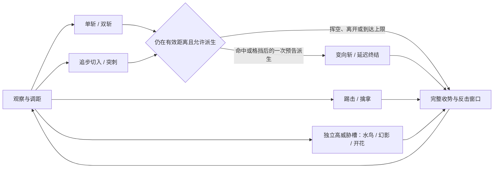

# 马莲妮娅技能设计 R2：流水剑术与腐败绽放

> 2026-09-27 · 当前动作与状态机实装见 [V13 记录](malenia-motion-v13.md)。
> 15 个技能、40 段动画；V13 动作沿用 V12 几何和像素材质。
> 目标：还原原作的动作身份，以身体发力、节奏落差和分层特效建立力量感。

[视频观察与代码核查](../references/malenia-skill-video-analysis.md)提供本轮证据；[既有战斗规格](malenia-blade-of-miquella.md)继续记录伤害、回血、腐败和状态机。本文区分“当前基线”“制作目标”“玩法修改提案”，不会把设计方案标为已运行效果。

## 1. 战斗体验

第一阶段让玩家面对一个会观察、抢入、连斩并从失误中回血的剑士。她的力量来自全身重心快速穿过刀锋方向：起手短暂聚力，斩出时加速，刀锋通过后身体仍带着惯性，随后才回到安静的持刀姿势。

第二阶段保留同一套剑术，让翅膀、幻影与花域改变空间。她仍然在挥刀；腐败从身体和招式里向外释放。最明亮、最大的视觉峰值留给水鸟终末、本体俯冲和艾奥尼亚绽放。

每一招都必须回答四件事：玩家从什么姿势认出它；哪一刻力量释放；危险朝哪里移动；结束后何时能反击。普通斩击、突刺、踢击、擒拿、腐败爆发采用各自的形状与声音，不能仅靠换粒子颜色区分。

## 2. 本轮设计决定

| 层面 | 制作目标 | 对既有实现的处理 |
| --- | --- | --- |
| 原作轮廓 | 高位持刀的水鸟、义手火花四连、空手擒拿、浮空幻影、花苞绽放可在静帧辨认 | 保留现有技能 ID 与模型手侧，逐招重审起手/命中/收势三张关键姿势 |
| 力量感 | 蓄力压缩、短促加速、接触反馈、惯性收势组成一拍 | 不通过统一加速或提高伤害代替动作制作 |
| 剑光 | 从真实刀根到刀尖形成短寿命带，普通刀光窄，水鸟交叉弧宽 | 替换实体中心的通用粒子弧；装饰剑风不生成额外命中 |
| 幻影 | 能认出持刀身体；斩击与突刺姿态明确；本体收尾更重 | 增加专用幻影渲染；六拍候选单独验证，见第 5.3 节 |
| 艾奥尼亚 | 空中聚合、俯冲、触地花苞、延迟翻瓣、低位花域、露出本体 | 利用现有花骨架，补世界坐标花域；提出延长触地后停顿 |
| Minecraft 风格 | 像素化边缘、有限色阶、块状花瓣和碎屑；连续几何轨迹保证高速动作可读 | 延续 V12 材质，不用大面积白雾盖住模型细节 |
| 反馈 | 挥空、命中、格挡、瞬防各有不同峰值 | 命中峰值由服务端结果触发；不冻结服务端或强行转动玩家视角 |

## 3. 当前时间轴与实际范围

以下是读取[配置样例](../config/elder-bosses-common.example.toml)、`defaultComponentStages` 与事件规划器后得到的**当前基线**。20 tick = 1 秒，窗口采用 `[开始, 结束)`。组件的 ACTIVE 不一定代表持续伤害，例如开花的上升与锁点也是组件；表中特别写出真正事件。

| 技能 ID | 当前事件 / 窗口 | 总时长 tick |
| --- | --- | ---: |
| `SINGLE_SLASH` | 横斩 [10,13) | 27 |
| `DOUBLE_SLASH` | 两刀 [11,14)、[29,32) | 50 |
| `RAPID_SLASHES` | 三刀 t14、16、18；终结 t26，终结组件 [26,32) | 54 |
| `RUNNING_SLASH` | 切入与斩击 [16,20) | 38 |
| `UPWARD_COMBO` | 上挑 [18,22)；下落 [44,49)，落地打击 t48 | 73 |
| `KICK` | 踢击 [9,13) | 31 |
| `THRUST` | 突进与刺击 [22,26) | 50 |
| `GRAB_IMPALE` | 抓取 [24,29)；成功后刺穿 t44、释放 t54 | 67 |
| `RETREAT_SLASH` | 后撤与前向刀弧 [8,12) | 32 |
| `WATERFOWL_DANCE` | 三次突进 [32,50)、[62,74)、[82,102)，原地收尾 [110,116) | 142 |
| `SCARLET_AEONIA` | 锁点 t26；俯冲 [43,61)；冲击 t61；绽放/建区域 t86 | 182 |
| `SCARLET_PLUNGE` | 刀身 [24,30)；腐败爆发 [30,36) | 66 |
| `FLYING_SLASH` | 横扫 [20,25)；突刺 [45,49) | 73 |
| `SCARLET_PHANTOMS` | 幻影 t36、44、52、60、68；本体 [76,108) | 146 |
| `WINGED_SWEEP` | 环扫 [16,24) | 46 |

范围也必须从服务端读取。当前样例中普通横斩为 `3.4 × 1.25 = 4.25` 格；水鸟胶囊宽为 `3.5 × 1.35 = 4.725` 格；艾奥尼亚半径为 `5.5 × 1.5 = 8.25` 格；幻影宽为 `1.6 × 1.45 = 2.32` 格。宽与半径不能混用。这里不是新增平衡建议，更不能把旧文档未乘倍率的数字直接用于特效边界。

当前 `SkillTuning` 已将统一施法倍率归一为 1。后续节奏调整直接修改对应组件；自定义组件必须同步驱动动画、锁点、预警和特效，不能另写一套固定 t32/t58 的客户端逻辑。

## 4. 全技能制作卡

下表是目标表现与应对设计；具体力度和音效参数为本项目制作建议。伤害、回血与腐败沿用既有公式，只有第 6 节显式列出的时序/行为提案需要另改服务端。

| 技能 / 战斗角色 | 关键动作与力量传递 | 刀光、环境与接触反馈 | 玩家识别与结束信号 |
| --- | --- | --- | --- |
| `SINGLE_SLASH` 流水横斩：近身试探 | 右肩先收，髋部带动横切；刀过中线后才收肘，左手维持平衡 | 单条银灰窄弧，亮芯只在刀刃；接触点喷切向短火花，挥空只有风声 | 看肩和刀位；刀锋越过、手臂回落后给一个短反击机会 |
| `DOUBLE_SLASH` 变向双斩：抓住持续贴身 | 第一刀余势接回拉，第二刀改变切面与重心，不把两刀镜像成同一姿势 | 两道分开的弧；第一道在第二道之前退出，第二刀声音略低更厚 | 第一刀后保持警惕，第二刀完整伸展后进入明确后摇 |
| `RAPID_SLASHES` 义手火花四连：节奏陷阱 | 义手扣合、短步抢入，前三刀紧凑；第四刀先收刀再明显放出 | 三个窄白峰值；延迟处降低亮度与风声；第四刀较长的弧尾和低频金属收音 | 义手火花是固定辨识点；不能把第三刀误读成连段结束 |
| `RUNNING_SLASH` 追步切入：惩罚远离/用物品 | 倾身加速，步伐带入斩击，踏地后重心从前脚转回 | 切向贴地尘/水线、单道交错刀弧；披风只留很短的位移轮廓 | 看身体前倾和刀的蓄势；横移离开切入方向，挥空应暴露收势 |
| `UPWARD_COMBO` 上挑落斩：纵向压迫 | 低位装载、上挑抬升、悬空短停、刀与躯干共同下压；屈膝吸收落地 | 上挑竖弧与下落直弧分开；落地点短尘环，普通版不加红色腐败爆炸 | 抬刀后还有落斩；落地并完成冲击才是结束 |
| `KICK` 旋身踢：夺回贴身节奏 | 支撑脚与髋先转，左腿迅速伸出再收回；持刀手保持紧凑 | 脚端接触扁平冲击纹，低频短击；不用剑气。格挡时冲击沿盾面展开 | 抬膝与腰转独立于挥刀；处理踢击后仍观察是否进入有预兆的后续招 |
| `THRUST` 延迟突刺：中距穿入 | 刀收于肩侧，肘与刃线对齐；短暂停住后前腿推进，刺后身体仍向前倾 | 沿刀轴的窄亮线、尾端空气裂口；线快速退去，命中音比挥空更短硬 | 看刀尖与肩线；锁点后侧移，避免直接向后跑完整直线 |
| `GRAB_IMPALE` 空手擒拿：克制持续持盾 | 左手张开后前伸；成功才握紧、提起，右刀随后刺穿并释放 | 起手用手形与少量暗金提示；成功后的刀身脉冲只出现一次，释放加低尘 | 张开的空手是危险信号；抓空保留伸手落空后摇，不演出受害者不存在的刺穿 |
| `RETREAT_SLASH` 后撤反斩：打断围攻节奏 | 身体后退，右刀仍切向前方；脚步与刀轨方向相反 | 前向窄弧＋后向低透明位移痕；撞墙时两者都按实际移动裁剪 | 不把后退误认成无攻击；弧退去且双脚稳定后结束 |
| `WATERFOWL_DANCE` 水鸟乱舞：一阶段高潮 | 高位持刀、提膝悬停；紧凑追击、换向跨越、收束落地，四个逻辑窗口姿势各异 | 多切面白色剑风包围主体，弧间留空；地面沿实际路径扬起碎屑，末段短暂收束 | 空中剪影先于剑风；段间看得见方向改变，最后剑风消失后再接近 |
| `SCARLET_AEONIA` 猩红艾奥尼亚：阶段标志/区域控制 | 腐败翼聚合、俯冲蜷身、触地压缩为花苞，再逐层翻瓣，花心露出本体 | 先窄冲击，再大绽放；暖橙亮边、猩红内层、暗根脉；边界留到区域真正结束 | 空中花团与地面锁点共同预告；躲过俯冲后还要退出绽放区 |
| `SCARLET_PLUNGE` 腐败下刺：二段落点陷阱 | 右刀下压、脚与翼收束，触地后短停，腐败沿前方喷开 | 刀身白亮峰值与腐败暖红峰值分离，腐败层低于主要视线 | 不能只躲刀身就回头；第二次地表爆发退去才算结束 |
| `FLYING_SLASH` 翼展飞斩：立体追击 | 空中横扫后重新对齐刀尖，再前刺；翅膀随横向转体与突进改变形状 | 扇形弧转为直线刃迹；两种形状不能用同一圈粒子替代 | 首刀是横扫，下一拍是刺；两段之间读刀轴，刺空后的落地可惩罚 |
| `SCARLET_PHANTOMS` 腐败幻影：远距节奏考验 | 本体高位悬停，幻影依次做斩/刺；最后本体收翼、持刀俯入 | 浅暖色人体、暗红碎边、短寿命独立刀弧；本体金属刀芯更实，终结冲击更低沉 | 看本体仍悬空就知道没有结束；最后本体落地才开放主要反击窗口 |
| `WINGED_SWEEP` 腐翼回旋：近距解围变体 | 翼根和躯干先反向压缩，随后由右刀带动回旋，翼作为惯性后随 | 银色刀弧承担攻击，暗红翼影退居后层；有效几何按服务端显示 | 不把整片翅膀当攻击体积，也不画服务端没有的安全缺口 |

## 5. 三个招牌技能的演出节拍

### 5.1 水鸟：短暂静止让爆发更快

第一阶段采用冷银、灰白、少量金色刀芯。第二阶段保持银白刀芯，在弧尾混入稀疏暖红碎瓣；身体附近保留可辨认的暗部。

| 当前组件 | 动画任务 | 特效任务 | 感受与验收 |
| --- | --- | --- | --- |
| 0–31 起手 | 单腿提起，刀在头肩上方横置；空手靠近躯干 | 以姿势、风的聚合与义手局部亮点预告；不提前铺满攻击弧 | 无特效时也能认出水鸟 |
| [32,50) 第一段 | 紧凑压身，向前爆发 | 三组倾角不同的短弧先后出现；最强前向位移痕 | 感到突然抢入，而不是模型平移进光球 |
| [50,62) 间隔 | 重心重新悬住，准备变向 | 旧弧的面积/亮度迅速退至低水平，保留本体 | 明确听见和看见一次空拍 |
| [62,74) 第二段 | 展开后再收，跨过原目标方向 | 改变主弧倾角，路径碎屑不回贴到 Boss | 与第一段静帧能分辨 |
| [74,82) 间隔 | 躯干转回，刀先于脚重新对齐 | 上一段刀风断开 | 不积成常驻球壳 |
| [82,102) 第三段 | 更大换向，随后开始降低重心 | 斜向交叉弧，避免所有弧同一水平面 | 移动轨迹与服务端实际路径一致 |
| [102,110) 间隔 | 由追击转向收势 | 清出末段展开空间 | 玩家能辨识即将结束但尚未安全 |
| [110,116) 第四段 | 强调下落、收刀与余势 | 较宽但迅速断裂的终末环弧；不增加第五次独立爆炸 | 服务端第四段不再位移，环形预警与原地余斩一致 |
| [116,142) 后摇 | 双脚落稳，披风/发尾延迟跟上 | 危险弧退出，只剩短暂非伤害碎屑 | 反击窗口不被残留强光遮住 |

视觉弧数与命中数独立。保留每目标 `2/2/2/1` 命中上限；锁点改为 t22/58/78/106，霸体与真实攻击窗口同步。原作录像支持三次追击与末尾余斩的节奏，本项目 tick 是 Minecraft 改编值，不宣称原作逐帧数值。

### 5.2 艾奥尼亚：落地与绽放形成两个峰值

用户视频约 04:55.8 触地、04:57.5 明显绽放，支持“先压缩，再释放”的节奏。当前默认上升 26 tick、悬停 17 tick、连续俯冲 18 tick；t61 冲击，t86 绽放，整招 182 tick。动画本体为 166 tick，运行时 t86 映射到作者时钟 t70。触地到绽放保留 25 tick，属于 Minecraft 改编值。

开场从转阶段结束处起飞，不能传送到场地锚点；标记落点限制在可达距离内。冲击前将命中、花域与特效锚点统一到实际碰撞后的到达位置。花瓣向上展开，花缘高于花心。

| 演出层 | 设计 |
| --- | --- |
| 空中聚合 | 翼与花瓣收向身体，外层花瓣卷曲，亮度向中心集中；轮廓仍可见 |
| 触地 t61 | 小范围低位尘/水冲击，花芯压低后回弹；音效为短低频撞击 |
| 花苞蓄压 | 保留明显竖向闭合轮廓，表面脉冲由下往上；地面危险边界保持锁定，不继续追人 |
| 绽放 t86 | 花瓣根部先转，外瓣稍后外翻；最亮瞬间短，随后立即恢复内外层色差；绽放音延后于触地音 |
| 持续区域 | 低位根脉、孢子和外瓣形成稳定范围；花域快照控制位置、寿命和伤害，Boss 离开后不随行 |
| 退出 | 外瓣逐层降低密度、根脉最后退出；能重新看清本体下一招起手 |

区域仍持续 84 tick，起点随绽放移动；现有伤害公式和积累不变。范围表现必须读取当前实际半径，不能用直径 3 格落点花纹暗示整个 8.25 格危险区。小落点标识和大范围预警分层显示。

### 5.3 幻影：让玩家读出人形、刀路和最后的本体

本轮密集片段可区分约六个攻击视觉峰值，但不足以确认它们是否来自六个不同实例。设计把 `幻影身份` 与 `攻击拍` 分开：同一个幻影可以转入第二个姿势，不能用 `phantom_count` 同时含混代表模型数量、命中数和释放次数。

第一步先接入当前五次释放的人形表现，验证位置、遮挡和锁点。推荐的还原候选则制作**六个攻击拍＋本体终结**的时间样机，作为下一轮玩法调整；不得只在旧五次判定上画第六个有威胁的假攻击。

候选节奏：幻影打击 t36、46、56、64、70、78，本体 t94 起俯入；前三拍偏斩击，后三拍偏突刺/返回刺击。六拍的身份与刀路需对照录像继续确认，首个样机允许先用不同颜色调试身份。若保留 32 tick 本体组件与 38 tick 后摇，总长 164 tick。

每个攻击拍都有自己的出发点、锁点、到达时刻和可见刀轨。本体悬停位置持续可读，幻影为较浅的人形轮廓；本体真正俯冲时显示实体金属刀锋和更重的落地反馈。低粒子模式仍保留带刀的人体轮廓，不降级为不可辨认的传送门粒子线。

增加一个候选攻击拍时保留原先前/后组命中上限，不默认增加总可受伤次数；同步修改配置组件数量检查、事件规划、动画语义点、幻影锁点、预警和测试。原作精确数量未完全确证前，当前默认五次是兼容基线，六拍为明确标注的还原提案。

## 6. 连段、反制与玩法修改范围

现有选招器有距离、持盾、用物品和高威胁冷却条件。本轮设计把“连段衔接”作为独立后续功能，不能仅在动画上连起来却暗中取消服务端后摇。

候选派生最多四个剑术伤害段，挥空或离开有效距离后停止追接；第四段必须有完整终结后摇。每次新动作仍保留可见起手与独立动作序号。第二阶段通过缩短观察空档、增加落斩后腐败压力和空中动作比例加压，不能用随机取消后摇或把三个招牌技能串成无空档连播。

| 提案 | 改动性质 | 默认处理 |
| --- | --- | --- |
| P1 骨骼刀轨、逐段峰值、命中/格挡分流 | 表现 | 最优先，保留服务端判定与数值 |
| P2 花苞停顿 8→24 tick 候选 | 时序 | 推荐进入原型；整个语义时间轴一起改，区域起点后移 |
| P3 六个幻影攻击拍候选 | 事件结构与节奏 | 先可视样机复核身份，再迁移；保持命中上限，不能只加装饰性假判定 |
| P4 有限条件派生 | AI 与状态机 | 在前三项可读后实现；每段明确预告，挥空不得无限追接 |
| P5 突刺提前锁向 | 玩法 | 当前规划器在 t22 生效时锁点；旧文档“最后 6 tick 固定”不能当成已实现。可试 t16 锁向，但必须同时调整判定与预警 |
| P6 腐败下刺刀身与爆发之间增加空拍 | 时序 | 当前两窗口紧邻。先通过动画/亮度分开，若实机仍不可读，再评估 4 tick 间隔并重映射时间轴 |

跑离、侧移、举盾、瞬间防御及反击必须能在原版移动能力下成立，不预设玩家安装翻滚模组。保留格挡回血及现有恢复上限；腐败仅由明确事件积累。命中过程和力量感可以更鲜明，单次伤害不因“特效更大”自动提高。

## 7. 特效与声音制作规格

### 7.1 视觉分层

| 层 | 内容 | 建议初始参数（制作目标，非已测数据） |
| --- | --- | --- |
| 主体 | 手、长刀、头肩、翼根、花瓣轮廓 | 无特效时仍可读出招；本体附近减少背景粒子 |
| 刀锋 | 骨骼刀根/刀尖间的短寿命带 | 普通弧尾 2–3 tick；重斩 4 tick；水鸟分段控制，间隔不跨段连带 |
| 接触 | 切向火花、盾面冲击、低位尘/水 | 命中一次发射一次，接触闪光约 1 tick，不能每渲染帧重复 |
| 位移 | 贴地风线、少量轮廓残像、翼流 | 残像最多 2 层，冻结在采样世界位置，4–6 tick 内退出 |
| 腐败 | 花瓣、菌膜碎边、根脉、稀疏孢子 | 暗根脉 → 深红内层 → 暖橙外瓣 → 短暂亮芯，控制峰值面积 |
| 玩法提示 | 服务端范围与时机 | 低画质仍保留；遵循现有指示器开关、透明度和深度规则 |

刀轨需要补足高速转刀采样，但不能把相机重复渲染当成新样本。短时缺样不连成长距离三角片；瞬移、受击打断、动作切换、换维度和实体移除立即切断历史。

透明层按深度正常遮挡。大花瓣保留实体形状，外围孢子稀疏；强发光只占细边和短时峰值。当前瞬防规则要求独立红光与提示音，二阶段大面积暖红腐败不能盖住这对信号；用局部位置、脉冲形状和声音共同区分。

### 7.2 非语言声音与接触反馈

以下是原创/授权音频的制作需求，本轮没有从视频提取或试听原声。

| 动作阶段 | 声音建议 | 播放条件 |
| --- | --- | --- |
| 义手蓄势 | 短金属扣合、低幅摩擦 | 快速四连的对应起手事件；不循环盖过后续节拍 |
| 剑通过空气 | 普通斩短而尖，重斩带低频尾，突刺更集中 | 真实刀锋经过有效动作阶段 |
| 命中 / 格挡 / 瞬防 | 身体接触短促、盾面金属宽频、瞬防保持独立辨识音 | 服务端结果，各段去重；挥空不播命中重音 |
| 水鸟 | 密集斩风形成段内纹理，间隔降响度，末段收束 | 随当前分段开始/结束，不整招播放等音量循环 |
| 幻影 | 薄而轻的掠过声，本体终结更实更低 | 单个攻击拍一次；同场多 Boss 有并发上限 |
| 艾奥尼亚 | 空中低频聚合、触地短击、绽放宽频涌开、持续域低声纹理 | 冲击与绽放分开触发，区域结束清理循环 |

初版通过动作收势、瞬时亮度和声音建立冲击感，不加入会错开真实命中时刻的整段动画停顿。镜头震动若后续加入，只做可关闭的短小本地反馈，不强制锁镜、不改变玩家操作或判定。

## 8. 实现落点

以下专用职责已在首批实装中建立；完整设计目标与实际完成项的区别见实现记录：

| 模块 | 输入与职责 | 边界 |
| --- | --- | --- |
| `ClientMaleniaBladeTrails` | 渲染后的 `blade_root`/`blade_tip` 世界坐标＋有效段信息 | 只记录和绘制刀带，不能生成命中 |
| `ClientMaleniaSkillEffects` | 动作序号、组件/段、锁定/生效/结束时刻、实际几何 | 管理起手、切段、爆发与清理，逐步替代通用 Malenia 粒子分支 |
| `ClientMaleniaPhantoms` | 服务端幻影攻击拍的出发点、锁点、攻击类型和到达时刻 | 克隆模型使用独立姿势状态；不修改主模型、不设假 LivingEntity、不重选目标 |
| `ClientMaleniaAeonia` | 花骨架语义点＋持久腐败区快照 | 花域世界锚定，过期/断线/场景卸载清理 |
| 命中反馈事件 | `entityId + actionSequence + segmentId + targetId + result` | 去重后播声音/闪光；失败与格挡不可误播伤害反馈 |

优先复用 `MaleniaIndicatorSnapshot` 的真实几何和时间，以及 `MaleniaAnimationTimeline` 的映射。`action_seed` 用来稳定装饰变化，不替代服务端已经锁定的位置。若现有网络快照不足以恢复幻影或持久区域，补最小字段并核对两个加载器的编码/解码合同。

新增刀轨、幻影与花域效果要在客户端渲染入口实际注册。只新增纹理、shader 或类文件不算完成。公共代码保持 Forge 1.20.1 Java 17 兼容，加载器差异放在适配层；约定之王已有实现仅作为本地参考。

## 9. 制作顺序与验收

| 批次 | 交付内容 | 完成条件 |
| --- | --- | --- |
| A：普通剑术 | 单斩、双斩、四连、突刺、踢击、擒拿的姿势与刀轨；命中反馈 | 无特效静帧能区分；刀光经过刀刃；抓空不播刺穿；挥空/盾挡/命中结果不同 |
| B：水鸟 | 四段不同重心、交叉剑风、间隔退光、末段收势 | 四窗口与当前服务端时序一致，命中上限不变；0/低/高粒子均能读出当前段与结束 |
| C：艾奥尼亚 | 花苞停顿原型、分层翻瓣、锁点世界花域 | 1.25 秒与约 1.6 秒停顿对比；区域边界与真实判定匹配；Boss 移动不拖走花域 |
| D：幻影 | 先当前五次的独立人形；再六拍候选和本体终结 | 锁点与路径可复现；无假攻击；主模型不被幻影姿势污染；本体收尾清楚 |
| E：二阶段与连段 | 飞斩/下刺/腐翼的差异，有限派生与资源预算 | 反击窗口稳定；原版移动可应对；高威胁共享冷却仍生效 |

测试按实际改动进行：时序/判定变化运行对应事件、组件、快照、命中上限与自定义时长测试；表现改动检查姿势与坐标，不以粒子数断言替代目视复核。两个加载器都编译并处理资源，随后进入游戏验证。

实机至少覆盖：第一/第三人称、近处/中距、坡地与墙边、挥空/持盾/瞬防、动作被打断、四人联机、网络延迟、两只 Boss 同屏、自定义组件时长和范围倍率、维度切换。所有效果在动作或区域结束后清理；任何配置下不得用错位光效暗示错误安全区。

性能初始预算：每 Boss 刀轨最多 24 个历史截面；最多 2 个高细节幻影同时近景显示，其余保留低细节的人形与刀；装饰粒子服从现有 `skill_vfx` 总预算，低画质优先删外围碎屑。预算是待测目标，不能写成已经达到的帧率。

当前实现重做了动作加速、持刀关节、身体重心、水鸟节奏、连续开花轨迹与连招巡航；几何和贴图沿用 V12。验证及游戏内验收边界见 [V13 记录](malenia-motion-v13.md)。
