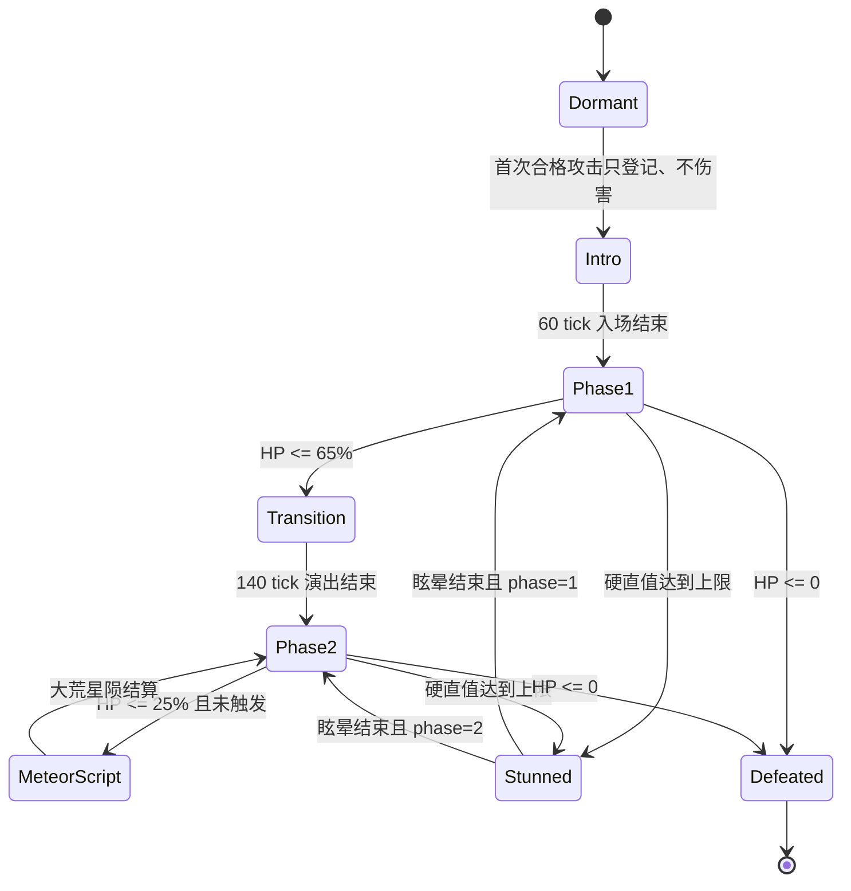

# 约定之王：可实现战斗规格

> 文档状态：初版实现基线  
> 目标平台：Forge 1.20.1（Java 17）与 NeoForge 1.21.1（Java 21）  
> 平衡对象：默认面向原版终局装备的 1-4 名玩家；参与上限可配置到 16
> 游戏内显示名称：约定之王  
> Boss ID：`elder_bosses:promised_consort`  
> 资料核对日期：2026-09-08

## 1. 设计目标

本 Boss 还原《艾尔登法环：黄金树幽影》最终战的三项核心体验：双大剑造成的连续近身压迫、重力技能改变玩家站位、米凯拉在第二阶段为剑击追加延迟圣光。Minecraft 改编不复刻原作帧数，而是保留可读抬手、稳定服务端判定和明确的反制窗口。

优先级如下：

1. 玩家应从姿势、剑侧、粒子颜色和音效判断招式，而不是依赖背招表。
2. 危险来自连续失误，常规单次命中不应直接击杀满状态的终局玩家。
3. 多人战增加耐久和目标切换压力，不直接放大 Boss 的单次伤害。
4. 每个高威胁技能至少提供一种站位反制和一种时机反制。
5. 关键数值由唯一 common 配置中的服务端权威值控制，默认值只是原版终局平衡基线。

全部 22 个动作都受逐技能 `cast_speed_multiplier` 与 `range_multiplier` 控制，其中 `lion_claw_double` 继承 `lion_claw`。默认只将慢速技能提速约 30%-50%，全部技能范围扩大 25%-70%；倍率同时作用于服务端命中、受控位移、技能内部节拍和客户端预警。旧占位粒子已由剑气、血焰轨迹、重力涡流、圣光柱、光速残影和陨石冲击效果替换。

## 2. 原作事实与改编决策

| 项目 | 经资料核对的原作信息 | 本项目决策 |
| --- | --- | --- |
| 战斗结构 | 共用一个血条；约 65% 生命时米凯拉现身 | 生命降至 65% 时强制进入不可重复的阶段转换 |
| 韧性 | 第一阶段 125，第二阶段 120 | 不照搬固定值；玩家造成的实际生命损失按比例转为硬直值，积满后打断动作并进入眩晕 |
| 韧性恢复 | 约 6 秒未承受有效攻击后恢复 | 硬直值默认延迟 120 tick，随后每 tick 衰减 2 点 |
| 战斗台词 | 入场由拉塔恩战吼，转阶段与战败由米凯拉承担叙事 | 保留角色分工；米凯拉只显示原创字幕；拉塔恩非语言音效合同保留，但本轮除瞬防提示外等待原创或授权音频资产 |
| 属性倾向 | 突刺相对有效；第一阶段对圣属性尤其缺乏抗性，第二阶段圣抗提高 | 突刺进入物理通道，圣属性进入魔法通道；原有效倍率由来源倍率保留 |
| 二阶段强化 | 大部分既有攻击会伴随延迟光柱 | 每次实体剑击生成一次可见的「圣光回响」，但保留右后侧安全带 |
| 大荒星陨 | 低血量时触发，之后可再次施放 | 首次到 25% 生命强制触发，之后进入 3600 tick 冷却 |

说明：用户最初资料中的 50% 转阶段是常见简化描述；本规格按已确认的约 65% 原作口径实现。原作资料只用于行为和视觉研究，下面的 Minecraft 数值均为原创改编参数。

## 3. 统一数值口径

### 3.1 伤害公式

所有技能伤害只允许使用以下形式：

`最终基础伤害 = 固定值 + Boss 当前 ATTACK_DAMAGE × 攻击力百分比`

文档统一写成 `固定值 + 攻击力百分比`，例如 `3 + 70%`。默认 `ATTACK_DAMAGE = 24`。伤害公式先求值，再交给 Minecraft 护甲、抗性、附魔和效果系统处理。禁止用目标最大生命、当前生命或难度系数暗中追加伤害。

每个生命伤害事件必须声明结算通道。常规物理、突刺和流血触发伤害统一为`物理`，进入 Minecraft 护甲、抗性与附魔结算；魔法、圣属性和霜冻触发伤害统一为`魔法`，绕过护甲，但仍接受魔法通道倍率与其他合法减伤。原来源标签只用于表现、来源倍率和通道路由，不再创建独立积累系统。火焰、雷电、毒、凋零和睡眠规则保持独立。

一次攻击若同时包含两个通道，必须拆成两次伤害事件，例如 `3 + 60%（物理）` 与 `1 + 20%（魔法，圣属性来源）`；两个事件共享同一个命中去重 ID。

### 3.2 默认基础属性

| 属性 | 默认值 | 备注 |
| --- | ---: | --- |
| 最大生命 | 1600 | 进入战斗时按有效玩家数缩放 |
| ATTACK_DAMAGE | 24 | 所有伤害公式的唯一攻击力来源 |
| 移动速度 | 0.30 | 冲刺技能使用受控位移，不临时修改该属性 |
| 跟随范围 | 96 格 | 覆盖扩大后的 80 格直径竞技场；仍只在逻辑边界内选取目标 |
| 击退抗性 | 1.0 | 进入硬直状态时由专用状态覆盖 |
| 伤害转硬直比例 | 75% | 按 Boss 实际损失生命计算，可配置 |
| 硬直值上限 | 最大生命的 10% | 使用多人缩放后的最大生命，转阶段不改变 |
| 硬直衰减延迟 | 120 tick | 从最后一次有效硬直积累开始计时 |
| 硬直衰减速度 | 每 tick 2 | 延迟结束后降至 0 |
| Boss 基础宽/高 | 1.9 / 4.6 格 | 模型可越界，逻辑碰撞箱必须固定 |

最大生命直接使用实体原生 `MAX_HEALTH` 属性。开发环境固定加载 AttributeFix：Forge 1.20.1 使用 `21.0.5` 并以 `modImplementation` 接入，NeoForge 1.21.1 使用 `21.1.3` 并以 ModDevGradle 支持的 `implementation` 接入；两端均不内嵌，也不在模组 metadata 中声明。缺少 AttributeFix 时接受原版属性上限对 1600 及多人生命的静默夹断，不增加逻辑生命池或运行时错误。

### 3.3 多人缩放

默认平衡仍按 1-4 人校准。配置 `max_active_players` 默认 4、合法范围 1-16；人数超过 4 时仍按同一公式线性外推，但不属于默认平衡保证。默认只缩放耐久：

`最大生命倍率 = 1 + 55% × (N - 1)`

| 有效玩家数 | 最大生命 | 硬直值上限 | 招式伤害倍率 |
| ---: | ---: | ---: | ---: |
| 1 | 1600 | 160 | 1.00 |
| 2 | 2480 | 248 | 1.00 |
| 3 | 3360 | 336 | 1.00 |
| 4 | 4240 | 424 | 1.00 |

参与者由每个 Boss 实例独立记录。默认 `roster_slot_policy=never_reopen`，名单达到 `max_active_players` 后不再释放席位；`reopen_on_exit` 则在参与者永久退出时释放当前名额，但退出 UUID 仍保留在历史集合中且不能重返本场。`scaling_count_mode=cumulative_unique` 按本场累计唯一参与者缩放；`current_active` 按当前在线、存活、同维度且位于场内的参与者缩放，人数下降时保留 Boss 当前绝对生命并钳到新上限；`high_water_mark` 按本场最高同时有效人数缩放且只升不降。最大生命变化时硬直容量同步变化，已有硬直保留绝对值，降容跨过新上限则排队触发眩晕。

DORMANT Boss 只有场内玩家或可解析到玩家主人的归属来源首次攻击时才开战。玩家攻击 Boss 与 Boss 首次攻击未登记玩家都支持三种顺序：`register_only` 只登记不造成该次伤害，`register_then_damage` 先扩容再结算，`damage_then_register` 先按旧参与状态结算再登记扩容。默认仍为玩家首击只登记、Boss 首击先登记再伤害。名单已满后，额外玩家仍可成为目标并受到伤害，但不能登记或伤害 Boss。

死亡、断线和越出 40 格边界默认使参与者永久退出本场；换维度者可在 100 tick 脱战宽限内返回。默认累计唯一缩放与不释放名额使退出不降低最大生命；其他模式按上一段规则更新。场内没有有效参与者时，Boss 完成当前动作后冻结；宽限期不接受新玩家接力，合法返回者恢复战斗并清空技能冷却，超时则回冻结场心、回满生命并转为 `DORMANT`。这些策略及人数上限均由 common 配置控制并在开战时进入快照。

### 3.4 抗性与异常

| 类别 | 第一阶段倍率 | 第二阶段倍率 | 实现方式 |
| --- | ---: | ---: | --- |
| 物理 | 0.80 | 0.80 | 常规物理、突刺和流血触发伤害；受到护甲影响 |
| 魔法 | 0.80 | 0.80 | 魔法、圣属性和霜冻触发伤害；不受护甲影响 |
| 突刺来源 | 1.00 | 1.00 | 进入物理通道后应用 1.25 来源倍率，保留相对弱点 |
| 火焰 | 0.80 | 0.80 | 伤害类型标签 |
| 雷电 | 0.80 | 0.80 | 伤害类型标签 |
| 圣属性来源 | 1.00 | 0.60 | 进入魔法通道后分别应用 1.25 / 0.75 来源倍率 |
| 中毒/凋零伤害 | 0.35 | 0.35 | 对实际生命伤害应用倍率，不修改效果实例 |
| 流血触发伤害 | 0.50 | 0.50 | 只识别伤害来源标签并进入物理通道，不实现积累系统 |
| 霜冻触发伤害 | 0.50 | 0.50 | 只识别伤害来源标签并进入魔法通道，不实现积累或减速系统 |
| 睡眠标签伤害 | 0.00 | 0.00 | 标签伤害免疫，不实现睡眠积累系统 |

Boss 受到的绝对免疫伤害类型由数据包标签 `elder_bosses:promised_consort_immune` 控制，TOML 不重复维护同一集合。内置标签以 `replace=false` 提供摔落、飞行撞墙、窒息、实体挤压、世界边界、溺水、仙人掌、甜浆果、钟乳石、火焰、熔岩、热地面、普通爆炸和玩家爆炸；数据包可追加或覆盖。未命中该标签的伤害仍需满足 common 配置中的来源资格策略，默认只接受逻辑边界内玩家及其归属来源，管理员强制死亡标签例外。

## 4. 战斗空间与目标规则

竞技场已获批准按数据包固定 NBT 地表结构实装，目标为半径 40 格、净高至少 28 格的灰白圆形战区。半径 0-34 格平坦，34-40 格总抬升不超过 1 格；神之门、基座和短阶整体北移圆盘外，废止旧门位 `Z=-36`，回归锚点与技能范围不变。南侧保留宽阶和独立祭台，不封门。默认沙漠群系标签、96/32 稀有分布、固定高台、供品手动召唤与重战及开战前状态恢复详见[竞技场合同](../arenas/promised-consort-arena.md)。目前仅完成方块/物品资源与只读校验基础，NBT、自然生成、交互和恢复尚未接入。

在 NBT 建筑接入前，首次合格攻击发生时冻结 Boss 位置为逻辑场心、冻结其当时朝向为局部轴，并严格使用开战点 Y。入场点使用局部偏移 `(0, 14, 18)`，阶段回归点使用 `(0, 0, -30)`；目标空间阻挡时回退到场心安全表面。40 格圆盘立即用于目标、伤害来源、投射物、落点和受控位移裁剪，但不生成围墙或临时地形。多只 Boss 的逻辑圆盘可以重叠，各自独立维护参与者、伤害与指示器。

公开资料没有原作绝对尺寸：Wiki 仅分别称马莲尼亚场地为 `wide cavern`、约定之王场地为 `very wide area`。结合两组全场截图，可战斗净空半径的保守比例估算约为 1.45-1.70。Minecraft 采用 40:26，即半径比 1.54、面积比约 2.37；该值用于还原明显更宽阔的战斗空间，不声称是原作世界坐标的精确换算。

当前无 NBT 快照时默认关闭方块破坏；管理员显式开启后，以 Boss 移动后碰撞箱向各轴扩张 `block_break_radius`，只允许破坏 `elder_bosses:boss_breakable` 且不在 `elder_bosses:arena_protected` 中的方块，并受每 tick 数量预算限制。当前版本从不恢复破坏，也不输出额外警告。所有受控动作可在最多 24 tick 内忽略方块碰撞；到期仍无合法出口时取消动作并回到最近合法路径点，失败后回冻结场心。穿墙作用域固定为所有受控位移，不再暴露无效策略枚举；后续 NBT 接入后再定义建筑快照恢复合同。

距离带按 Boss 逻辑碰撞箱中心到玩家脚底的水平距离划分：

| 距离带 | 范围 | 主要行为 |
| --- | --- | --- |
| 贴身 | 0-3.5 格 | 快斩、踩地、横斩 |
| 近距 | 3.5-7 格 | 连段、狮子斩、螺旋突击 |
| 中距 | 7-14 格 | 唤星、狮子斩、光速侧闪 |
| 远距 | 14-40 格 | 重力陨石、入场突击、追近；超过 28 格时优先缩短距离但不传送 |

Boss 每 20 tick 在 40 格内重新评估主目标，默认 `primary_target_policy=players_only`，使用所有存活、非创造、非旁观玩家，未登记玩家默认也可被攻击。`living_when_no_players` 仅在没有合格玩家时加入场内非免疫生物，`all_living` 始终让两者同池评分；非玩家永不进入参与名单或人数缩放。默认分数为距离权重 50%、最近 8 秒输出权重 35%、正在使用食物或药水的机会权重 15%。同一目标连续成为主目标 200 tick 后，其评分乘 0.75，鼓励多人换仇恨。Boss 攻击默认可波及所有 `LivingEntity`；`elder_bosses:promised_consort_attack_immune` 标签中的实体类型绝对免疫，内置默认只包含约定之王本体。所谓「读指令」只读服务端可观察状态，不读取客户端按键。

## 5. 服务端权威状态机



顶层状态：

| 状态 | 持续 | 可受伤 | 可移动 | 关键行为 |
| --- | ---: | --- | --- | --- |
| `DORMANT` | 直到开战 | 否 | 否 | 隐藏 Boss 条，不运行技能选择器 |
| `INTRO` | 60 tick | 否 | 受控 | 冻结场心与局部轴、执行重力入场；第 18 tick 保留战吼事件但本轮无对应音频资产 |
| `PHASE_1` | 动态 | 是 | 是 | 双剑与重力招式池 |
| `TRANSITION` | 140 tick | 否 | 受控 | 清投射物、米凯拉附身、回到场心 |
| `PHASE_2` | 动态 | 是 | 是 | 一阶段招式、圣光回响、米凯拉招式 |
| `METEOR_SCRIPT` | 150 tick | 0-120 tick 否 | 受控 | 25% 生命脚本化大荒星陨；全程不积累硬直 |
| `STUNNED` | 80 tick | 是 | 否 | 打断并清除当前动作；可正常受伤，无特殊伤害倍率 |
| `DEFEATED` | 160 tick | 否 | 否 | 第 24 tick 显示米凯拉战败字幕，随后结算掉落和经验并移除实体；当前无出口逻辑 |

每个动作还拥有 `WINDUP`、`ACTIVE`、`RECOVERY` 三段。服务端保存 `action_id`、`action_tick`、`combo_step`、`phase`、`stagger`、`stagger_capacity` 和随机种子；客户端只根据同步数据播放动画、相机震动、音效与粒子，不自行决定命中。

## 6. 通用选招逻辑

每次恢复结束后构造候选集，排除冷却未结束、距离不符、路径不可达和最近两次已经使用的动作，再执行带权随机。禁止在一个 tick 内直接从空闲状态造成命中。

| 条件 | 候选倾向 |
| --- | --- |
| 目标正在持续使用物品且距离 4-12 格 | `LION_CLAW` 或 `GRAVITY_DIVE` 权重 ×1.8 |
| 目标距离超过 14 格 | `GRAVITY_METEOR` 权重 ×2.0，追近动作权重 ×1.5 |
| 两名以上玩家在 4 格内 | `STOMP` 或 `STARCALLER_CRY` 权重 ×1.7 |
| 主目标连续贴右后侧超过 50 tick | `CROSS_SLASH` 权重 ×1.5，但不无前摇转身 |
| 上次技能未命中任何玩家 | 中低威胁技能权重 ×1.2，避免连续空大 |

独立技能使用硬冷却，基础连段使用动作组软冷却。所有权重和冷却均进入配置文件。被完整格挡的攻击段默认有 70% 概率改派生为 `STOMP`；同一动作内累计三次普通格挡或瞬防后强制进入至少 20 tick 后摇。两项策略均可配置。`blocked_branch_mode=continue_combo` 表示动作正常结束后按常规 6-14 tick 间隔选招；`weighted` 表示分支概率成功后跳过间隔，立即按正常资格、冷却、历史和权重选招。

## 7. 第一阶段技能规格

### 7.1 技能总表

伤害列中的每一项均为一次独立命中。`ATK%` 始终引用 Boss 当前 `ATTACK_DAMAGE`。

| ID / 名称 | 时序（tick） | 有效范围 | 单次伤害（固定值 + ATK%） | 瞬间防御 | 冷却 |
| --- | --- | --- | --- | --- | ---: |
| `GRAVITY_DIVE` 开局重力旋坠 | 24 / 6 / 24 | 落点半径 4.5 格 | 剑身 `4 + 80%（物理）`；冲击 `3 + 55%（物理）` | 仅剑身 | 160 |
| `L_COMBO_CROSS` 左起三连 | 9/3/7，8/3/8，14/4/22 | 3.8 格、120°扇形 | `2 + 45%（物理）`；`2 + 45%（物理）`；`4 + 70%（物理）` | 三击可 | 50 |
| `L_COMBO_BLOODFLAME` 刺击血焰 | 13/3/8，12/4/24 | 刺击 5 格；横扫 4 格 | 刺击 `3 + 60%（物理）`；横扫 `2 + 50%（物理）`；爆燃 `2 + 35%（火焰）` | 刺击、横扫可 | 100 |
| `R_COMBO_CROSS` 右起合刃 | 9/3/8，15/4/22 | 3.8 格、140°扇形 | `2 + 45%（物理）`；`4 + 75%（物理）` | 两击可 | 55 |
| `R_COMBO_LEFT_TWIN` 右起左双斩 | 9/3/7，7/3/7，8/3/20 | 3.6 格、110°扇形 | `2 + 45%（物理）`；`2 + 40%（物理）`；`2 + 45%（物理）` | 三击可 | 50 |
| `R_COMBO_TEMPEST` 双旋风 | 10/3/6 ×3，18/8/26 | 4.2 格、环形 | 前三击各 `2 + 45%（物理）`；旋风每段 `3 + 55%（物理）` | 全部可 | 110 |
| `R_COMBO_EARTHHEAVE` 掀地板 | 10/3/6 ×3，20/5/12，10/6/30 | 近身斩与前方 7×5 格裂地 | 前三击各 `2 + 45%（物理）`；下砸 `5 + 80%（物理）`；地裂 `4 + 65%（物理）` | 三斩与下砸可 | 140 |
| `LION_CLAW` 狮子斩 | 22 / 5 / 28 | 落点半径 3.5 格 | `5 + 85%（物理）` | 可 | 100 |
| `LION_CLAW_DOUBLE` 二连狮子斩 | 16 / 5 / 34 | 第二落点半径 3.5 格 | `5 + 90%（物理）` | 可 | 共用 |
| `STARCALLER_CRY` 唤星 | 30 / 10 / 34 | 拉扯半径 12 格；震地半径 6 格 | 拉扯 `0 + 0%（无伤害）`；震地 `4 + 70%（物理）`；重力尖刺 `2 + 40%（魔法）` | 不可 | 180 |
| `GRAVITY_METEOR` 重力陨石 | 32 / 50 / 36 | 8 枚追踪岩块 | 每枚 `2 + 35%（物理）`；最多计入 3 枚 | 不可 | 220 |
| `STOMP` 踩地 | 14 / 5 / 24 | 前方 5×4 格 | `3 + 55%（物理）` | 不可 | 70 |
| `CROSS_SLASH` 双剑交叉横斩 | 18 / 5 / 26 | 4 格扇形与 7 格碎屑波 | 剑身 `4 + 75%（物理）`；碎屑波 `2 + 35%（物理）` | 仅剑身 | 90 |
| `SPIRAL_ASSAULT` 螺旋突击 | 26 / 8 / 30 | 直线 12 格、宽 3 格 | 旋身 `3 + 60%（物理）`；落斩 `5 + 85%（物理）` | 两段可 | 150 |

### 7.2 第一阶段技能特效时间轴

客户端以 `action_id`、`action_tick` 和 `action_seed` 驱动特效。双剑轨迹由 `blade_root_l/r` 到 `blade_tip_l/r` 的采样带生成，地面范围使用有符号距离场（SDF），重力扭曲只采样 Boss 与场地遮罩；任何渲染通道都不得反向决定命中、位移或追踪。

| 技能 | 前摇特效 | 有效段特效 | 后摇与着色器约束 |
| --- | --- | --- | --- |
| `GRAVITY_DIVE` | 双剑边缘从暗金转为紫黑，脚下碎屑缓慢上浮；落点 4.5 格圆环由外向内收紧 | 旋坠时两条螺旋剑带围绕本体，触地先闪剑身白边，再展开低矮紫黑冲击环 | 冲击环贴地消散，碎屑按原轨迹落回；折射只作用于环内背景且最大偏移不超过 2 像素 |
| `L_COMBO_CROSS` | 左肩和左剑根先亮，右剑保持暗色；每段起手在对应剑侧显示短金边 | 前两击生成分离的低位弧，终结交叉处产生一次菱形白色火花 | 每道弧在下一击前衰减到 30% 以下；左右剑使用独立 UV 流向，不镜像同一纹理 |
| `L_COMBO_BLOODFLAME` | 刺击线上出现暗红虚线，横扫前地面裂痕以低亮红色延伸 | 刺击使用窄黑铁针光，横扫留下 24 tick 裂痕；第 16 tick 爆燃从裂痕两端向中心夹合 | 爆燃火舌低于 1.5 格并在 5 tick 内熄灭；火焰扭曲不遮住后续剑姿，裂痕 SDF 与服务端矩形一致 |
| `R_COMBO_CROSS` | 右剑先抬起并显示短促旧金边，合刃前两条刀脊亮度同步升高 | 第一击为右向窄弧，终结为两条交叉厚弧，交点只闪一帧白芯 | 交叉弧从外端向交点收束；禁止以持续十字光柱代替实体剑轨 |
| `R_COMBO_LEFT_TWIN` | 右剑亮起后，左剑连续出现两次间隔明确的刀尖脉冲 | 三击分别绘制右、左、左的短弧，颜色峰值依次为暗金、银灰、白银 | 上一击轨迹在下一击生效前断开，末击碎屑沿水平方向散开；不使用环形模糊 |
| `R_COMBO_TEMPEST` | 前三击每次在脚边生成一段旋向标记，终结前标记拼成有缺口的 4.2 格圆环 | 三道剑弧逐步抬高，旋风段使用两层反向流动的环带并分别对应两次判定 | 外环先散、内环后散，始终保留角色中心负形；透明排序失败时降级为单层轮廓环 |
| `R_COMBO_EARTHHEAVE` | 三连斩后双剑下压，前方 7×5 格区域出现稀疏灰白裂纹预告 | 下砸产生实体尘环，随后裂地按从近到远的条带顺序抬亮并喷出扁平碎屑 | 裂纹仅沿服务端矩形延伸，遇墙截断；视差高度不超过 0.25 格，避免看似可跨越障碍 |
| `LION_CLAW` | 起跳前双剑外缘聚出两条粗重亮边，落点 3.5 格环在翻身中逐渐闭合 | 翻身轨迹留下短促红鬃残影，落地时黑铁剑芯与灰白冲击环同时出现 | 残影只保留三个离散姿势，冲击环 6 tick 内沉入地面；不使用全屏径向模糊 |
| `LION_CLAW_DOUBLE` | 首击结束后所有冲击尘先清空，第二落点重新显示 16 tick 完整闭合环 | 第二次翻身使用更窄但更亮的双剑轮廓，落地环增加一圈向内回卷的尘线 | 不继承首击残影或地纹；两次落点分别绑定服务端锚点，着色器不得插值漂移 |
| `STARCALLER_CRY` | 双剑在胸前合拢，12 格内碎屑朝中心倾斜，地面紫线显示拉扯方向；下砸前 8 tick 环缩到 6 格 | 拉扯阶段仅显示向心流线；震地用低矮物理尘环，重力尖刺随后以紫黑竖线分批刺出 | 流线不得形成不透明雾；尖刺先从根部熄灭，跳跃可避开的震地区域必须始终贴地可读 |
| `GRAVITY_METEOR` | 剑刃铲地时出现碎石遮罩，8 个岩块先从地面升起并逐个显示紫色核心 | 每枚岩块带一条弯曲但不过宽的尾迹，转向时尾迹连续显示曲率，撞击产生小型碎石环 | 尾迹最长保留 12 tick，岩块被破坏时从核心向外碎裂；不使用屏幕空间锁定线 |
| `STOMP` | 抬脚区域出现 5×4 格前向矩形的断续边线，尘粒向脚底内收 | 踩地时边线同时压亮，扁平尘浪由近向远扫过矩形 | 尘浪遇台阶和墙体按深度裁剪，4 tick 后只留少量落尘；范围不能渲染成圆形 |
| `CROSS_SLASH` | 双剑在胸前形成可辨的 X 形暗金轮廓，地面正前方显示 7 格渐淡方向带 | 剑身交叉弧先亮，碎屑波随后沿方向带推进，二者用金属白与灰褐明确区分 | 碎屑高度低于 1 格并随距离降低密度；X 形残光在生效后立即断开，不持续遮脸 |
| `SPIRAL_ASSAULT` | 12 格冲刺线路显示两条平行紫灰边线，双剑收向身体两侧并产生反向旋流 | 旋身段绘制双螺旋刀带，落斩点显示闭合前的圆环并在接触时压成十字尘纹 | 螺旋带按路径碰撞裁剪，撞墙即在截断点撕裂；运动残影只作用于 Boss 本体遮罩 |

时序写作 `前摇 / 有效 / 后摇`。多段连段以逗号分隔各段。玩家被同一有效段命中一次后，在该段结束前不能再次受击。

### 7.3 连段分支

基础起手只在 `WINDUP` 结束前锁定朝向；进入 `ACTIVE` 后最大转向速度为每 tick 6°。每一段结束时按距离和命中结果决定是否派生：

| 当前结果 | 派生概率 | 约束 |
| --- | ---: | --- |
| 命中且目标仍在 4 格内 | 85% | 优先完成当前连段 |
| 被盾牌完整格挡 | 70% | 可改派生为踩地，不读取玩家按键 |
| 未命中且目标在 4-8 格 | 45% | 只允许追步或连段终结，不瞬移修正 |
| 未命中且目标超过 8 格 | 0% | 立即进入正常后摇 |

`LION_CLAW_DOUBLE` 只有首击未命中或被格挡时才有 35% 概率派生，且第二击前必须重新显示 16 tick 抬手。

### 7.4 重力与血焰规则

- 唤星拉扯玩家时每 tick 位移不超过 0.35 格，保留垂直速度，不把玩家传送到 Boss 身边。
- 唤星下砸前 8 tick，地面紫色环收缩到中心；玩家在冲击生效时离地 0.6 格以上可避开震地，但仍可能被重力尖刺命中。
- 重力陨石使用可破坏的投射物实体，默认生命 6、存活 60 tick；转向角每 tick 不超过 4°，每个 `LivingEntity` 最多计入 3 枚。只有场内玩家及其归属投射物能破坏岩块；击破后只消失并播放占位粒子，不爆炸、不掉落、不反伤 Boss。正式资产缺失时客户端用可配置方块模型渲染，默认 `minecraft:crying_obsidian`。
- 血焰横扫在地面留下 24 tick 裂痕，第 16 tick 爆燃。裂痕不破坏方块，不点燃场外实体。

## 8. 阶段转换

生命首次跨过最大生命的 65% 时，默认把本次伤害截断到 65% 并丢弃溢出，当前技能进入 10 tick 强制收招，然后切换 `TRANSITION`。伤害门控可配置，但默认保证转换不会被一次高伤害跳过：

| 时间 | 演出与逻辑 |
| ---: | --- |
| 0-20 tick | Boss 获得无敌与无碰撞；清除其所有陨石、血焰和光柱实体 |
| 21-55 tick | 拉塔恩向神之门跃离，客户端播放低频重力音与紫色尾迹 |
| 56-100 tick | 米凯拉显现；同步 `miquella_visible=true`，金色发丝从独立骨骼展开；第 58/92 tick 显示两句转阶段字幕 |
| 101-126 tick | 场心出现直径 6 格金色星图，提示回归落点 |
| 127 tick | 回归冲击结算 `4 + 70%（物理）` 与 `2 + 35%（魔法，圣属性来源）` |
| 128-140 tick | Boss 起身，保留当前硬直值与上限，进入第二阶段 |

转换演出不会重置异常积累、仇恨或 Boss 冷却。进入转换时清除全部 Boss 所有的投射物、裂痕、回响、光柱和分身。当前临时回归锚点若被方块阻挡，服务端回退到冻结场心的安全表面，不动态寻找玩家脚下位置。

## 9. 第二阶段通用强化

### 9.1 圣光回响

第一阶段所有带剑身判定的攻击在第二阶段都会生成一次延迟回响：剑击 `ACTIVE` 结束后 8 tick，沿剑刃运动轨迹生成 1-3 条竖直光柱。每名玩家每次挥剑最多被一条回响命中，伤害为 `1 + 25%（魔法，圣属性来源）`；光柱不可瞬间防御。

光柱必须满足以下可读性约束：

- 生成时先显示 8 tick、宽 0.45 格的地面金线；金线不造成伤害。
- 判定柱宽 0.8 格、高 8 格、持续 3 tick，不追踪玩家。
- 大多数横斩的光柱落在 Boss 正前方和左侧，右后方约 1:30-3:00 方向保留至少 1.2 格宽安全带。
- 同一时刻超过 24 条光柱时，只保留最近 24 条逻辑判定；额外效果降级为无判定粒子。
- 低粒子设置仍显示地面金线和边缘轮廓，不能把提示完全关闭。

### 9.2 第二阶段新增技能

| ID / 名称 | 时序（tick） | 有效范围 | 单次伤害（固定值 + ATK%） | 瞬间防御 | 冷却 |
| --- | --- | --- | --- | --- | ---: |
| `LIGHT_OF_MIQUELLA` 米凯拉之光 | 44 / 10 / 42 | 目标点半径 8 格 | 主爆 `5 + 90%（魔法，圣属性来源）`；余辉 `1 + 20%（魔法，圣属性来源）` | 不可 | 300 |
| `RING_OF_LIGHT` 光环横断 | 24 / 5 / 30 | 半径 3-11 格扩张环 | `3 + 55%（魔法，圣属性来源）` | 不可 | 140 |
| `LIGHTSPEED_SLASH` 光速纵斩 | 28 / 24 / 34 | 3 道幻影与本体纵斩 | 幻影各 `1 + 20%（魔法，圣属性来源）`；本体 `5 + 80%（物理）` | 仅本体 | 160 |
| `LIGHTSPEED_DASH` 光速突贯 | 26 / 20 / 36 | 直线 16 格、宽 2.5 格 | 幻影 `1 + 20%（魔法，圣属性来源）`；本体 `4 + 75%（物理）`；尾光 `1 + 20%（魔法，圣属性来源）` | 仅本体 | 170 |
| `LIGHTSPEED_SIDE_DASH` 光速侧闪 | 18 / 20 / 30 | 横移后 3 幻影夹击 | 幻影各 `1 + 20%（魔法，圣属性来源）`；本体 `4 + 70%（物理）` | 仅本体 | 150 |
| `PROMISED_CONSORT` 王者连舞 | 26 / 54 / 48 | 双斩、双旋、跃起十字落地 | 双斩各 `3 + 55%（物理）`；双旋每段 `3 + 50%（物理）`；终结 `6 + 95%（物理）`；圣环 `2 + 35%（魔法，圣属性来源）` | 本体五段可 | 260 |
| `ENHANCED_EARTHHEAVE` 强化掀地 | 20 / 20 / 38 | 半径 6 格与向外光列 | 下砸 `5 + 85%（物理）`；地裂 `4 + 70%（物理）`；光列 `1 + 25%（魔法，圣属性来源）` | 仅下砸 | 170 |
| `CONSORT_METEOR` 大荒星陨 | 150 tick 脚本 | 落点半径 9 格，外环至 13 格 | 核心 `8 + 120%（物理）`；外环 `4 + 65%（物理）`；余波 `2 + 30%（魔法，圣属性来源）` | 不可 | 3600 |

### 9.3 第二阶段技能特效时间轴

圣光使用三层材质：低亮金色预警、半透明象牙体积、最多 2 tick 的白色核心。分身使用轮廓遮罩和深度淡出，不写入实体选择缓冲；所有世界空间落点在服务端锁定后冻结，镜头抖动和曝光变化仅为可关闭的附加层。

| 技能 | 前摇特效 | 有效段特效 | 后摇与着色器约束 |
| --- | --- | --- | --- |
| `LIGHT_OF_MIQUELLA` | 0-28 tick 地面环从 2 格扩到 16 格，29-44 tick 中央象牙柱逐层增亮并显示 8 格伤害边界 | 主爆先闪白色核心再显金色外柱；8 个余辉区先画 4 tick 小圆边界，再依次脉冲 | 主柱从底部向上收束，曝光恢复不超过 6 tick；低粒子模式保留主环和全部余辉边界 |
| `RING_OF_LIGHT` | Boss 腰部形成一圈细金环，地面同时显示 3 格内边界与 11 格最远边界 | 环带从内径向外扩张，前缘白、后缘金且中部透明，玩家可看见脚下 | 环带越过后立即断裂成四段并上浮消失；使用环形 SDF，不以粒子密度决定碰撞宽度 |
| `LIGHTSPEED_SLASH` | 本体上方依次出现三条纵向金线，每条金线提前对应一个分身落点；本体剑芯最后转白 | 三道分身纵劈使用低饱和轮廓和窄光带，本体纵斩保留黑铁剑芯、红披风和更亮落点 | 分身在挥空或命中后 4 tick 内碎成向上的短线；本体残影不超过两层，防止真假主体混淆 |
| `LIGHTSPEED_DASH` | 16 格线路显示宽 2.5 格的两条平行金线，四个分身起点按时间顺序点亮 | 分身沿同一路径留下短白线，本体贯穿使用黑铁中心和红金外缘，尾光延迟铺在路径末段 | 每道残影在下一道出现前降至 25% 亮度；尾光贴地并服从墙体裁剪，禁止穿墙显示终点 |
| `LIGHTSPEED_SIDE_DASH` | 横移方向先出现一条短金线，左、中、右三条夹击线随后依次固定 | 三分身以不同入射角留下三条不相交的窄带，本体落点用红鬃残影和白色剑芯强调 | 夹击线命中时只在交点闪一次，不形成实心金墙；残影按世界坐标冻结并快速淡出 |
| `PROMISED_CONSORT` | 双剑边缘按左、右、双侧顺序点亮；跃起前地面出现十字落点与圣环内外边界 | 双斩和双旋使用黑铁剑芯加暗金轨迹，终结十字为物理尘纹，圣环延迟 8 tick 以象牙边缘扩张 | 每一连舞段结束清理前段 60% 以上轨迹；十字、圣环分层渲染，不能让圣光提前遮住物理落点 |
| `ENHANCED_EARTHHEAVE` | 6 格下砸环与向外光列的细金起点同时出现，地裂方向用灰白断线标明 | 下砸尘环和地裂先结算，光列再沿裂纹两侧逐格升起；白芯持续不超过 2 tick | 光列从近到远熄灭且始终保留间隙；深度淡出不能消除地面预警线，低粒子模式保留完整列序 |
| `CONSORT_METEOR` | 离场后地面星图缓慢旋转，逆向尘流显示逃离方向；110 tick 起固定 9 格核心圈与 13 格外环 | 121 tick 核心产生短暂白金柱，外环以物理尘墙向外翻卷，魔法余波随后沿地面扩张 | 白屏峰值不超过 2 tick且可关闭，尘墙高度快速下降；核心圈、外环和余波分别使用独立 SDF，永不重叠成不可读实心盘 |

### 9.4 六种分身斩编排

分身是无碰撞、不可选取、不可受伤的 GeckoLib 表现实体，同时最多存在 4 个；真正判定由 Boss 动作时间轴创建。分身命中只造成表中标明的较低伤害，不复制 Boss 完整攻击。当前共享正式骨架，以低饱和半透明金白贴图和六类独立动画表现；攻击路径与指示器继续保留，主特效优先由着色器绘制。v3 用户确认的观察范围含“分身或大荒星陨”，不据此推断六类分身和所有星陨节点都已逐项验收，详见模型工程实机记录。

三种二阶段派生分身分别从父技能配置读取独立 `clone_damage`，默认均为 `1 + 20%（魔法，圣属性来源）`，不复用父技能本体伤害。

| 变体 | 触发场景 | 编排 | 固定特效语法 | 安全解法 |
| --- | --- | --- | --- | --- |
| `CLONE_OVERHEAD_3` | 独立光速纵斩 | 3 个分身每隔 5 tick 纵劈，本体延迟 8 tick 落下 | 三条纵线按低、中、高亮度依次点亮；本体线带黑铁中心 | 横向持续移动，看到本体金光时反向闪避 |
| `CLONE_SIDE_FAN_3` | 独立光速侧闪 | 分身从左、中、右同时斜切，本体最后追踪当前点 | 三条扇线用同宽不同流向，本体落点追加红色披风轮廓 | 向 Boss 原位置穿行，避开扇形交汇点 |
| `CLONE_METEOR_4` | 重力陨石二阶段派生 | 陨石 ACTIVE 结束后的恢复段第 0/5/10/15 tick，4 个分身依次以 3.5 格半径下砸；首拍在 ACTIVE 结束前 5 tick 锁定主目标位置，此后每次下砸锁定下一拍，本体拔剑产生光柱 | 紫色陨石尾迹先清空，再按真实锁点以 CURRENT/NEXT 显示金色落点，禁止两套噪声叠色 | 先横跑陨石，再按固定节奏连续换向 |
| `CLONE_STARCALLER_2` | 唤星二阶段派生 | 尖刺扩张时 2 个分身十字斩，本体随后落地 | 紫黑尖刺保持贴地，两条金色斩线在其上方交叉，本体尘环最后出现 | 远离中心；被拉近时向右后侧跳跃 |
| `CLONE_DASH_4` | 光速突贯 | 4 道残影沿同一直线间隔冲锋，本体最后贯穿 | 四道短尾迹逐道降低残留时长，本体轨迹保留黑铁芯和最亮端点 | 垂直于轨迹移动，不沿直线后退 |
| `CLONE_CROSS_RETURN_2` | 王者连舞终结 | 两道残影从落点两侧交叉回切，本体释放圣环 | 回切线先显示交点缺口，圣环在回切结束后才从缺口外扩 | 贴近环内圈后穿过其中一道残影轨迹 |

### 9.5 米凯拉之光

技能开始时锁定目标当时的位置，不持续追踪。前 28 tick 显示直径从 2 格扩到 16 格的地面环，第 29-44 tick 中央光柱逐渐增亮，第 45 tick 主爆生效。主爆判定持续 10 tick，但同一玩家只受击一次；随后随机生成 8 个半径 1 格的余辉区，每个只结算一次 `1 + 20%（魔法，圣属性来源）`。

Boss 施法期间悬浮且不可被击退，但仍可受伤。玩家可以全速跑出范围；不设计要求客户端翻滚无敌帧才能通过的判定。

### 9.6 大荒星陨

生命首次跨过 25% 时，默认把本次伤害截断到 25% 并丢弃溢出；当前 `ACTIVE` 尚未结束的等待期锁血免伤，随后强制进入 `METEOR_SCRIPT`。默认脚本总长 150 tick，所有 tick 从 0 开始：0-50 tick 起跳，91 tick 锁定预测落点并立即显示核心、外环和余波预告，121 tick 先将本体放到锁定落点，再结算伤害。施法加速时使用服务端取整后的事件时间，余波按落地 tick 加上缩放后的 2 tick 结算。

落地前先升空离场，短暂低光后由空中星点渐强为白金星芒、亮核和长光迹，最后沿已锁定的地面落点高速回归；本体和光迹共享表现轨迹。这些表现使用 GLSL，不依赖大量粒子。普通伤害必须等实际 `MeteorLanded` 状态为真才可进入原有受伤判定，缩短配置免伤窗口不能提前解除保护；配置可继续延长落地后的保护。每次星陨重新清除此状态并随实体保存、同步。管理员强制死亡标签保留例外。整个脚本不接受硬直积累；进入脚本时清除此前全部 Boss 所有危险区。

预测落点采用目标当前位置加最近 10 tick 平均速度 × 12 tick。默认基础核心/外环半径为 9/13 格，星陨专属 `range_multiplier = 2.40` 后实际为 21.6/31.2 格，余波最外缘 `(13 + 2) × 2.40 = 36` 格。此数值是用户最终确认的目标，替代此前三倍要求。场地仍为 40 格，锁点考虑完整余波，默认中心距场心最多 4 格；警示出现后不再追踪目标。核心伤害为 `8 + 120%（物理）`，外环伤害为 `4 + 65%（物理）`，余波为 `2 + 30%（魔法，圣属性来源）`。核心和外环互斥，目标不会在同一 tick 同时承受两者。首次脚本完成后默认进入 3600 tick 冷却；冷却结束会在当前 `ACTIVE` 结束后再次强制排队，不进入普通随机候选池。

所有拉塔恩攻击在统一入口绕过 Minecraft 受击伤害冷却，独立子段不会被上一击吞掉。各段命中次数上限、盾牌、瞬防、创造模式及真正无敌状态不变；这不代表原作所有招式都能无视翻滚无敌帧。

## 10. 瞬间防御、硬直值与眩晕

### 10.1 瞬间防御

服务端记录玩家开始使用可格挡物品的 tick。只有攻击段被程序标记为 `instant_guard`、攻击进入原版盾牌正面格挡角度，且命中发生在举盾后的第 3-6 tick（含首尾）时，才判定瞬间防御。第 0-2 tick、超过第 6 tick、提前持续举盾、背对攻击以及攻击段不在白名单时，都只按原版普通盾牌规则处理。

| 规则 | 默认值 |
| --- | ---: |
| 有效窗口 | 举盾后第 3-6 tick |
| 再次起盾最短间隔 | 4 tick |
| 瞬间防御生命伤害倍率 | 0.0 |
| 瞬间防御盾牌耐久倍率 | 0.50 |
| 预警提前量 | 命中前至少 6 tick |
| 红色预警色 | `#FF2020` |

所有可瞬间防御的攻击段必须在命中前同时发出明显红色攻击方向脉冲和 `elder_bosses:promised_consort.instant_guard_cue` 独立音效。正式模型接入后，方向脉冲替换为对应剑刃轮廓。多段连击的每个可瞬防攻击段都要独立提前至少 6 tick 提示，不能用第一段提示覆盖后续攻击；若配置把某段前摇缩短到不足提前量，该段自动取消瞬防资格。低粒子模式不能关闭红色提示；静音玩家可凭光效判断，色觉障碍玩家可凭音效与三段式脉冲节奏判断。红光只表示可瞬间防御，不能与血焰裂痕、重力紫光或米凯拉金光共用形状。

瞬间防御不直接增加 Boss 硬直值，也没有独立累计次数。分身、重力陨石、震地、尖刺、地裂、碎屑波、血焰爆燃、圣光回响、光柱、圣环和大荒星陨不可瞬间防御。普通格挡与瞬防都计入 `guard_chain_threshold`：`current_action` 只在当前动作内累计；`same_target` 跨动作按目标独立累计，达到阈值后只清零该目标；`encounter` 对所有目标共享累计，达到阈值后清零全场计数。达到阈值后 Boss 必须进入至少 20 tick 可行动后摇；累计值和待执行后摇随 `restart_policy=resume` 保存。

### 10.2 硬直值

每次服务端伤害结算完成后，读取 Boss 本次实际损失生命 `D`：

`硬直增量 = D × damage_conversion_ratio × distance_multiplier`

默认 `damage_conversion_ratio = 0.75`，硬直值上限为多人缩放后最大生命的 10%。距离取伤害来源实体到 Boss 碰撞箱最近点的水平距离，采用离散区间而非连续函数：

| 命中距离 | 默认倍率 |
| ---: | ---: |
| 不超过 4 格 | 1.00 |
| 大于 4 且不超过 8 格 | 0.70 |
| 大于 8 且不超过 16 格 | 0.40 |
| 大于 16 格 | 0.20 |

投射物使用命中时投射物位置，不按射手位置计算。被护甲、抗性、格挡或无敌完全抵消的伤害不产生硬直值；同一攻击者、同一伤害来源在 5 tick 内只累计一次。持续伤害、环境伤害和非玩家阵营伤害默认不累计，白名单由配置控制。`INTRO`、`TRANSITION`、`METEOR_SCRIPT` 的离场段和 `DEFEATED` 不接受硬直积累。

同一命中 ID 拆出的物理、魔法或其他生命伤害分量先汇总实际生命损失，再只计算一次硬直增量，避免复合伤害重复享受转化比例。对没有显式命中 ID 的原版与第三方玩家入站伤害，服务端以“攻击者 UUID + 直接来源实体 UUID + 游戏 tick”作为聚合键，在下一 tick 一次提交；同组距离取各分量到 Boss 碰撞箱最近点的最小水平距离。

硬直值达到上限后立即取消当前动作并进入 80 tick `STUNNED`：前 20 tick 跪地，21-60 tick 保持眩晕，61-80 tick 起身。眩晕期间不能移动、选招或攻击，但仍可正常受伤；不存在胸口交互点、额外伤害倍率或专用攻击动作。重力重招、跳劈/冲锋与二阶段高威胁动作默认在 `ACTIVE` 期间拥有可配置霸体；霸体不免除硬直积累，只把进入 `STUNNED` 延迟到当前 `ACTIVE` 结束。进入眩晕时已经生成的回响、裂痕、岩块、余辉和光列继续结算，尚未生成的后续危险取消；进入转换、星陨或战败则立即清除全部 Boss 所有危险。眩晕结束后硬直值清零，并获得 100 tick 硬直积累免疫。转阶段保留当前硬直值与上限。

## 11. 判定与动作技术规格

### 11.1 判定形状

| 类型 | 用途 | 服务端实现 |
| --- | --- | --- |
| 扇形 | 横斩、交叉斩 | AABB 粗筛后检查水平距离、夹角与高度差 |
| 胶囊体 | 刺击、突贯 | 起点到终点线段与玩家膨胀碰撞箱求最近距离 |
| 圆柱体 | 下砸、光柱 | 水平半径加独立高度范围，不使用球形距离 |
| 扩张环 | 光环、余波 | 比较当前 tick 的内外半径，并记录命中集合 |
| 地面矩形 | 地裂、踩地 | 按 Boss 朝向转换玩家局部坐标后判断 |

每个动作段维护 `hit_set<UUID>`。服务端只在 `ACTIVE` tick 查询实体；表现实体不参与查询。攻击越过维度、竞技场边界或不可加载区块时立即取消。

### 11.2 移动和防卡

- 常规追踪使用导航系统；冲锋、跳劈、分身斩使用预计算曲线和逐 tick 碰撞裁剪。
- 受控位移每 tick 最大 1.25 格。路径遇到普通方块时可破坏 `elder_bosses:boss_breakable` 标签内方块，或在最多 24 tick 内临时忽略方块碰撞穿过墙体。
- 当前无 NBT 阶段只以 `elder_bosses:boss_breakable` 与 `elder_bosses:arena_protected` 两个标签决定可破坏性，不额外硬编码基岩、屏障、方块实体或不可破坏硬度保护。每 tick 最多破坏 40 个方块；默认关闭破坏，显式开启后的变更当前不恢复。
- 穿墙只改变 Boss 与方块碰撞，不提供无敌、不穿过玩家盾牌面，也不允许离开竞技场边界；出口无合法站立点时取消动作并回到最近合法路径点。
- 连续 20 tick 水平位移小于 0.05 格且目标可见时判定卡住；受控动作先按配置尝试穿墙或破坏白名单方块，失败后取消动作并回最近合法路径点，再失败才回冻结场心。常规导航不主动穿墙。
- 只有脱战重置允许安全传送，战斗中不因路径失败瞬移到玩家身边。

### 11.3 服务端与客户端同步

服务端实体同步字段：

| 字段 | 类型 | 用途 |
| --- | --- | --- |
| `phase` | byte | 0-2 阶段 |
| `combat_state` | byte | 顶层状态 |
| `action_id` | resource location | 当前技能 |
| `action_tick` | varint | 动作时间轴 |
| `action_seed` | long | 粒子与分身可复现随机种子 |
| `target_entity_id` | varint | 客户端朝向表现 |
| `stagger` | float | 当前硬直值 |
| `stagger_capacity` | float | 本场硬直值上限 |
| `miquella_visible` | boolean | 第二阶段模型层 |
| `dialogue_event_id` | byte | 程序固定台词字幕事件，0 表示无事件；不承载战吼等声音事件 |
| `dialogue_event_start_tick` | long | 字幕开始的服务端游戏 tick，用于多人同步与重连去重 |

客户端不得发送「我闪避成功」或「我命中了」之类结算包。客户端只发送原版移动和交互；服务端根据位置与状态判定。

## 12. 动画、音效与特效预算

### 12.1 模型骨骼最低要求

`root`、`body`、`pelvis`、`head`、左右上臂/前臂/手、左右大腿/小腿/脚、`sword_l`、`sword_r`、`cape`、`hair_main`、至少 6 条 `hair_lock_*`、`miquella_root`、米凯拉躯干/头/四臂、`halo`。剑刃根部与尖端各放一个定位骨骼，供客户端拖尾与服务端导出的离线判定轨迹对齐。

### 12.2 视觉语言

| 系统 | 主色与形状 | 提示职责 |
| --- | --- | --- |
| 物理剑击 | 黑铁、暗金、红鬃弧线 | 方向与武器长度 |
| 重力 | 深紫核心、黑色碎石、向内螺旋 | 拉扯、落点与飞行轨迹 |
| 血焰 | 暗红裂痕、黑红火星 | 延迟爆燃倒计时 |
| 米凯拉圣光 | 象牙白、浅金直线与同心环 | 延迟光柱与范围边界 |
| 大荒星陨 | 金色星图、逆向尘流、白金核心 | 逃离方向和核心/外环分界 |

光效不能依赖米凯拉长发遮挡抬手来制造难度。头发只承担轮廓和运动层次；低视距或第一人称近身时自动降低发丝材质不透明度。

### 12.3 性能预算

| 项目 | 单 Boss 上限 |
| --- | ---: |
| 同时存在的逻辑投射物 | 16 |
| 同时存在的逻辑光柱 | 24 |
| 同时存在的分身表现实体 | 4 |
| 常态粒子 | 每 tick 40 |
| 大招峰值粒子 | 每 tick 160，持续不超过 20 tick |
| 动态光源 | 默认关闭，仅提供兼容开关 |
| 网络自定义同步 | 常态平均低于 2 KB/s/玩家 |

### 12.4 台词字幕与非语言音效

保持原作角色分工：拉塔恩没有口语台词，只保留战吼、呼吸和受击声；转阶段与第二阶段的台词只以米凯拉字幕显示。米凯拉字幕只出现在附身、第二阶段首次直接击败玩家和战败等关键叙事节点；硬直、低生命、大荒星陨和普通技能不显示台词。原创中文文本、优先级和语言资源键见[Boss 台词字幕与非语言音效规范](../dialogue/boss-voice-lines.md)。Boss 条名称始终为「约定之王」，字幕说话者标为「米凯拉」。

台词选择和触发状态由程序固定，TOML 只控制启用、触发 tick、统一持续时间和队列数量。对白不制作 OGG，不要求米凯拉或拉塔恩的口型和额外模型动画。本轮只注册和实装瞬间防御提示音，并用合适的原版声音作占位；其音量、音高和冷却独立配置。拉塔恩战吼、呼吸、受击、倒地和胜利战吼的事件时机与 `[nonverbal_audio]` schema 保留，但在原创或明确授权 OGG 提供前不注册、不播放。瞬防提示不受该 reserved 配置节控制。

### 12.5 技能指示器

所有伤害技能都使用服务端状态驱动的世界空间指示器，完整形状、锁定、遮挡、透明度、性能和 22 个技能 ID 映射见[Boss 技能指示器设计规范](../indicators/boss-skill-indicators.md)。灰白地表使用低饱和填充；重力、血焰、圣光和物理判定必须同时通过颜色、线型与脉冲方向区分。

神之门、Boss 模型或其他实体遮挡指示器时，填充保持受遮挡，只有真实危险边框以 common 配置指定的低透明度透视显示。瞬间防御红光只附着本体武器或攻击方向，不替换地面形状颜色。

## 13. 程序控制与配置

项目只注册 `config/elder_bosses-common.toml`。约定之王数值位于 `[promised_consort.*]` 子树，完整样例见[Common 配置样例](../config/elder-bosses-common.example.toml)，层级说明见[Common 配置结构](../config/README.md)。所有战斗结算由服务端读取 common 配置；`[indicators]` 仅控制客户端本地视觉。

Boss ID `elder_bosses:promised_consort` 与语言资源显示名「约定之王」是固定注册合同，不属于服务端数值配置，配置文件不能改名或替换实体类型。

Common 配置中的 `[promised_consort.*]` 子树至少包含：

```toml
[indicators]
enabled = true
opacity = 0.60
occluded_outline_opacity_multiplier = 0.35

[promised_consort.general]
base_health = 1600.0
attack_damage = 24.0
phase_two_health_ratio = 0.65
meteor_health_ratio = 0.25
max_active_players = 4
health_per_extra_player = 0.55

[promised_consort.damage_routing]
ordinary_physical = "physical"
pierce = "physical"
bleed_trigger = "physical"
magic = "magic"
holy = "magic"
frost_trigger = "magic"
physical_uses_armor = true
magic_bypasses_armor = true

[promised_consort.stagger]
damage_conversion_ratio = 0.75
capacity_health_ratio = 0.10
distance_bands = [
    { max_distance = 4.0, multiplier = 1.00 },
    { max_distance = 8.0, multiplier = 0.70 },
    { max_distance = 16.0, multiplier = 0.40 },
    { max_distance = -1.0, multiplier = 0.20 }
]
decay_delay_ticks = 120
decay_per_tick = 2.0
stun_ticks = 80

[promised_consort.instant_guard]
start_tick = 3
end_tick = 6
red_cue_color = "#FF2020"
cue_sound = "elder_bosses:promised_consort.instant_guard_cue"

[promised_consort.skills.gravity_dive]
enabled = true
weight = 1.0
cooldown_ticks = 160
sword_damage = { flat = 4.0, attack_ratio = 0.80 }
impact_damage = { flat = 3.0, attack_ratio = 0.55 }
```

配置中的 `flat` 是固定值，`attack_ratio` 是攻击力比例；上例在设计表中显示为 `4 + 80%` 与 `3 + 55%`。`damage_routing` 只决定是否进入护甲结算，突刺和圣属性等来源倍率继续由 `source_multiplier` 配置。硬直比例、硬直上限、距离档位、瞬间防御窗口、字幕时机、参与者与生命周期策略、阈值门控、逻辑场地、穿墙时限、奖励和全部技能数值均由 common TOML 控制；未实装非语言音效节暂为 reserved。开战触发、临时锚点坐标系、阻挡锚点回退、DORMANT 重置位置、方块不恢复、所有受控位移穿墙、短前摇取消瞬防资格和原版击退是程序不变量，不再暴露无效枚举。建筑尺寸、方块、材料和正式锚点由未来提供的 NBT 结构资源固定；指示器透明度只在根节 `[indicators]` 出现一次。每个技能必须暴露 `enabled`、`weight`、`cooldown_ticks`、霸体、所有伤害分量和判定范围。多段技能内部事件序列由 Java 固定，其阶段时长若偏离默认值则整项回退并记录警告；单段技能时长可调。启动时校验比例不小于 0、距离档位严格递增、字幕 tick 位于对应状态内、范围不超过逻辑战斗直径、动作时长不小于 1；非法策略或数值回退到默认值并记录明确日志。

招式选择、连段分支、动作时间轴、位移曲线、命中窗口、瞬间防御段、红光/音效提示触发点、阶段转换和陨星脚本全部由 Java 程序控制，不引入自定义招式数据包类型。最终 Boss 建筑使用 Minecraft 原版数据包 NBT 结构资源，但当前不提供建筑或放置功能；配方、战利品表、标签、模型、动画、纹理、声音和语言文件继续使用各自的原版资源类型。TOML 只提供可调运行数值，不能改写建筑、增加技能、改变程序状态图或注入任意执行逻辑。资源位置统一使用 `elder_bosses:promised_consort/...`；TOML 重载只在未开战时替换战斗配置快照。建筑接入后，数据包结构重载只影响下一次新建竞技场，进行中的实例保持不变。

## 14. 双平台工程边界

当前仓库使用 Stonecutter 维护 1.20.1 Forge 与 1.21.1 NeoForge 两个节点。共享玩法代码保留在主源码集中，版本条件代码与平台适配器集中到 `com.tonywww.elder_bosses.platforms`，避免条件编译散落在状态机中：

```text
src/main/java/.../boss/      各 Boss 独立状态机、技能数据模型与组合式服务装配
src/main/java/.../platforms/ Forge/NeoForge 注册、网络和事件的条件代码
src/main/resources/          共享模型、动画、纹理、音效和数据包默认值
versions/                    Stonecutter 生成的版本视图，不手工复制业务逻辑
```

共享代码只抽取纯几何、数学和小型组合式辅助服务，不迁移马莲尼亚现有控制路径，也不建立深继承 Boss 基类。战斗网络采用通用 Boss 快照头加约定之王专属扩展；唯一 ConfigSpec 由根配置协调 `[indicators]`、Malenia 与 Promised Consort 子构建器。

动画层固定使用 GeckoLib 4：Forge 1.20.1 使用 4.8.4 并补 `mclib:20` 开发运行库，NeoForge 1.21.1 使用 4.9.2。约定之王实体实现 `GeoEntity`，当前已接入[原创双阶段模型与 43 段动画 v3](../../models/promised_consort/README.md)，覆盖原有待机、移动、受击、眩晕、死亡、转换及 22 个动作 ID，另补双阶段移动、转身、入场和六类分身片段。制作时间轴保持默认合同，运行时由服务端把按施法速度缩放的实际阶段及关键命中映射回动画时间，并同步当前与下一 tick 端点；实际水平位移驱动步态，米凯拉按同步字段显隐。自然肘弯、四元数插值与短起手过渡代替过度腕部补偿。`hurt` 与四段原地转身已交付，但当前选择器没有独立触发。GeckoLib 不写入模组 metadata，缺失时接受类加载失败；核心状态机不从动画回调决定伤害。v3 已获双平台入世界的所见表现确认，完整逐招和全部配置组合仍需独立验收。

v3 主特效采用注册的 `consort_energy` GLSL core shader，不要求外部光影包：本体渲染后的剑根/剑尖生成短拖尾，范围效果读取服务端指示器的形状、锁点和生效时间。约定之王整段通用粒子喷射关闭，只有必要的物理/血焰生效点碎屑和既有岩块辅助粒子保留。原危险边界与瞬防提示继续独立显示；全屏 bloom/折射、第三方光影兼容性及近镜头发丝透明度不属于本轮已完成内容。

## 15. 掉落与战后内容

默认掉落不直接复制原作物品数值，只保留主题：

| 掉落 | 数量 | 用途 |
| --- | ---: | --- |
| `god_and_lord_remembrance` 神与王的追忆 | 默认 1 | 当前直接掉落；数量可配置 |
| `young_lion_greatsword` 年轻狮子大剑 | 0 | 无属性普通物品占位，只通过创造栏或 `/give` 获取 |
| `circlet_of_fading_light` 渐隐光冠 | 0 | 无属性普通物品占位，只通过创造栏或 `/give` 获取 |
| `gate_fragment` 神门残片 | 默认 4-8 | 当前直接掉落；范围与抢夺影响可配置 |

Boss 默认额外提供 500 经验。四件物品均注册到统一的 Elder Bosses 创造模式标签页，图标使用神与王的追忆；当前使用原创纯色临时 PNG，不注册刷怪蛋。大剑与光冠不实现装备属性、主动技能或配方，也不在 TOML 保留无效装备字段；后续设计确认后再扩展。

## 16. 验收场景

实现完成后必须在 Forge 1.20.1 与 NeoForge 1.21.x 分别执行同一组测试；最终验收必须启动客户端并实际进入世界。

| 场景 | 验收条件 |
| --- | --- |
| 单人完整战 | 原版终局装备可在 6-12 分钟内完成；常规单次命中不直接击杀满生命玩家 |
| 四人完整战 | 默认累计唯一模式下生命按 4 人档锁定；目标至少发生 3 次有效切换；退出不能降低当前生命或释放席位 |
| 可配置人数 | 将上限调到 16 时按同一公式扩容；5 人以上只验证功能，不宣称默认平衡 |
| 参与登记 | 默认玩家首击只登记不伤害、Boss 首击先登记扩容再伤害；两侧三种首次命中顺序逐项生效；`reopen_on_exit` 只释放永久退出者的槽位 |
| 阶段阈值 | 跨过 65% 时伤害默认截断到阈值，当前有效段正常收招，转换只触发一次 |
| 硬直值 | 实际生命损失按 75% 转化并应用 1.00/0.70/0.40/0.20 距离档；达到最大生命 10% 后打断动作并进入 80 tick 眩晕；无额外倍率或特殊交互 |
| 瞬间防御 | 仅举盾后第 3-6 tick 生效；所有可瞬防攻击均有红色光效和独立音效；分身、环境与魔法范围不误触发 |
| 伤害通道 | 常规物理、突刺和流血触发伤害受护甲影响；魔法、圣属性和霜冻触发伤害不受护甲影响；火焰、雷电及其他状态保持独立规则 |
| 圣光回响 | 每次实体剑击都有提示；同次挥剑每名玩家最多被回响命中一次；右后安全带可用 |
| 大荒星陨 | 25% 伤害默认截断并锁血；0-120 tick 无敌且无硬直；警示后落点不追踪；核心与外环不重复命中；冷却后可再次强制排队 |
| 临时场地 | 无 NBT 时以开战点/朝向建立 40 格逻辑圆盘和相对锚点，不生成方块；建筑验收全部后置 |
| 破坏与穿墙 | 默认不破坏方块；显式开启时只服从两个方块标签且当前不恢复；所有受控动作可穿墙但不能越界 |
| 台词字幕与音频 | 米凯拉字幕沿用马莲尼亚参与者队列与重连去重；本轮只实装瞬防提示音，其他非语言音频后置 |
| 技能指示器 | 22 个技能 ID 均显示与服务端判定一致的形状；神之门遮挡时只透视边框；锁定后不追踪；透明度修改下一帧生效 |
| 低粒子模式 | 所有危险范围仍有地面边界或实体轮廓，不依赖高密度粒子 |
| 低 TPS | 在 10 TPS 模拟下按逻辑 tick 顺序结算，不跳过前摇直接命中 |
| 重连与重启 | 参与、退出和战斗快照按配置恢复；默认停服断线不豁免，恢复后允许按脱战规则重置 |
| 配置校验 | 每个技能关闭后不进入候选集；伤害、冷却、范围修改在下一场战斗生效 |

## 17. 当前实现边界

- 当前只通过 `/summon elder_bosses:promised_consort` 创建实体，不注册刷怪蛋或战斗控制命令；首次合格攻击手动开战。
- 自然建筑与祭台重战已进入独立实装轮次，进度见竞技场合同第 17 节；尚未投放 NBT 或世界生成。当前静态祭台不扣供品、不生成 Boss，不能当作可用召唤入口。
- 大剑与光冠的装备属性和主动技能继续后置；新卢恩残片配方已加入，与既有 `gate_fragment` 无关。
- 只保证原版伤害、盾牌、属性和实体协议；本轮不为 Epic Fight、Better Combat 等第三方战斗模组编写专门适配。
- 全部实装完成前不运行测试任务、不新增冗余 Java 测试；最终验收必须分别启动两个版本客户端并实际进入世界。

## 18. 资料入口

- [Promised Consort Radahn - wiki.gg](https://eldenring.wiki.gg/wiki/Promised_Consort_Radahn)：阶段、抗性、韧性、招式列表、场景与剧情资料。
- [Shadow of the Erdtree - Bandai Namco](https://en.bandainamcoent.eu/elden-ring/elden-ring/shadow-of-the-erdtree)：官方世界观简介与宣传视觉。
- [Remembrance of a God and a Lord - wiki.gg](https://eldenring.wiki.gg/wiki/Remembrance_of_a_God_and_a_Lord)：米凯拉选择拉塔恩为王的物品叙事。
- [Greatsword of Radahn (Lord) - wiki.gg](https://eldenring.wiki.gg/wiki/Greatsword_of_Radahn_(Lord))：黑铁双大剑、狮鬃纹样与王者连舞。
- [Greatsword of Radahn (Light) - wiki.gg](https://eldenring.wiki.gg/wiki/Greatsword_of_Radahn_(Light))：光速斩与圣光柱视觉依据。

详细美术图板见[拉塔恩美术制作规范](../art/promised-consort-radahn-art-bible.md)，来源与版权说明见[资料与图片台账](../references/promised-consort-radahn-sources.md)，完整参数见[Common 配置样例](../config/elder-bosses-common.example.toml)与[Common 配置结构](../config/README.md)。