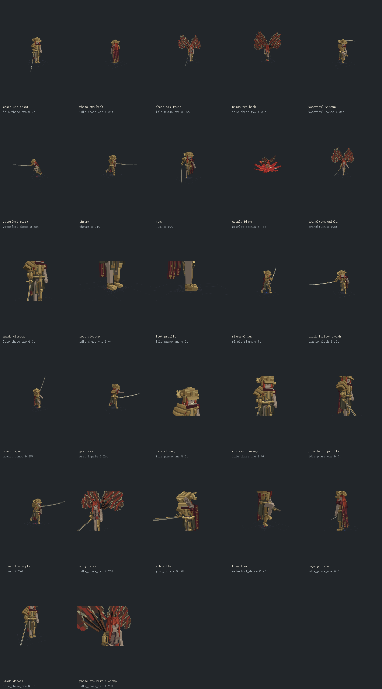

# Malenia / Elder Bosses

Original detailed GeckoLib interpretation for `elder_bosses:malenia`.
Authoring format: **GeckoLib Animated Model** in Blockbench.

## Deliverables

| File | Purpose |
| --- | --- |
| [malenia.bbmodel](malenia.bbmodel) | Editable model, embedded atlas, rig and all 40 animations |
| [geo/malenia.geo.json](geo/malenia.geo.json) | Bedrock 1.12.0 geometry for GeckoLib 4 |
| [animations/malenia.animation.json](animations/malenia.animation.json) | GeckoLib-compatible 1.8.0 keyframe library |
| [textures/malenia.png](textures/malenia.png) | Original 512 x 512 RGBA pixel atlas |
| [textures/malenia_emissive.png](textures/malenia_emissive.png) | Reserved transparent mask; no emissive layer is enabled |
| [animation_manifest.json](animation_manifest.json) | Clip lengths, default stage durations and event landmarks |
| [art_direction.json](art_direction.json) | Authoring-only figure size, precision, texel density and detail budget |
| [validation.json](validation.json) | Generated structural validation results |
| [surface_audit.json](surface_audit.json) | Geometry/animation-hashed near-coplanar surface checks in 32 poses |
| [angular_review.json](angular_review.json) | Pre-client visual review, 88 angles, anatomical sides, crown and posed-motion checks |
| [preview_validation.json](preview_validation.json) | Visible-pixel checks and rendered foot-contact samples |
| [runtime_validation.json](runtime_validation.json) | Platform runs and user-confirmed in-world acceptance |
| [MOTION_PLAN.md](MOTION_PLAN.md) | Bilibili reference evidence, optimization plan and execution record |
| [SOURCES.md](SOURCES.md) | Research, authorship and distribution boundaries |

The current `reference_motion_v7` model has **91 bones, 378 cubes and 1,379 textured faces**.
Minecraft pixel styling remains a texture requirement only. Fractional
geometry, refined joints, the cape, hair and physical blade remain detailed.
It preserves the **1.2 authoring scale** without separately rounding joints and geometry.
The original atlas uses 512 x 512 pixels, a base density of one texel per model unit,
nearest-neighbor sampling and a limited palette. Dense highlights and small line
patterns are reduced. Only joint-cap and final blade-tip silhouette masks use a
three-texel density to preserve their cutout contours.
There are no arbitrary meshes, skinned vertices or imported game assets. The project
embeds its texture and remains a cube-and-bone GeckoLib asset.

## Current Refinement

- The figure is approximately four blocks tall, depending on pose and helmet silhouette.
  Joint pivots, blade and local animation position keys scale together. Flower geometry,
  collision dimensions, damage zones and gameplay timing are deliberately unchanged.
- Shoulders, elbows, hips, knees and wrists use eight-sided rounded connections
  centered on the actual animated pivot. Natural limbs use matching skin tones;
  prosthetics retain metallic hinge caps and sleeve structure. Narrow stick joints
  and the independently rounded pivots from earlier versions are removed.
- Anatomical right/left is now verified from the character's forward direction,
  not from bone labels or the viewer's side. The legacy model, pivots, UV faces and
  animation rotations are reflected together: right arm and right foot on +X in
  Blockbench, empty left arm and prosthetic left leg on -X, with the figure facing -Z.
  The Bedrock export negates X and GeckoLib negates it back during baking.
- The empty left hand has eight proximal/distal finger bones and two thumb bones.
  Fingers curl separately in a relaxed pose, open before capture, close after contact,
  and release for a throw or miss. Wrist motion is restrained and the elbow no longer
  hyperextends backwards. The right hand retains the v6 grip and
  closes four three-segment fingers and a thumb around a physical handle. Palm,
  fingers, handle and carrier share the wrist-centered `blade_mount` frame, while
  the blade alone retains its telescoping motion. The outer palm and fitted backplate
  are separated from the forearm's side plane to prevent flicker.
- Feet have narrower heels, sloped insteps, thin soles and progressively narrowed
  toe sections. Ankle pivots and the original mechanical-limb arrangement are unchanged.
- The first-phase cape is rebuilt around connected cloth-segment pivots. The shoulder
  carries most posture compensation; the two lower segments have small relative lag
  instead of accumulating a large forward pitch. Idle local pitches total about -6.7 degrees.
- Hair now consists of a fitted scalp layer, temples, face-framing locks and six
  independently articulated, tapered ends. `phase_two_hair` adds exposed crown strands
  and a central fringe. The opaque scalp cap now covers the full head-top footprint,
  including the previously uncovered front strip beneath the outer locks.
- The weapon uses seven physical curved sections, progressively thinner cross sections,
  honed edges, spine inlay, a tapered tip, collar and mechanical blade carrier. Only
  the small final tip uses cutout shaping; the main blade is no longer a silhouette card.
- The video-guided motion pass separates descending cuts, rising returns, high
  thrust preparation, low uppercut loading, kick recovery and forward grab/release.
  Waterfowl uses overhead horizontal preparation and different burst silhouettes;
  phase two has higher asymmetric wings and separate hovering/body-dive poses.

### Surface Separation

Concentric joint facets and caps share the precise pivot. Hair, face and helmet
surfaces occupy separate layers. Blade sections have progressively different side-plane
depths, and cloth panels omit unnecessary thickness faces. The model does not depend
on a global polygon-offset setting to hide overlapping geometry.

[Surface audit](surface_audit.json) checks 32 posed frames, including all five moving
clips, using Blockbench's actual
world matrices, opaque texture samples and an outward-ray exposure filter. It found
**zero exposed near-coplanar pairs** at a 0.006 model-unit tolerance. Six internal
pairs remain classified as occluded. This sampled test is not a proof for every
possible camera, shader or animation frame; close-view in-world observation is also required.

### Pre-Client Review

The latest request requires a multi-angle model review **before** launching the game.
[Review sheets](angular_review.json) cover both phases at eight azimuths plus high/low
angles, eight crown views, and six directions for seven grip poses. Grip closeups
isolate the right arm where the torso would hide the target; full-body orbit and pose
views are also inspected. Naturally occluded rear-axis views are supplemented by
side and lower views. Six empty-hand poses add three-angle closeups. Crown views
isolate the head where the raised wings would otherwise hide it.

The v7 review corrected anatomical mirroring, rigid empty fingers, backwards torso
lean and shoulder-height Waterfowl preparation. It retains the earlier wrist and
surface-separation repairs. The final 88 views and 16 review sheets, plus the updated
action-sequence sheets, were reviewed before the v7 client launch.
Across 270 animation samples, 264 visible grip poses
retained their local handle relationship; six hidden poses were excluded.
Finger/handle centers did not enter the tested forearm interior. All 405 crown rays
in five poses met the scalp cap before the head. Eleven actual posed-motion checks
verify blade direction, forward weight transfer and overhead preparation. These checks are sampled, not a
proof of every possible surface intersection or viewing configuration.

Review entries: [phase one](previews/review_phase_one_orbit.png),
[phase two](previews/review_phase_two_orbit.png), [crown](previews/review_crown.png),
[idle grip](previews/review_grip_idle_phase_one.png),
[plunge grip](previews/review_grip_scarlet_plunge.png),
[relaxed empty hand](previews/review_empty_hand_idle_phase_one_0.png),
[open capture hand](previews/review_empty_hand_grab_impale_24.png).

## Motion Contract

- The detailed geometry is still animated by named bones and ordinary GeckoLib keys;
  its increased precision does not make the client authoritative for hits or movement.
- Swordplay now uses video-guided high/low blade paths and more restrained empty-arm
  counterbalance instead of imposing wide symmetrical swings on every action.
  Double slashes and the delayed rapid finisher follow through into the next windup.
  Thrust, uppercut/drop and grab/release use forward weight transfer; their gameplay
  event times and durations have not changed.
- Excessive wrist pitch is limited to -50 through 25 authoring degrees. ZYX
  quaternion compensation transfers the remaining rotation into the forearm;
  continuous Euler branches and half-tick samples reduce discontinuities.
  The wrist's local position can change, but combined blade orientation is preserved
  at baked samples. Entity movement, collision and server hit timing are unchanged.
- Waterfowl uses the reference's raised knee and overhead horizontal blade silhouette,
  with four existing active windows, different compact/extended burst postures and
  separate regrouping beats. Phantom release uses high-wing hovering, then a forward
  body thrust; Aeonia uses its own curled body dive and unfolding sequence.
- The [motion plan](MOTION_PLAN.md) records frame observations from original Bilibili
  showcases and a move breakdown. Sources were researched after the hand fixes, using
  Bilibili and cn.bing.com, not Google or YouTube. Public anonymous video frames were
  examined; no extracted HKX/TAE/FBX animation was imported. Low-resolution footage,
  camera motion and occlusion limit precision. This is an executed, manually authored
  video-guided pass, not exact original-game joint trajectories or event timing.
- Bounded cubic curves are baked to ordinary GeckoLib keys without overshoot.
  Loop tangents now wrap across the seam instead of forcing zero endpoint velocity;
  the five moving clips include additional sub-tick seam samples.
  Cape segments and hair ends now use relative delayed movement; secondary channels
  explicitly cover the final tick, including odd-length clips.
- Per-entity pose blending follows the shortest angular path on clip changes. Attack
  entry blending finishes within two authored ticks, idle changes within four client
  ticks, and stagger interrupts immediately. Hit times and server movement are unchanged.
- The presentation clock no longer reuses a cyclic `partialTick` as progress through
  an unchanged network sample. Time is monotonic within that sample and holds at the
  latest server-provided endpoint rather than extrapolating beyond it.
- Ground locomotion candidates must persist for four ticks before changing clips,
  preventing walk/strafe/turn threshold chatter. Re-rendering an identical frame restores
  that frame's blended pose rather than exposing the unblended animation again.
- Walk, backward walk, both strafes and run share a distance-driven footstep phase.
  Render-interpolated horizontal movement advances that phase; direction changes retain
  it, while stops hold it. Teleports and long render gaps do not advance stale steps.
- Those five clips use explicit support and swing trajectories, with hip/knee/ankle
  poses solved from the existing leg lengths. The support sole remains level while
  the opposite foot clears the floor. Reference cycle distances are 2.0 blocks for
  walk, 1.6 backward, 1.4 strafing and 2.7 running. These are presentation parameters,
  not movement-speed changes or terrain-aware foot IK.

Useful previews: [hands](previews/hands_closeup.png),
[feet](previews/feet_closeup.png), [foot profile](previews/feet_profile.png),
[walk sequence](previews/walk_sequence.png),
[helmet](previews/helm_closeup.png), [cuirass](previews/cuirass_closeup.png),
[prosthetic profile](previews/prosthetic_profile.png),
[bent elbow](previews/elbow_flex.png), [bent knee](previews/knee_flex.png),
[cape profile](previews/cape_profile.png), [blade](previews/blade_detail.png),
[second-phase hair](previews/phase_two_hair_closeup.png),
[low-angle thrust](previews/thrust_low_angle.png),
[double-slash sequence](previews/double_slash_sequence.png),
[Waterfowl sequence](previews/waterfowl_sequence.png),
[rapid-slash sequence](previews/rapid_sequence.png),
[thrust sequence](previews/thrust_sequence.png), [uppercut sequence](previews/upward_sequence.png),
[grab sequence](previews/grab_sequence.png), [phantom sequence](previews/phantoms_sequence.png),
[Aeonia sequence](previews/aeonia_sequence.png).
The existing [double-slash GIF](previews/double_slash.gif) and
[Waterfowl GIF](previews/waterfowl_dance.gif) are retained **v2** motion references.
They do not show the current geometry, textures or motion fixes and are not Minecraft client footage.

## Rig Contract

- Model coordinates use 16 units per Minecraft block, but are no longer restricted
  to whole pixels. Figure geometry and pivots are scaled together with four decimal
  places of retained precision. Wings retain the existing enlarged span.
- `root` and `control` never receive animation position keys. Entity travel,
  ascent, collision and hit detection remain server-owned. `pelvis` has only local
  pose compression, never the attack's world-space travel.
- `blade_root` and `blade_tip` are empty named bones for future trail sampling.
  `grab_anchor` and `rot_cloud_anchor` are named attachment points, not hitboxes.
- The right arm, left leg and right foot are mechanical; knees, hands and finger
  groups are named separately. `prosthetic_fingers_r` is parented to `blade_mount`
  and remains closed; the left finger group remains independently animated.
  Shoulder armor follows the upper-arm joint.
- Stage-one groups: `helm`, `armor_torso`, `armor_shoulder_l/r`, `armor_waist`,
  `cape_01`, `skirt_front/back/l/r`.
- Stage-two groups: `phase_two_body`, `phase_two_hair`, `wing_root_l/r`, with four branch and four
  membrane bones per side. Opaque root-woven body coverage is retained.
- `aeonia_core` owns eight independently posed, three-fold petals. The same rig
  contains bloom and defeated-flower poses; it does not spawn a persistent entity.
- Hair and cloth secondary motion is authored keyframes, not a physics simulation.
  `hair_end_01..06` are children of the corresponding `hair_01..06` bones.

## Animation Coverage

All identifiers start with `animation.malenia.`. Times below are default **ticks**, not seconds.

| Group | Clips |
| --- | --- |
| Lifecycle | `dormant` 80 loop, `intro` 80, `transition` 150, `defeated` 160, `defeated_flower` 80 loop |
| Locomotion | `idle_phase_one` / `idle_phase_two` 80 loop, `walk` 32, `walk_back` 36, `strafe_left` / `strafe_right` 36, `run` 20, `turn_left` / `turn_right` 16 |
| Air and interruption | `airborne` 32 loop, `landing` 14, `stunned` 70 hold, `stun_recover` 16, `hurt` 10 |
| Ground swordplay | `single_slash` 27, `double_slash` 50, `rapid_slashes` 54, `running_slash` 38, `upward_combo` 73, `thrust` 50, `retreat_slash` 32 |
| Close combat | `kick` 31, `grab_impale` 67, `grab_miss` 67, `grab_cancel` 16 |
| Waterfowl | `waterfowl_prepare` 20, `waterfowl_dance` 142 |
| Stage two | `scarlet_aeonia` 154, `scarlet_plunge` 66, `flying_slash` 73, `scarlet_phantoms` 146, `winged_sweep` 46 |
| Auxiliary effects | `phantom_slash` / `phantom_thrust` 14, `aeonia_loop` 84 loop |

The 15 combat actions are wired to the existing action IDs. Lifecycle, grounded
locomotion, turning, grab miss and early grab cancellation are selected in Java.
Auxiliary airborne/landing, hurt, stun-recovery, waterfowl-preparation, independent
phantom and persistent-flower clips are supplied for editing and future presentation
hooks; they do not add new gameplay states or spawn additional entities.

### Timing Rules

- Rapid slashes: ticks 14 / 16 / 18 / 26, with the mechanical windup before the first hit.
- Waterfowl: four bursts 32-45 / 50-61 / 66-77 / 82-99; lock pauses at 22 / 46 / 62 / 78.
- Aeonia: lock 26, dive 43-48, impact 49, bloom 58. Model bloom is attached to the
  Boss; persistent damaging zones still use the existing server-driven indicators.
- Phantoms: default releases at 36 / 44 / 52 / 60 / 68; body dive begins at 76,
  as verified in `MaleniaSkillEventPlanner`, not an inferred original-game frame.
- Grab: impale and release stay aligned to the actual capture tick +20 / +30.
- The server maps configured windup/active/recovery sections and special landmarks
  to the authored timeline. Two synchronized float samples interpolate the current
  rendered tick. No hit, healing, rot or audio event is fired by an animation JSON callback.
- Custom phantom counts retain the existing server-authoritative sequence; the
  five authored body pulses are the default visual adaptation, not extra hit events.

## Editing and Rebuilding

Open [malenia.bbmodel](malenia.bbmodel) with the GeckoLib Blockbench plugin installed.
The two idle clips provide convenient stage visibility previews. Combat clips are
shared by both phases; Java applies the appropriate stage layers after animation.

The scripts are the reproducible authoring source and currently target this workspace
path. Running the builders replaces this project's authored geometry or animations;
preserve manual Blockbench edits in a separately named project before rebuilding.
Previous editor states were preserved in [malenia.pre-v6.bbmodel](malenia.pre-v6.bbmodel)
and [malenia.pre-v7.bbmodel](malenia.pre-v7.bbmodel).

1. Run `scripts/build_model.js` through Blockbench MCP `risky_eval` in the dedicated
   `malenia` project, using `eval(require('fs').readFileSync(absolutePath, 'utf8'))`.
2. Run `node models/malenia/tests/gait.test.js` from the repository root to regenerate
  the animation JSON and manifest and check the five moving clips. Then run
  `scripts/build_animations.js` in Blockbench to import the library.
3. After the atlas loads, run `scripts/audit_surfaces.js` in Blockbench. Inspect any
  exposed conflict and repeat after editing geometry or animation. It records both hashes.
4. Run `scripts/review_model.js` in Blockbench to check the crown, grip and forearm
  interior, anatomical sides and motion directions, generating the 88-angle review.
  Inspect the resulting sheets and fix
  issues before client testing. Regeneration resets its visual-review status.
5. Run `scripts/capture_previews.js` in Blockbench to refresh 27 rendered views and
  14 sequential pose sheets. It checks actual rendered foot transforms in 25
  moving poses and rejects untextured or blank views using canvas-pixel checks.
6. Run `scripts/export_assets.js` in Blockbench. It saves the project and copies only
   the geo, animation and base atlas into the matching runtime asset directories.
7. After actual image inspection, record the findings in `angular_review.json` and
  set `inspection_status` to `visually_reviewed_before_client_test`. Run
  `node models/malenia/tests/hand_pose.test.js`,
  `node models/malenia/tests/reference_motion.test.js` and
  `node models/malenia/scripts/validate_assets.js`, then perform the in-world test.

The optional GIF recorder uses the older v2 camera framing. Existing GIFs were not
re-recorded for v7; use the updated stills, sequences or direct Blockbench playback.

The builders use Blockbench's Group, Cube, Texture and animation codec APIs, with
deterministic pixel painting. PNGs and JSONs are generated from authored code,
not edited inside any JAR. Normal resource processing is sufficient to run the mod.

## Verification

- Structural validation: all 40 clips, all 15 action IDs, bone parents, finite
  keyframes, loop closure, valid fractional dimensions, concentric joint construction,
  physical blade sections, second-phase hair and articulated ends, cape idle angle,
  PNG dimensions, embedded texture, figure/pose scaling, unchanged flower dimensions,
  exact runtime copies and matching geometry/animation-hashed surface and angular reviews.
- Current library: **46,095 keyframes**. All sampled rotation intervals are at most
  62.82 degrees per tick. This detects sharp jumps but does not alone prove visual quality.
- Standalone Java timeline, transition, network-clock and gait checks: **4,272 assertions**
  across all actions, doubled stage durations, Waterfowl landmarks, angular wraps,
  delayed samples, same-action restarts, candidate stability, phase-preserving direction
  changes, stops, repeated frames, long intervals and teleports. These unchanged
  Java checks last ran for v5; this revision does not modify Java presentation code.
- [Gait tests](tests/gait.test.js): **1,790 checks** of support height, foot sliding,
  sole alignment, natural knee bend, swing clearance and loop closure/velocity.
  Blockbench additionally verified both rendered foot transforms in 25 sampled poses.
- [Hand tests](tests/hand_pose.test.js) verify anatomical sides, right-hand weapon
  ownership, ten extra left-hand joints and the capture/release sequence.
- [Reference-motion tests](tests/reference_motion.test.js): **113 checks** retain
  all 40 old clip lengths, skill landmarks and directional/pose contracts.
- Wrist compensation: **3,250 baked samples** checked their combined orientation;
  maximum rounding error was below 0.001 degrees. The v6 before/after comparison
  remains historical evidence, not proof that v7 preserves the old choreography.
- Both Forge 1.20.1 and NeoForge 1.21.1 compiled and processed the v7 resources.
- Current v7 NeoForge run: world entry at 04:09:12 and normal shutdown and completed
  world saving at 04:10:12 on 2026-09-10 are confirmed by the log, with
  no model/animation error observed. The user separately confirmed that the inspected
  hand sides and empty-hand motion were normal, and the major motions looked closer
  to the references. This does not establish exact fidelity for unobserved moves.
  This is scoped acceptance, not a claim that every attack, terrain shape or adverse
  network condition was tested in-world. Forge was not rerun in-world for v7.
- The first version's Forge model confirmation and NeoForge combat confirmation
  remain historical evidence, not acceptance of this revised asset.
- Full combat, custom timing, multiple simultaneous Bosses and complete two-phase
  fight acceptance remain separate from structural/compile validation.

For manual inspection use a new creative world, enable cheats, and summon
`/summon elder_bosses:malenia ~ ~ ~5`. To observe combat without changing Boss values,
give the test player resistance and switch to survival. Check the intro, different
windups, phase-one armor visibility, phase-two wing opening and Aeonia flower.

The existing NeoForge AttributeFix 21.1.3 also needs Bookshelf 21.1.81 and Prickle
21.1.11. Their exact NeoForge Modrinth version IDs are pinned in the build script
after the missing dependencies blocked initial runtime verification.

This delivery does not add an arena, original-game audio, particle systems, sword
trails, independent phantom rendering or persistent post-defeat flower placement.
Existing indicators and gameplay remain authoritative. See the project design docs
for those separate presentation and world-content contracts.