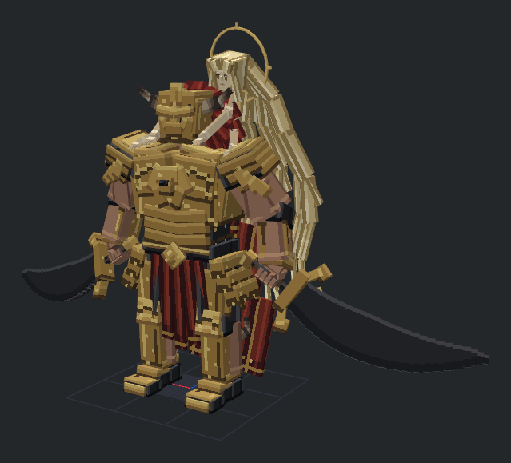

# 约定之王：GeckoLib 模型与动画工程

当前制作版本：`reference_lion_v3`。v2 的实机动作被用户否定，反馈见 [user_feedback_v2.json](user_feedback_v2.json)；v1 工程和生成器以 `.pre-v2` 后缀保留，v2 导出记录以 `.rejected-v2` 后缀保留。



## 交付内容

- [Blockbench 工程](promised_consort.bbmodel)：GeckoLib Animated Model，包含完整骨架、内嵌像素贴图与 43 段动画。
- [几何](geo/promised_consort.geo.json)：125 根骨骼、550 个 cube、3208 个可导出面；拉塔恩 364 个 cube，米凯拉与发幕 186 个 cube，均在原美术预算内。
- [动画库](animations/promised_consort.animation.json)：覆盖现有 28 个资源 ID，并补齐双阶段移动、转身、入场与六类分身动作。
- [本体贴图](textures/promised_consort.png)：512×512 统一图集，约 1 texel/模型单位，保持 Minecraft 大像素表面，不使用高密度噪点。
- [分身贴图](textures/promised_consort_clone.png)：低饱和、四档金白色、半透明。
- [发光遮罩](textures/promised_consort_glowmask.png)：仅用于制作侧，当前游戏使用无自发光基础贴图。
- [预览总览](previews/contact_sheet.png)、[动画清单](animation_manifest.json)、[逐招编排](choreography.json)、[动作制作记录](MOTION_PLAN.md)。

## 造型与动作

拉塔恩采用宽肩、分层冠甲、原创狮纹胸饰、暗红鬃毛、分段红披风和两把上弧黑铁巨剑。面甲新增眉甲、眼窝暗部、口鼻护甲、宽颊甲和下颌包边；曲刃增加连续弧段，采用冷灰金属刃口并消除逐段重复条纹。

米凯拉保留四臂与独立光环的项目设定，但不再居中直立、向外撑开四臂。躯干前倾贴靠，头部压低并略向角色左侧偏移，内手环抱锁骨附近，外手顺着肩甲贴放。手指末节、颈部、下巴、长袍及十组三级发束重做，发束有粗细变化和弯曲层次。

几何保留小数精度。每只持剑手包含四根三段弯曲手指、两段拇指、掌背与腕部；剑柄和手掌共用变换链。足部包含脚踝、脚跟、足弓、足背与前掌。步态按落脚位置求解髋膝角度，攻击下沉时保持脚掌接地，不包含地形 IK。

动画保留左右独立起手、蓄力、接触、挥过和后摇，扩大肩胯展开并增加踏步承重。v2 只追求更大角度并把腕部旋转补给前臂，实际产生扭曲与摆姿势感。v3 改用受限的双骨骼手臂解算，只在关键姿势求解自然肘弯，帧间采用四元数插值，不再逐帧切换肘弯解。手腕统一限幅，过短的抬手/收势段重新分配时间，原命中节点与片段总长不变。米凯拉保持低幅贴靠，披风和发束承担次级惯性。

## 动画覆盖

| 类别 | 内容 |
| --- | --- |
| 原有基础合同 | `idle`、`walk`、`hurt`、`stunned`、`death`、`transition` |
| 全部战斗动作 | 22 段双剑、重力、血焰、狮子斩、光速斩、王者连舞与大荒星陨 |
| 补充移动 | `idle_phase_two`、`walk_phase_two`、`run`、`run_phase_two` |
| 转身 | 两阶段各有 `turn_left`、`turn_right` |
| 入场 | `intro` |
| 分身 | `clone_overhead_3`、`clone_side_fan_3`、`clone_meteor_4`、`clone_starcaller_2`、`clone_dash_4`、`clone_cross_return_2` |

当前游戏自动使用待机、行走/跑步、入场、战斗、转换、眩晕、死亡与分身动画。`hurt` 和四段原地转身是已制作的补充片段，当前选择器没有独立触发它们，不计作已实机触发。

## 运行接入

正式资源沿用 `geo/entity/promised_consort.geo.json` 和 `animations/entity/promised_consort.animation.json`；贴图位于 `textures/entity/promised_consort/`。

本体按服务端实际阶段时长和关键事件映射回原始动画时间，同步当前与下一 tick 的表现端点。这样施法速度配置不再只加速伤害而漏掉动画；非循环动作保持末帧，起手有短姿态衔接，步态按实际水平位移推进。米凯拉按同步字段显隐，转换从第 56 个原始动画 tick 展开。分身读取父技能 ID，只播放表现动画，不参与命中。

伤害、选招、阈值、冲锋和升空路径、指示器、分身生成数量及生命周期均沿用战斗程序。动画不写入 `root`/`control` 世界位移；`pelvis` 偏移只用于视觉重心。动画以默认时序制作，未逐项验证全部非默认配置。

按用户最新要求，约定之王主特效改用注册式 GLSL core shader：真实剑根/剑尖矩阵驱动短拖尾，服务端指示器快照驱动重力环、裂纹、光柱、光路与冲击波。全部保持深度测试、低透明边缘和可读危险边界，不通过着色器决定伤害。原客户端整段通用粒子喷射已对约定之王关闭，只在物理/血焰生效点保留受预算约束的少量碎屑。马莲尼亚的特效路径不在本轮改动范围。

这不是外部光影包或全屏 bloom/折射系统，不要求安装光影模组；第三方光影包兼容性未验证。v3 模型轮没有增加竞技场、正式音频或近镜头发丝透明度。

### 范围预警与星陨修订

本次运行代码修订保留 v3 模型、贴图和动画：逐攻击段预告与真实伤害共用锁定形状，变更立即同步；转阶段冲击也有与真实包围盒匹配的矩形预告。伤害公式和范围数值不变，命中位置服从已公告的几何，不能临时改成另一个范围；未提前公告的直接攻击不结算，动态危险区先预告再生效。用户确认重力岩块保留追踪弹体碰撞，只提前提示发射，其虚线不是安全边界。

剑气按实际攻击侧采样剑根/剑尖，使用更亮的双层刃光与最多 3 tick 的短拖尾；历史样本与当前帧分开，避免高帧率反复覆盖导致尾迹消失。星陨增加跟随本体的白金蓄光、亮核、长光迹和锁点连接；实际落地前始终拒绝普通伤害，落地后再按配置免伤窗口处理。伤害结算放在真实落地之后。

本轮验收独立记录在 [combat_telegraph_validation.json](combat_telegraph_validation.json)，不能用 v3 的旧实机结论代替。

## 重建步骤

在 Blockbench 打开名称为 `promised_consort` 的 GeckoLib 项目，按顺序执行：

1. [模型生成器](scripts/build_model.js)。
2. [动画生成器](scripts/build_animations.js)。
3. [多角度审查](scripts/review_model.js)与[针对性审查](scripts/audit_revision.js)，目视检查新预览。
4. [正式导出](scripts/export_assets.js)。

MCP 执行入口示例：

```javascript
eval(require("fs").readFileSync("C:/Users/12044/Documents/EX/IDEA_PROJECT/ElderBosses/models/promised_consort/scripts/build_model.js", "utf8"))
```

模型生成器返回 Promise，必须等贴图载入再继续。MCP 最外层不要写 `return`。脚本中的工作区路径在迁移机器时需要调整。

离线动画构建使用制作侧 Three.js：

```powershell
npm install three@0.170.0 --prefix models/promised_consort/.tools --ignore-scripts --no-audit --no-fund
node models/promised_consort/scripts/build_animations.js
node models/promised_consort/scripts/validate_manifest.js
node models/promised_consort/scripts/validate_assets.js
node models/promised_consort/tests/check_motion.js
java -cp versions/1.20.1-forge/build/classes/java/main models/promised_consort/tests/TimelineCheck.java
node models/promised_consort/tests/run_attack_plan_check.js
```

重建会覆盖本工程的生成结果与预览，不自动合并手工修改。需要保留手工关键帧时，不要直接运行生成器。旧验收记录不自动适用于重新生成后的资产哈希。

## 验证状态

- [资产校验](validation.json)：骨架、UV、动画时长、循环首尾、内嵌贴图及运行时文件一致性通过。
- [动画计算](animation_validation.json)：关键手位、自然肘弯与步态/承重求解通过；受限手腕意味着部分非接触姿态的剑向只近似目标，不宣称逐帧精确复刻。
- [Blockbench 渲染检查](preview_validation.json)：25 张细节图、43 套动作序列图，72 个脚底样本与三种前向攻击样本通过。
- [针对性检查](revision_validation.json)：765 条面甲采样射线、1176 个环抱手掌样本、596 个握剑及屈肘样本通过。只覆盖记录中的采样，不推断所有视角或所有中间帧。
- [连续性检查](motion_continuity.json)：32490 个关节采样，没有超过 45°/半 tick 的跳变；这是排错上限，不是视觉质量评分。
- [时序回归](tests/TimelineCheck.java)：22 个动作、6 档施法速度、31750 项检查，验证单调播放、阶段起点、连舞事件和星陨节点。
- [预告几何回归](tests/AttackPlanCheck.java)：22 个动作、2 个阶段、4 档速度、3 档范围倍率，242892 项检查覆盖 1932 个段；验证指示器几何还原、冻结位置恢复、提前量、螺旋位移预测与分身取整次数。这是离线几何检查，不等于实机命中或视觉验收。
- [目视审查](visual_review.json)：记录实际审看的代表性画面，不声称每个中间帧都已人工检查。
- [实机记录](runtime_validation.json)：v3 两端均实际进入世界并正常退出；用户确认 Forge 动作和特效改善、可以保留，NeoForge 与 Forge 一致。观察类别原样记录，不扩写为全部逐招完成；前版记录单独归档。

固定镜头视频录制被用户取消，没有生成可交付视频，未自动重试；[录制脚本](scripts/record_motion.js)仅完成语法检查。新版实机进度以记录为准；完整逐招、二阶段未观察内容、多人、低 TPS、非默认配置和战斗平衡不因上述检查而视为已验收。

## 来源与边界

见 [SOURCES.md](SOURCES.md)。模型、贴图与动画均为原创适配，没有导入原作解包网格、贴图、动作数据或音频。研究帧仅在文档参考目录中，不进入运行资源。原创制作不等于取得角色商业使用授权。